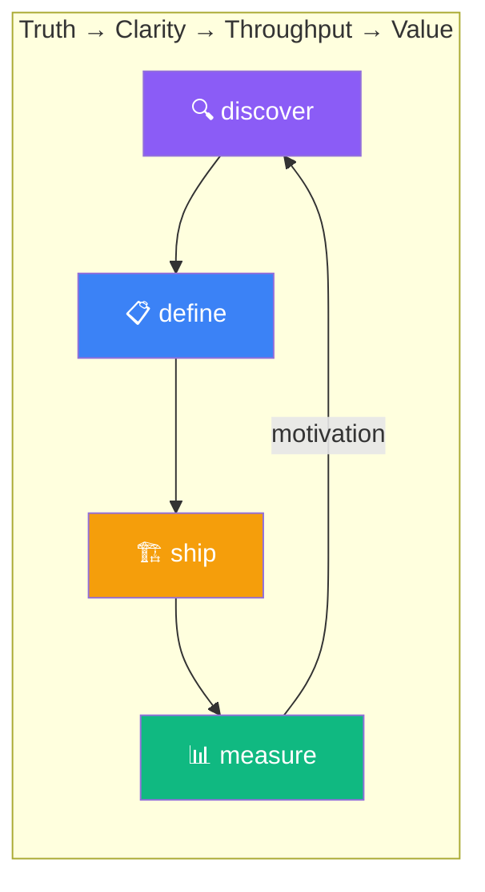

# 🦩 gwrk

<div align="center">


**You better gwrk!**

*Truth → Clarity → Throughput → Value.*

[](https://github.com/gforge-esc/gwrk/releases/latest)
[](https://github.com/gforge-esc/gwrk/actions/workflows/ci.yml)
[](LICENSE)

</div>

---

> **The scarce resource in AI-assisted engineering isn't code generation — it's architectural judgment.**

**gwrk** is a Principal Engineer's operating system. It takes your architectural thinking — decomposition, interface contracts, dependency ordering, review rigor — and turns it into shipped code at previously impossible speed.

> ⚠️ **Alpha Software** ([latest alpha release](https://github.com/gforge-esc/gwrk/releases/latest)) — gwrk is under active development. Some core workflows require files not yet bundled with the distribution (see [R004](docs/research/R004-shareability-readiness/draft.md)). Expect rough edges. Feedback and contributions welcome — see [CONTRIBUTING.md](CONTRIBUTING.md).

📖 **[What is gwrk?](docs/product/WHAT_IS_GWRK.md)** — the full thesis, ontology, and architecture.

---

## Quick Start

```bash
# Install
pnpm install && pnpm build && pnpm link --global

# Initialize a project
cd your-project
gwrk init

# Define a feature
gwrk define spec 001-my-feature        # Generate spec.md
gwrk define plan 001-my-feature        # Generate plan.md
gwrk define tests 001-my-feature       # Generate RED test files
gwrk define tasks 001-my-feature       # Generate tasks.json + gate scripts

# Ship it
gwrk ship 001-my-feature 1             # Autonomous implement → review → PR loop

# Measure it
gwrk measure compression --all         # Shipping accountability
```

## The Four Pillars



| Pillar | CLI | What It Does |
|--------|-----|-------------|
| **Discovery** | `gwrk define research R00X` | Scaffold research initiatives with structured methodologies |
| **Definition** | `gwrk define spec → plan → tests → tasks` | Strict pipeline — each step gates the next |
| **Shipping** | `gwrk ship <feature> <phase>` | Autonomous implement → build → test → review → PR loop |
| **Accountability** | `gwrk measure compression` | LOC-derived effort forecast vs. actual delivery time |

## CLI Commands

```
Foxtrot Charlie
  define       Define: spec → plan → tasks → tests → analyze
  ship         Ship: autonomous branch→implement→review→PR loop
  test         Run vitest scoped to feature test files
  gate         Execute gates and enforce truth
  measure      Measure: compression, pulse (shipping accountability)

Operations
  init         Initialize gwrk in the current directory
  tasks        Query and manage task state
  plan         Build Plan Orchestrator — query and manage the project spine
  db           Query the local execution ledger
  status       Show system status
  project      Project management commands
  plugin       Manage plugins (skills, workflows, enforcement)
```

## Directory Model

| Directory | Purpose |
|-----------|---------|
| `~/.gwrk/` | Global home — plugins, skills, workflows, config, execution ledger |
| `.gwrk/` | Project-local overrides, ontology, perspective |
| `specs/` | Feature specs, plans, tasks, gates |
| `src/` | TypeScript source (CLI + engine) |
| `docs/` | Architecture, product docs, ADRs, research |

## Documentation

- **[What is gwrk?](docs/product/WHAT_IS_GWRK.md)** — thesis, ontology, architecture
- **[Foxtrot Charlie](docs/product/FOXTROT-CHARLIE.md)** — the operating model
- **[ADR-009](docs/decisions/ADR-009-domain-ontology-information-hierarchy-ux.md)** — domain ontology and project knowledge
- **[CONTRIBUTING.md](CONTRIBUTING.md)** — how to contribute
- **[DEVELOPMENT.md](docs/DEVELOPMENT.md)** — development setup
- **[SECURITY.md](SECURITY.md)** — vulnerability reporting

## Community & Roadmap

gwrk is an early public alpha, and feedback shapes it directly.

- 💬 **[Discussions](https://github.com/gforge-esc/gwrk/discussions)** — tell us what worked, what was rough, and what you'd like to see. Start in [🧪 Alpha Feedback](https://github.com/gforge-esc/gwrk/discussions/categories/alpha-feedback) or [💡 Ideas](https://github.com/gforge-esc/gwrk/discussions/categories/ideas).
- 🗺️ **[Roadmap](https://github.com/orgs/gforge-esc/projects/5)** — where gwrk is headed (directional and outcome-led). Check it before requesting a feature.
- 🐞 **[Issues](https://github.com/gforge-esc/gwrk/issues/new/choose)** — reproducible bugs and concrete requests.
- 🧭 **[SUPPORT.md](SUPPORT.md)** — not sure where something goes? Start here.

## Stack

TypeScript CLI (Commander.js) · SQLite (better-sqlite3) · Vitest · Biome · pnpm

---

<div align="center">

🦩 **You better gwrk.** 🦩

*Truth extracted. Clarity committed. Throughput shipped. Value delivered.*

</div>
