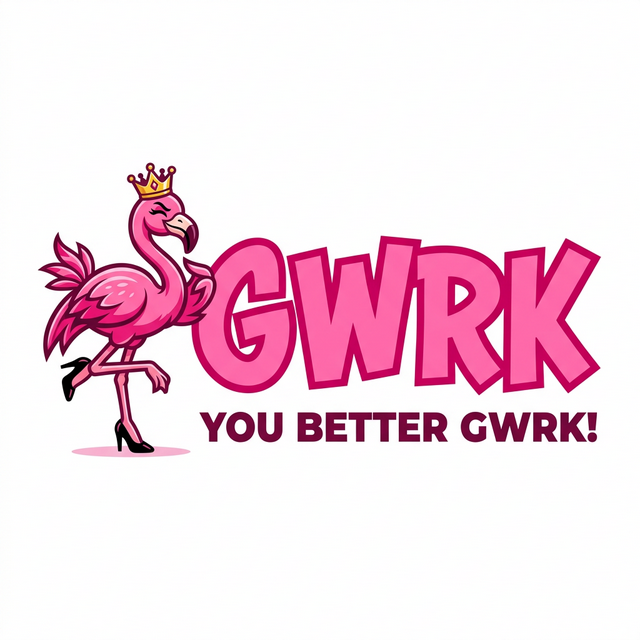

# 🦩 gwrk

<div align="center">



**You better gwrk!**

*Truth → Clarity → Throughput → Value.*

</div>

---

## What is gwrk?

**gwrk** is a CLI and local build server that orchestrates fleets of AI coding agents through governed, parallelized pipelines — and lets you control the whole thing from your phone.

It takes your architectural vision, decomposes it into executable phases, dispatches AI agents to build them in parallel, drives the results through review gates, CI, and merge — and reports back to you on Telegram. You ship features while walking the dog.

gwrk is not another AI code generator. It's the **general contractor** for your software factory. Your agents are the workforce; gwrk is the one who makes sure the building actually gets built.

---

## The Name

**gwrk** is pronounced **"gwerk"** — one syllable, rhymes with *work*.

Not "gee-work." Not "gee-forge." Just *gwerk*. Say it fast, say it loud, say it like you mean it.

The name draws from the same well as the sharpest tools in a Unix engineer's kit — `grep`, `sed`, `awk`, `gawk` — terse commands that do exactly one thing and do it ruthlessly well. Those tools didn't need pretty names. They needed to *work*. gwrk carries that same energy: a short, blunt, unapologetic name for a tool that exists to get things done.

But gwrk isn't just a Unix throwback. The name channels something else entirely:

> **"You better work!"**
> — RuPaul, Joan Rivers, Betty White, and every creative who ever turned ambition into art.

That's the duality at the heart of gwrk: the **precision of GNU tooling** meets the **audacity of the runway**. Utilitarian power wrapped in unapologetic flair. A tool that grinds through specs, dispatches agents, resolves merge conflicts, and monitors CI — with the energy of someone who walked into the room and *owned it*.

gwrk doesn't apologize. gwrk doesn't do "minimum viable." gwrk ships.

---

## The Mascot

<div align="center">

🦩

</div>

**The gwrk Flamingo** — fierce, fabulous, and structurally absurd.

A flamingo stands on one leg in the mud and looks like it owns the place. It's naturally flamboyant, structurally impossible, and completely unbothered. That's the energy.

The mascot comes in two moods:

| Mood | Vibe | Use |
|---|---|---|
| **The Crowned Queen** | Bright, bold, drag-inspired. Crown, heels, full strut. | README headers, social, merch. Light backgrounds. |
| **Cyberpunk Neon** | Dark mode, sunglasses, neon glow, code in the background. | Terminal splash, docs, dark themes. Developer contexts. |

Both say the same thing: **You better gwrk.**

> See [branding/](branding/) for mascot assets.

---

## The Philosophy: Foxtrot Charlie

gwrk is the automation of [Foxtrot Charlie](foxtrot-charlie.md) — an operating model built for outcomes, not ceremony.

The cleanest truth behind Foxtrot Charlie is this: **what gets built is 1,000% more important than how it gets built.** You cannot cargo-cult your way into product-market fit. You can have immaculate sprints and still sprint straight into irrelevance. The thing that matters most is a near-maniacal obsession with figuring out the exact right thing to build — and then shipping it fast enough to learn whether you were right.

Foxtrot Charlie distills execution into four pillars:

| Pillar | Purpose | Mantra |
|---|---|---|
| **Discovery** | Extract truth from customers, the market, reality | Messy truth > clean narratives |
| **Definition** | Convert truth into buildable, testable commitments | If it's not written, it's not committed |
| **Shipping** | Build and ship increments that generate learning | Ship to learn. Fast reds surface problems early |
| **Delivery** | Prove that shipped work created measurable value | Shipped ≠ delivered. Value = adoption + outcomes |

The mantra that connects them: **Truth → Clarity → Throughput → Value.**

Everything else is decoration.

### gwrk *Is* the Four Pillars in Code

Every gwrk agent maps directly to a Foxtrot Charlie pillar:

| FC Pillar | gwrk Agent | What It Does |
|---|---|---|
| **Discovery** | **DUT** — Dream Until Told | Extracts truth. Lives in Telegram. Turns your half-formed ideas — voice notes from a walk, 2am brainstorms — into structured insight. DUT asks the hard questions: scope, risk, architecture, feasibility. It doesn't generate features; it extracts the truth about what should be built. |
| **Definition** | **DUS** — Define Until Solid | Creates clarity. Takes extracted truth and converts it into buildable, testable commitments: `spec.md` → `plan.md` → `tasks.json` → gate scripts. Binary acceptance criteria. Explicit ownership. Written artifacts, not conversations. |
| **Shipping** | **ZFG** — Zero F\*cks Given | Creates throughput. The local orchestrator decomposes plans into parallelizable phases, dispatches agents, manages the git tree, resolves merge conflicts, and drives work through review gates and CI. No heroics; shipping is a reflex. |
| **Shipping** | **WUD** — Work Until Done | Creates throughput. The ephemeral worker receives a phase, writes code, runs tests, opens a PR, and terminates. Maniacal commitment to completion — if one backend fails, gwrk retries on another. Done, Done! |
| **Delivery** | **Pulse + Compression** | Proves value. Pulse shows *what shipped* across every repo. Compression shows *how fast* — estimated effort vs. actual delivery time. The feedback loop that tells you whether your architecture and your agents are actually working. |

### The Foxtrot Charlie Invariants, Enforced by Machinery

Foxtrot Charlie has five operating invariants. In most organizations, they're aspirational. In gwrk, they're automated:

| FC Invariant | gwrk Enforcement |
|---|---|
| **Every initiative has a single accountable owner** | ZFG owns the feature lifecycle. Each phase has one assigned agent. No shared ownership |
| **Reality is expressed as state, not narrative** | RAGB status in `tasks.json`. Gate scripts that pass or fail. No interpretation, only execution |
| **All commitments exist as written artifacts** | `spec.md`, `plan.md`, `tasks.json`, gate scripts. If it's not in the repo, it doesn't exist |
| **Shipping happens frequently enough to surface truth** | Parallel dispatch, continuous merge, daily Pulse snapshots. Short cycles reveal error |
| **Value is measured in adoption or outcome, not effort** | Compression ratio. Not "how many hours did agents run" but "did the feature ship, and how fast" |

### When Things Break

Foxtrot Charlie assumes three failure modes. gwrk handles each:

| Failure | FC Diagnosis | gwrk Response |
|---|---|---|
| **Truth is missing** | Return to Discovery | DUT conversation in Telegram — re-extract, re-clarify |
| **Clarity is broken** | Rewrite commitments | DUS loop — regenerate spec, plan, tasks, gates |
| **Throughput is stalled** | Reduce batch size and ship | ZFG re-decomposes phases, retries on different backend, escalates via Telegram |

No new process is added. No ceremonies are created. The system tightens around reality.

---

## The Thesis

> **The scarce resource isn't code generation — it's architectural judgment.**

The better you are as a Principal Engineer, the better gwrk performs. gwrk rewards real system-design skill: decomposition, interface contracts, dependency ordering, review rigor. It replaces the cumbersome "explain the codebase to an AI" pipeline with one that amplifies your expertise.

The rarer your judgment, the more gwrk multiplies it.

This is Foxtrot Charlie's thesis made executable: tools don't extract truth — people do. Tools don't make decisions — leaders do. gwrk doesn't think for you. It takes the thinking you've already done and turns it into shipped code at a speed that was previously impossible.

---

## How It Works

gwrk runs a persistent local daemon — inspired by [OpenClaw](https://github.com/nicepkg/openclaw)'s Gateway model — that serves as the control plane for your entire development pipeline:

```
You + Phone (Telegram)
    │
    ▼
┌── gwrk daemon (localhost:18790) ──────────────────┐
│                                                    │
│   Spec Pipeline    → /specify → /plan → /tasks    │
│   Agent Router     → Codex · Claude · Gemini      │
│   Git Manager      → branch, merge, resolve       │
│   Review Gate      → code review → UAT → GO       │
│   Pulse Engine     → LOC trends, velocity          │
│   Compression      → effort forecast vs. actual    │
│   Glass Dashboard  → mobile-first real-time UI     │
│   Telegram Bot     → commands, approvals, DUT      │
│                                                    │
└────────────────────────────────────────────────────┘
    │              │               │
    ▼              ▼               ▼
  Phone        Local Agents    Cloud Agents
 (Telegram)   (Claude/Gemini)  (Codex Cloud)
```

### The Pipeline Is the Four Pillars

```
🔍 DISCOVER       → DUT on Telegram — extract truth (voice notes, text, sketches)
📋 DEFINE         → DUS generates spec → plan → tasks → gates (written commitments)
🏗️ SHIP           → ZFG dispatches WUD agents in parallel (throughput)
📊 DELIVER        → Pulse + Compression — prove value (what shipped, how fast)
                   ↩️ New truth feeds back into Discovery
```

**You dream it on your phone. gwrk builds it while you sleep.**

---

## Core Capabilities

| Capability | What It Does |
|---|---|
| **Multi-Agent Dispatch** | Routes tasks to Codex Cloud, Claude Code, or Gemini CLI — in tandem, with retry and escalation |
| **Telegram Control Plane** | Approve reviews, triage failures, dispatch work — all from your phone. Compresses decision latency to zero |
| **Agent-DUT** | Turn half-formed ideas into executable specs via Telegram conversation. Discovery on demand |
| **Pulse** | Productivity dashboard: LOC trends, spec progress, velocity across all your repos. The state of your work, not a narrative about it |
| **Compression** | The headline metric: estimated effort ÷ actual delivery time. Value measured in outcomes, not activity |
| **Glass Dashboard** | Mobile-first real-time UI: active agents, event stream, feature progress. Access via tunnel + magic link |
| **Governed Pipeline** | Spec-first. Gate scripts. Review verdicts. Audit trails. All commitments as written artifacts |
| **Git Automation** | Branch creation, parallel phase isolation, merge conflict resolution — all automatic |

---

## Quick Start

```bash
# Install
npm install -g gwrk

# Initialize in your project
gwrk init

# Dream up a feature from Telegram
/dream "I want historical git analysis with weekly LOC trends"

# Or specify locally
gwrk specify 003-ast-diff

# Plan it
gwrk plan 003-ast-diff

# Build it
gwrk dispatch 003-ast-diff

# Watch the magic
gwrk dashboard
```

---

## Lineage

gwrk is extracted from ~7,400 lines of workflow infrastructure battle-tested across two production codebases:

- **Code-Red** — Courtroom code forensics tool (Rust + TypeScript + Tauri + SQLite)
- **GForge.ai** — Personal epistemic engine (Fastify + React + Prisma + PostgreSQL)

The infrastructure is project-agnostic. It works for a forensics tool the same way it works for a publishing platform. gwrk is the extraction of that entire lifecycle into something you install in five minutes and control from your couch.

### Architectural Debt to OpenClaw

gwrk borrows three key ideas from [OpenClaw](https://github.com/nicepkg/openclaw):

1. **The Gateway model** — a local daemon as the control plane
2. **The sandbox model** — Docker-based isolation for agent execution
3. **The Telegram channel** — conversational interface via grammY

OpenClaw has a lobster. gwrk has a flamingo. Both get the job done. 🦞🦩

---

## Technology Stack

| Layer | Technology |
|---|---|
| CLI | TypeScript, Commander.js |
| Daemon | Fastify (localhost:18790) |
| Telegram | grammY |
| Agent Backends | Codex CLI/Cloud, Claude Code, Gemini CLI |
| Sandboxes | Docker (per-phase isolation) |
| Dashboard | Vite SPA (React, embedded static assets) |
| Database | SQLite (embedded, local file) |
| Config | Zod schemas, fail-fast validation |

---

## License

MIT

---

<div align="center">

🦩 **You better gwrk.** 🦩

*Truth extracted. Clarity committed. Throughput shipped. Value delivered.*

</div>