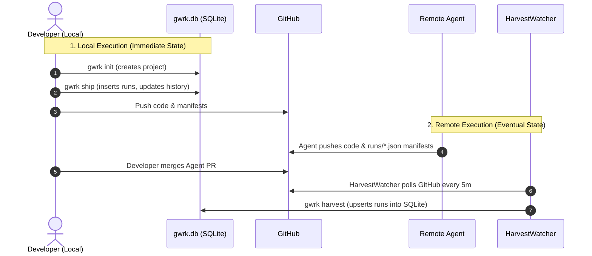
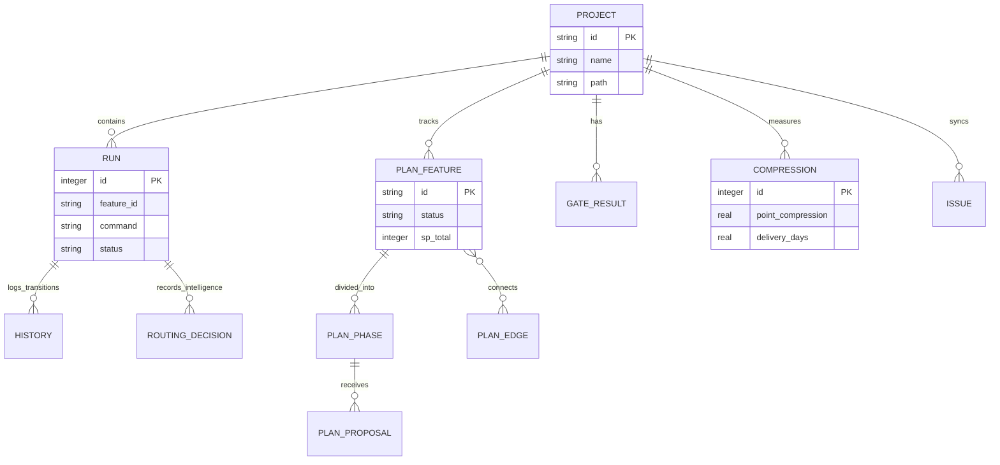

# `gwrk` State Contract Overview

> **Status:** Active · **Date:** 2026-06-16
> **Scope:** gwrk execution ledger and state architecture
> **References:** [ADR-002: SQLite Execution Ledger](../decisions/ADR-002-sqlite-execution-ledger.md), [ADR-003: Execution State Contract](../decisions/ADR-003-state-contract.md)

Welcome to the **`gwrk` State Contract**. This document is a developer-friendly guide to how state is managed, persisted, and synced across the `gwrk` ecosystem. 

In `gwrk`, state is divided into two distinct worlds:
1. **The Operational Ledger (Git):** Your `plan.md`, `tasks.json`, and `.gwrk/runs/*.json` execution manifests. This is the source of truth for what needs to be done and what has been done. If you can push to Git, you can participate in the `gwrk` ecosystem.
2. **The Analytical Ledger (SQLite):** The `~/.gwrk/gwrk.db` database. This powers our compression engine, agent router learning, metrics, and real-time observability. 

This document explains how the Analytical Ledger works, what it stores, and how remote execution seamlessly updates your local database.

---

## 1. How State Moves (Local vs Remote Execution)

Because `gwrk` agents can run remotely (e.g., Codex Cloud VMs) where they don't have access to your local SQLite database, we decouple execution from analytics using **Git-Native Manifests**.

### Sequence Diagram: State Synchronization

**Key Takeaways:**
- **Local Runs:** When you run `gwrk ship` locally, it writes to `gwrk.db` immediately.
- **Remote Runs:** Remote agents write execution manifests (`.gwrk/runs/*.json`) and push them to Git.
- **The Harvest Daemon:** The `HarvestWatcher` background process polls GitHub for merged PRs. When it finds one, it runs `gwrk harvest`, parsing the manifests and synchronizing them into your local `gwrk.db`.

---

## 2. Entity-Relationship Diagram (ERD)

Here is a bird's-eye view of how the tables in `gwrk.db` relate to one another. The `PROJECT` is the root entity, tying everything together.

---

## 3. The State Schema & Mutations

The following sections detail exactly what tables exist in `gwrk.db`, what they do, and what `gwrk` commands mutate them. 

### Core Entity Layer
- **`projects`**: The central registry of known gwrk projects and their configuration.
  - **Populated By**: `gwrk init` (`upsertProject` in `src/db/runs.ts`).

### Execution & Orchestration Layer
- **`runs`**: The core execution telemetry. Stores the manifestation of agent and CLI runs. Crucial for analytics, routing decisions, and calculating compression.
  - **Populated By**: `gwrk ship`, `gwrk harvest`, and agent executions.
  - **Note**: The decoupled harvest (`HarvestWatcher`) synthetically backfills missing runs with `status: 'merged'` to maintain ledger integrity if an agent crashes before writing a manifest.
- **`history`**: The state transition log for tasks.
  - **Populated By**: Task status changes (e.g., `gwrk tasks done` invoking `recordHistory` in `src/db/runs.ts`).
- **`gate_results`**: Enforced truth outcomes for execution gates.
  - **Populated By**: `gwrk gate` executions (`recordGateResult` in `src/db/gates.ts`).

### Plan & DAG Layer (The Spine)
This layer implements the `plan.md` DAG, reflecting the structural hierarchy of a feature.
- **`plan_features`**: High-level feature definitions and point totals.
  - **Populated By**: `gwrk plan` DAG sync (`insertFeature`, `updateFeatureStatus`, `updateFeatureName` in `src/db/plan.ts`).
- **`plan_phases`**: Sub-phases within features.
  - **Populated By**: `insertPhase` in `src/db/plan.ts`.
- **`plan_edges`**: DAG dependencies indicating relationships between nodes.
  - **Populated By**: `insertEdge` in `src/db/plan.ts`.
- **`plan_proposals`**: Pending changes proposed to the plan structure.
  - **Populated By**: `insertProposal` in `src/db/plan.ts`.

### Intelligence & Routing Layer
- **`routing_decisions`**: Advanced routing metadata tracking why a specific backend or model was selected (e.g., fallback usage, quotas).
  - **Populated By**: The backend selector during routing (`src/server/routing-decisions.ts`).
- **`routing_history`**: Success and failure rates for backends to train the router.
  - **Populated By**: `recordRoutingOutcome` in `src/db/plugins.ts`.
- **`agent_context_sync`**: Synchronization state to ensure agents have up-to-date `.gwrk/agent-context.md` hashes.
  - **Populated By**: `upsertAgentContextSync` in `src/db/plugins.ts`.

### Analytics & Value Layer
- **`compression`**: Deep analytics evaluating effort vs. value (Point Compression, Delivery Days vs Estimated Days, Dormancy, etc.).
  - **Populated By**: Computed and inserted analytically by `gwrk measure compression` (`insertCompression` in `src/db/compression.ts`).
- **`issues`**: GitHub issue mirroring and lifecycle tracking.
  - **Populated By**: Synced via `upsertIssue` / `updateIssue` in `src/db/issues.ts`.

---

## 4. Known Issues and State Gaps

> [!WARNING]
> 1. **Schema Overlap (`agent_sync` vs `agent_context_sync`)**: The initial `agent_sync` table exists but was functionally superseded by `agent_context_sync` in migration `003-agent-context.sql`. The `agent_sync` table remains as technical debt.
> 2. **Dormant Compression Metrics**: Some fields in the `compression` table remain aspirational depending on the rigor of the `HarvestWatcher` and the git execution manifest tracking. Ensure backfilling functions properly seed required compression bounds.
