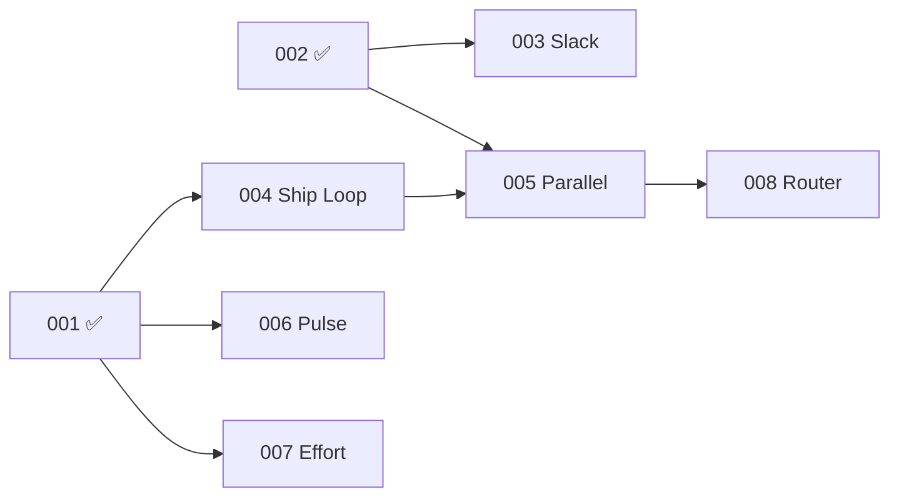

# Build Plan Audit: 003→008 Readiness Assessment

> **Date**: 2026-03-10  |  **Build Plan**: v5  |  **Total MVP SP**: 126

---

## Inventory Matrix

| # | Feature | Spec | Plan | Tasks | Gates | Contracts | Checklists | Status |
|---|---|---|---|---|---|---|---|---|
| 003 | Slack | ✅ 322L | ✅ 151L | ✅ 7 phases, 25 tasks | ✅ 25 + runner | ❌ | ❌ | 🟢 **Ship-ready** |
| 004 | Ship Loop | ✅ 310L | ✅ 217L | ✅ tasks.json | ✅ 13 + runner | ✅ 5 | ✅ 2 | 🟢 **Ship-ready** |
| 005 | Parallel Dispatch | ❌ | ❌ | ❌ | ❌ | ❌ | ❌ | 🔴 **Missing** |
| 006 | Pulse | ✅ 260L | ✅ 182L | ✅ 3 phases, 11 tasks | ✅ 11 + runner | ✅ 2 | ✅ 2 | 🟢 **Ship-ready** |
| 007 | Effort+Compression | ✅ 386L | ✅ 264L | ✅ 3 phases, 24 tasks | ✅ 24 + runner | ✅ 2 | ✅ 1 | 🟢 **Ship-ready** |
| 008 | Agent Router | ❌ | ❌ | ❌ | ❌ | ❌ | ❌ | 🔴 **Missing** |

---

## Build Plan Dependency Order vs Execution Order



### Recommended Execution Order

| Order | Feature | Dependencies Met? | Blockers |
|---|---|---|---|
| **1** | 003-slack | ✅ P2 complete | None — ship-ready |
| **2** | 004-ship-loop | ✅ P1 complete | Already partially built (ship command works) |
| **3** | 006-pulse | ✅ P1 complete | None — independent |
| **4** | 007-effort-compression | ✅ P1 complete | None — independent |
| **5** | 005-parallel-dispatch | ✅ P2+P4 complete | **Needs spec + plan + tasks** |
| **6** | 008-agent-router | ✅ P5 complete | **Needs spec + plan + tasks** |

> [!IMPORTANT]
> **003, 006, 007 can run in parallel** — they share no dependencies beyond P1 (done). 004 can also run in parallel with these since it depends only on P1. This is the maximum-velocity path.

---

## Per-Feature Audit

### 003-slack — 🟢 Ship-Ready

**Spec quality**: Complete — 9 user stories, 9 FRs, 10 TRs, full coverage matrix, error states for FR-001/002/004/009, data model for config/notifications/DUT threads.

**Readiness shortfall**:
- ❌ No [contracts/](file:///Users/gonzo/Code/gwrk/specs/001-cli-core/contracts) directory — missing interface contracts for slash commands, Block Kit message shapes, Bolt event handlers
- ❌ No [checklists/](file:///Users/gonzo/Code/gwrk/specs/001-cli-core/checklists) — missing requirements/infrastructure checklists
- ⚠️ Spec status is "Draft" — should be "Settled" before ship
- ⚠️ FR-003 (status updates) has no error states table
- ⚠️ FR-005 (interactive buttons) has no error states table
- ⚠️ FR-006 (DUT threads) has no error states table
- ⚠️ FR-007 (presence) has no error states table
- ⚠️ FR-008 (App Home Tab) has no error states table

**Action needed**: Add contracts, checklists, error states for FR-003/005/006/007/008, and flip to Settled.

---

### 004-ship-loop — 🟢 Ship-Ready (Partially Built)

**Spec quality**: Complete — 10 user stories (including FR-014 phase-skip, FR-015 circuit-breaker-to-issue added today), 15 FRs, 8 TRs, 5 contracts, 2 checklists, full coverage matrix.

**Already implemented**: `gwrk ship` command, [work-until-done.sh](file:///Users/gonzo/Code/gwrk/scripts/dev/work-until-done.sh), [wud-branch.sh](file:///Users/gonzo/Code/gwrk/scripts/dev/wud-branch.sh), [wud-ci-wait.sh](file:///Users/gonzo/Code/gwrk/scripts/dev/wud-ci-wait.sh), [wud-verdict.sh](file:///Users/gonzo/Code/gwrk/scripts/dev/wud-verdict.sh), [agent-run.sh](file:///Users/gonzo/Code/gwrk/scripts/dev/agent-run.sh), phase-skip logic, state machine, circuit breaker.

**Readiness shortfall**:
- ⚠️ FR-014 (phase-skip) implemented but not yet shipped via ship loop (implemented by hand today)
- ⚠️ FR-015 (circuit-breaker-to-issue) is spec'd but `wud-file-issue.sh` not yet implemented
- ⚠️ Tasks need to be re-generated from updated plan+spec (plan.md changed)

**Action needed**: Re-generate tasks with `gwrk define tasks`, implement FR-015, then ship.

---

### 005-parallel-dispatch — 🔴 Missing

**Build plan says**: Multi-phase concurrent execution with conflict resolution. Per-backend capacity gates. `gwrk feature <feature>` for full end-to-end lifecycle. 10 SP.

**Dependencies**: P2 (Build Server ✅) + P4 (Ship Loop — partially built)

**What needs to happen**:
1. `/specify` → [spec.md](file:///Users/gonzo/Code/gwrk/specs/003-slack/spec.md) (from build plan §Phase 5)
2. `/plan` → [plan.md](file:///Users/gonzo/Code/gwrk/specs/000-build-plan.md)
3. `/plan-to-tasks` → `tasks.json`
4. `/checklist` → checklists
5. `/define-tests` → test stubs

**Key scope from build plan**:
- Concurrent sandboxes with managed repo clones
- Merge ordering (phases complete in dependency order)
- Per-backend capacity gate: `maxConcurrent`, `rateLimit` sliding window
- 429/rate-limit error handling with exponential backoff + jitter
- `gwrk feature <feature>` as the top-level command
- See [docs/references/agent-backends.md](file:///Users/gonzo/Code/gwrk/docs/references/agent-backends.md) for constraints

---

### 006-pulse — 🟢 Ship-Ready

**Spec quality**: Complete — 8 user stories, 8 FRs, 7 TRs + 1 integration test, 2 contracts, 2 checklists, full coverage matrix.

**Readiness shortfall**:
- ⚠️ Status is "Draft" — should be "Settled"
- ⚠️ Duplicate checklists: both [checklists/](file:///Users/gonzo/Code/gwrk/specs/001-cli-core/checklists) and `.gwrk/checklists/` exist (infrastructure.md in both)

**Action needed**: Deduplicate checklists, flip to Settled.

---

### 007-effort-compression — 🟢 Ship-Ready

**Spec quality**: Complete — 9 user stories, 14 FRs, extensive data model (EffortReport, CompressionReport, LeadingIndicators), 2 contracts, 1 checklist, 24 gates.

**Readiness shortfall**:
- ⚠️ Status is "Draft" — should be "Settled"
- ⚠️ Missing infrastructure checklist (only has requirements)

**Action needed**: Add infrastructure checklist, flip to Settled.

---

### 008-agent-router — 🔴 Missing

**Build plan says**: Agent backend selection, Done Done! protocol, retry + escalation, learning from execution history. Agent registry schema. Context size estimator. 10 SP.

**Dependencies**: P5 (Parallel Dispatch — missing)

**What needs to happen**: Same as 005 — full `/specify` → `/plan` → `/plan-to-tasks` pipeline.

**Key scope from build plan**:
- Router logic based on per-backend invocation profiles
- `.gwrkrc.json` → `agents.registry` map with `contextWindow`, `maxConcurrent`, `rateLimit`, `models[]`, `invocation` template
- Context size estimator: rough token count for `phase-context.md` vs backend's `contextWindow`
- Mini-model fallback before backend escalation
- SQLite-backed learning engine: success rate × task SP × language
- Tandem dispatch (multiple backends simultaneously)
- See [docs/references/agent-backends.md](file:///Users/gonzo/Code/gwrk/docs/references/agent-backends.md) for documented constraints

---

## Build Plan Alignment Issues

| # | Issue | Severity | Location |
|---|---|---|---|
| 1 | P1 SP listed as 25 but spec says 21 in changelog notes | 🔵 Low | `000-build-plan.md:421` |
| 2 | 003 spec includes App Home Tab (US-008) but build plan has it as separate P11 | ⚠️ Medium | `003-slack/spec.md:116`, `000-build-plan.md:323` |
| 3 | 003 spec includes DUT threads (US-006/FR-006) but build plan has DUT as separate P9 | ⚠️ Medium | `003-slack/spec.md:88`, `000-build-plan.md:293` |
| 4 | 004 build plan says "Agent: Codex Cloud" but ship loop actually runs Gemini | 🔵 Low | `000-build-plan.md:183` |
| 5 | 005 and 008 have no spec directories — zero work exists | 🔴 High | filesystem |
| 6 | 012 has only a README placeholder | 🔵 Info | `012-knowledge-work/README.md` |

> [!WARNING]
> **Issue #2 and #3 are scope conflicts.** The 003-slack spec pulls in scope from P9 (Agent-DUT) and P11 (App Home Tab). This either means: (a) the build plan is stale and P9/P11 are folded into P3, or (b) the spec is over-scoped and US-006/US-008 should be deferred. **You need to decide: are P9 and P11 collapsed into 003, or are they separate?**

---

## Velocity Plan: Fastest Path to Multi-Agent

For maximum compression toward multi-agent (`gwrk feature` running 3 agents simultaneously):

```
NOW ─────────────────────────────────────────────────────────────►

│ Wave A (parallel, all deps met) │ Wave B (needs A) │
│                                 │                  │
│ 003-slack ─────────────────────►│                  │
│ 004-ship-loop ─────────────────►│ 005-parallel ───►│ 008-router
│ 006-pulse ─────────────────────►│                  │
│ 007-effort ────────────────────►│                  │
│                                 │                  │
│ /specify 005 + 008 now (no deps)│                  │
```

> [!TIP]
> **Specify 005 and 008 NOW while Wave A ships.** Spec writing has zero dependencies — it only needs the build plan. By the time Wave A finishes, 005 and 008 will be fully spec'd, planned, and task-ready.

---

## Checklist: What To Do Next

- [ ] **Decide**: P9 (DUT) and P11 (App Home Tab) — folded into 003, or separate? Update build plan accordingly
- [ ] **003-slack**: Add contracts, checklists, missing error states → flip to Settled
- [ ] **004-ship-loop**: Re-generate tasks, implement FR-015 (`wud-file-issue.sh`)
- [ ] **005-parallel-dispatch**: `/specify` → full spec
- [ ] **006-pulse**: Deduplicate checklists → flip to Settled
- [ ] **007-effort-compression**: Add infrastructure checklist → flip to Settled
- [ ] **008-agent-router**: `/specify` → full spec
- [ ] Ship Wave A: `gwrk ship 003-slack`, `gwrk ship 006-pulse`, `gwrk ship 007-effort-compression`
- [ ] Ship Wave B: `gwrk ship 005-parallel-dispatch`, then `gwrk ship 008-agent-router`
