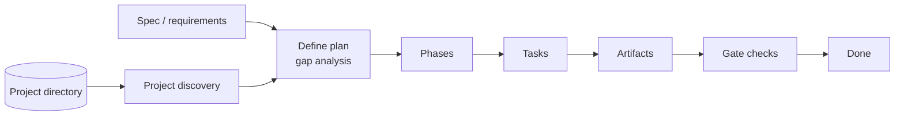
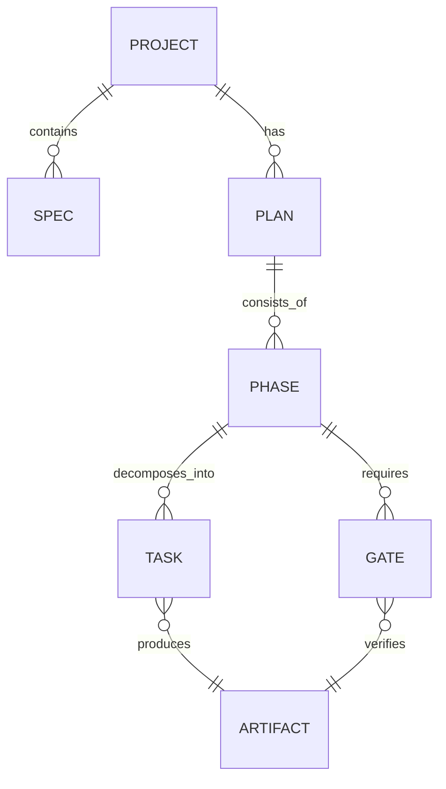

> **⚠️ SUPERSEDED** — This document has been absorbed into [agent-native-cli.md](file:///Users/gonzo/Code/gwrk/docs/reference/agent-native-cli.md) (§2, §3). Retained as primary source reference. The six design imperatives are now the authoritative framework in the unified document.

# gwrk Planning CLI and Project Model: Design Imperatives from the Conversation

## Executive summary

This conversation converged on a single architectural thesis: **gwrk is an operating system for work**, where the **CLI is the operating language** and the **project directory is the primary interface**. Planning is not an abstract exercise; it is a **gap analysis** between a **queryable spec** (“what should exist”) and a **discoverable project state** (“what exists now”). The output of planning is not “a plan” in the vague sense; it is a set of **phases**—bounded, verifiable units of progress—each with an explicit **gate** that determines done.

Three decisions emerged as design anchors:

- **WUD is a CLI consumer** (not a script runner). Agents should compose `gwrk …` commands with stable semantics and predictable contracts.
- **A project is a queryable directory.** Discovery (files, tests, specs, Git state) is first-class and drives planning.
- **Phases are planned output, and gates are verification.** A phase is “done” only when the gate passes.

To make this agent-operable (Why-nix / Why-text), the CLI must emit **compressed operational signals** the model can learn from repetition: **exit codes** and **durations**, consistently presented as something like `[exit:N | Xs]`. Exit status conventions (0 success, non-zero failure) are deeply embedded in Unix practice. citeturn0search14 The special meaning of **127** (“command not found”) is widely recognized in shells and is explicitly documented in Bash. citeturn3search4

The report below translates those insights into **design imperatives** for the gwrk planning CLI and project model, with explicit command-surface expectations, phase reasoning requirements, classification rules, and what remains unspecified.

## Chronological recap of key conversation insights

The conversation progressed in a deliberate tightening loop—from ambiguity to an almost algebraic operational definition.

It began with three clarifying questions:

- Is WUD a CLI consumer or a script runner?
- What is a “phase” across work types?
- Who defines phase “gates,” especially for non-code deliverables?

The first strong conclusion was that **WUD must be a CLI consumer**. The operational surface should be stable commands, not ad hoc scripts. That reframed everything else: if WUD is a CLI consumer, then “planning,” “phases,” and “gates” must be **expressible as CLI-queryable primitives** with explicit output and failure modes.

The second major turn was defining **planning as decomposition** (“define plan” breaks down a spec) but then sharpening it further: planning is not only decomposition—it is **gap analysis**. The gap analysis requires two inputs:

- A **spec** (requirements, stories, acceptance criteria)
- A **project** (the current state: files/code/tests/docs)

This immediately produced a key architectural insight: **the project itself must be discoverable**. Since a project is a directory, a large part of that discovery can be treated as “Unix-native”: listing files, inspecting structure, probing tests, reading spec docs, and checking Git state. The project becomes a **command-line interface in its own right** (via `gwrk project …`), not merely a passive repository.

From there, “phase” became definable: **phases are the output of planning**, and planning is driven by what exists vs. what the spec demands. A phase is complete when it yields a **reviewable artifact** and passes a **gate** (tests for code, rubric for writing, etc.). This also reframed the third question: gate authority becomes a property of a phase (and work type), not an external mystery.

Finally, the discussion returned to Why-nix / Why-text and made a pragmatic leap: **LLMs internalize repeated compact signals**. If every command yields (a) an exit code and (b) a duration, consistently surfaced, an agent learns to “feel” the environment: what is cheap to call, what is expensive, when to branch, and when to stop thrashing.

## Core principles that should govern the gwrk model

These principles are the conceptual bedrock. They are intentionally opinionated because agent-operable systems require **sharp invariants**.

**Discoverability over configuration.** The system should prefer asking “what is true in the directory right now?” over “what did we declare somewhere in config?” This matches both human ergonomics and agent reliability.

**CLI-as-operating-language.** WUD and other agents should not be handed arbitrary scripts. They should speak a small set of stable verbs (`define`, `project`, `tasks`, `implement`, `gate-check`) whose semantics do not drift per project.

**Project-as-queryable-directory.** The project is not an opaque blob; it is a state space that can be surfaced. This is an extension of classic Unix thinking: programs operate on standard inputs and files, and composition is achieved through predictable interfaces. POSIX explicitly defines pipelines as connecting one command’s standard output to the next command’s standard input, which is the conceptual model you’re borrowing and applying to planning itself. citeturn1search1

**Planning-as-gap-analysis.** Planning occurs at the boundary between intent and reality. The plan is a structured representation of the delta between spec and project state.

**Phases-as-planned-output.** A phase is not a vibe. A phase is **a bounded unit of work defined by planning** that produces a tangible artifact and has a named gate.

**Gates-as-verification.** A phase is only done when its verification passes. This is tightly aligned with Unix discipline: success is represented as an exit status of zero, and failures are non-zero. citeturn0search14

A useful way to visualize the pipeline that emerged in the conversation:



## Design imperatives for the command surface and operational signals

This section translates the Why-nix / Why-text ideas into concrete interface imperatives that matter to both humans and LLM agents.

### Command semantics must be stable, narrow, and composable

A gwrk subcommand should be one of:

- A **generator**: produces a canonical object (spec, plan, phase list) from project discovery and/or stdin
- A **query**: returns facts about the project (“what exists?”)
- A **verifier**: runs a gate and returns a pass/fail outcome
- A **mutator**: changes project state (implementation), but only inside an explicit task/phase context

This clarity prevents the agent from guessing whether a command is safe, destructive, expensive, or ambiguous.

### Help text must be deterministic, short, and treated as an interface

To be Why-text, help is not documentation; it is a **negotiation surface** between agent and tool.

Adopt the widely recognized convention that `--help` prints usage guidance and exits successfully, without performing the normal action. GNU explicitly specifies that `--help` should write brief docs to standard output and then exit successfully. citeturn0search11

That yields an important design rule: **help output is a “truthy” safe probe** the agent can call early to confirm command shape.

### Stdout/stderr contracts must be strict

To keep pipelines reliable, reserve streams:

- **stdout**: primary output (“the thing another command might consume”)
- **stderr**: diagnostics, warnings, and errors only

This aligns with POSIX utility documentation patterns that repeatedly specify: “The standard error shall be used only for diagnostic messages.” citeturn4search15turn4search6

This is not pedantry. It is what makes `gwrk … | gwrk …` safe. If your normal output leaks into stderr, downstream consumers break; if your diagnostics leak into stdout, downstream tools parse garbage.

A simple contract table:

| Stream | Contract in gwrk | Why it matters |
|---|---|---|
| stdout | Canonical result object (human text by default; JSON when requested) | Enables piping and machine consumption |
| stderr | Diagnostics, warnings, progress (if you emit progress) | Keeps stdout parseable and composable citeturn4search15turn4search6 |

### Exit codes must be discrete, with explicit meaning

Unix systems treat **zero as success** by convention, and shells/utilities interpret that convention broadly. citeturn0search14 Bash documents a specific convention: if a command is not found, the process exits **127**. citeturn3search4

Your conversation selected a deliberately minimal set:

| Exit code | Meaning in gwrk | Rationale |
|---:|---|---|
| 0 | Success | Matches standard Unix success convention citeturn0search14 |
| 1 | General error (any failure not classified as 127) | Keeps failure semantics simple; non-zero indicates failure citeturn0search14 |
| 127 | “Command not found” / unknown command path | Mirrors a shell-native meaning that agents already recognize citeturn3search4 |

One important caveat (do not ignore it, just control it): even POSIX-adjacent materials note that 127 is not universally guaranteed as “not found” for every possible utility environment; it is a convention, not a law. citeturn3search7 That means: in gwrk, **127 must be treated as an explicit, owned contract**, not an accidental emergent behavior.

### Duration signaling is an agent-facing affordance, not human decoration

The conversation’s key observation: repeated exposure to compact operational signals changes how an LLM allocates attention and calls.

Design imperative:

- Every command execution should return a **duration**.
- The interface should surface this duration in a standardized compact form (for both humans and agents), for example:  
  `… [exit:0 | 12ms]`

This is not a Unix standard; it’s a **Why-text extension** to help agents learn cost. It’s especially valuable because it produces “budget awareness” without an additional protocol.

A practical classification that was discussed:

| Duration | Agent interpretation |
|---|---|
| ~1–50ms | Cheap: safe for discovery probes |
| ~0.1–5s | Moderate: avoid repetition |
| 5s+ | Expensive: treat as gate-level or batch-level |

The goal is not precision. The goal is consistent *relative* signaling so the agent can adapt its behavior.

## Phase model, LLM reasoning requirements, and classification rules

### What a phase is, operationally

A software-phase definition emerged that generalizes:

A **phase** is a coherent unit of planned work that:

- is derived from spec + project discovery (gap analysis),
- produces one or more artifacts,
- has an explicit gate that verifies completeness,
- is bounded enough to be executed predictably.

That implies: phases are not imagined; they are **inferred**.

### What an LLM needs to reason about phases from inputs/outputs

To “reason its way to a phase,” an agent needs stable inputs and observable outputs:

**Inputs the agent must be able to obtain**

- Spec fragments: user stories, acceptance criteria, functional requirements
- Project state: files, structure, existing services/modules, tests, build/lint commands, Git status
- Policy constraints: what counts as “done” (gate definitions), naming conventions, repo layout conventions

**Outputs the agent must be able to produce**

- A proposed phase list, each with:
  - objective and scope boundaries
  - a task decomposition
  - expected artifact(s)
  - a gate definition that can be executed or reviewed
  - dependencies (explicit, minimal)

When these are explicit, an LLM can treat planning as transformation:

`(spec ∩ discovery) → delta → tasks → phase boundaries → gates`

### Classification rules: Greenfield vs Change vs Refactor

These classification labels arise from gap analysis, and they are useful because they constrain what “implementation” means.

A crisp classification table:

| Classification | Project-state signal | Spec-state signal | Typical action |
|---|---|---|---|
| Greenfield | No relevant files/modules/services can be identified | Requirement implies new capability | Generate new structure + implement |
| Change | Relevant component exists but lacks required behavior | Acceptance criteria unmet | Extend or modify existing code |
| Refactor | Behavior roughly exists but quality/shape violates constraints (testability, architecture, interfaces) | Spec adds non-functional constraints or current design blocks acceptance | Rework structure to enable correctness |
| No-op | Spec already satisfied and gate passes | Acceptance verified | Document or close |

This is intentionally conceptual. What remains unspecified (and should be treated as a deliberate future decision) is **how “relevant component exists” is detected**: naming heuristics, static analysis, dependency graphs, or explicit mapping metadata.

### Entity relationship model

This is the minimal conceptual model implied by the conversation:



The key thing to notice: **phase is not a sibling of plan**; it is a child of plan. That is the “phases-as-planned-output” invariant.

## Recommended CLI tree for planning and execution

This tree is a conceptual contract. It is intentionally small. It assumes the project directory is the default context (current working directory).

```text
gwrk
  help
  project
    status
    discover
    specs
    files
    services
    tests
    gates
  define
    spec
    plan
    phase
  tasks
    next
    list
    show
    done
  implement
  gate-check
```

### Command-surface imperatives for each branch

The goal is not to specify implementation details, but to make each command operable by an agent with predictable contracts.

A compact design table (conceptual I/O, not implementation):

| Command | Purpose | stdin expectation | stdout expectation | stderr expectation | Exit codes |
|---|---|---|---|---|---|
| `gwrk help` / `--help` | Discover interface | none | Help text | none | 0 citeturn0search11 |
| `gwrk project status` | Summarize project state | none | Human summary (or JSON) | diagnostics only | 0/1 |
| `gwrk project discover` | Structured discovery snapshot | none | Discovery object (JSON recommended) | diagnostics only | 0/1 |
| `gwrk define spec` | Produce or refine spec from context | optional prompt text (pipe) | Spec object | diagnostics only | 0/1 |
| `gwrk define plan` | Produce plan via gap analysis | optional spec object (pipe) | Plan object (includes phases) | diagnostics only | 0/1 |
| `gwrk tasks next` | Select next task to execute | optional plan/phase context (pipe) | Task object | diagnostics only | 0/1 |
| `gwrk implement` | Execute bounded work for current task | task object (pipe) or implicit context | Implementation summary + artifact refs | progress/diagnostics | 0/1 |
| `gwrk gate-check` | Run phase/task gate | gate ref (pipe) or implicit | Gate result object | diagnostics only | 0/1 |
| Unknown subcommand path | Signal “not found” | n/a | n/a | error text | 127 citeturn3search4 |

Two conventions above are anchored in widely used standards:

- `--help` behavior and where it prints is clearly codified in GNU interface standards. citeturn0search11turn0search15
- “stderr is for diagnostics” is restated across POSIX utility documentation. citeturn4search15turn4search6

### Pipe contracts and “Why-text” output modes

A Why-text CLI should be able to behave as both:

- **human-first**: readable summaries by default
- **agent-first**: JSON objects on demand (and safe for piping)

Design imperative: any command that can serve as a pipeline stage should support a machine-readable output mode (`--json` or `--format json`) and must keep it on stdout.

This directly leverages the POSIX pipeline model: stages connect stdout to stdin. citeturn1search1

### Help text is part of the contract

At minimum, every command’s help should specify:

- one-line purpose
- synopsis
- input expectations (implicit context vs stdin)
- output expectations (object type)
- exit codes (0/1/127)
- whether it mutates state

And `--help` should not run the normal function and should exit 0. citeturn0search11

### Operational signal format recommendation

The conversation’s pattern `[exit:N | Xs]` is best treated as a wrapper-level postlude emitted after command execution, not as part of the primary stdout payload (so you don’t corrupt JSON pipelines). That means:

- stdout remains pure payload
- stderr remains diagnostics
- the wrapper can emit the bracketed signal to stderr (or to a separate channel)

This preserves strict stream contracts while still making the agent cost-aware. The POSIX emphasis on stderr as diagnostic output supports emitting meta-signals there. citeturn4search15turn4search6

## Limitations, open questions, and prioritized next steps

### What remains unspecified (and should not be invented yet)

Several constraints were intentionally left open in the conversation. These are not flaws; they are the right “unknowns” to name explicitly:

- **Spec storage and format**: where specs live, how they are structured, and what schemas are mandatory vs optional.
- **Discovery methods**: how `gwrk project discover` maps requirements to code locations (heuristics vs configuration vs static analysis).
- **Phase boundary inference rules**: especially the “universal boundary” question across non-code domains.
- **Gate authority** outside software: who/what evaluates a writing rubric or research artifact, and how that evaluation is encoded.
- **State model**: whether plan/phase/task live as files in the repo, in a local cache, or as derived ephemeral structures.
- **Mutation safety**: how `gwrk implement` is constrained (workspace isolation, commit discipline, rollback).

The report deliberately avoids making those decisions for you; it only identifies them because agent-operability requires that eventually they be pinned down.

### Prioritized next steps and practical deliverables

These are the highest-leverage deliverables implied by the conversation and aligned with your “agent-native” direction.

**Produce a v2 agent-native CLI spec.** Make stdout/stderr, JSON modes, and exit codes contractual; define the `[exit:N | Xs]` wrapper behavior precisely (which stream, when, and how it avoids pipeline corruption). Anchor help behavior in the GNU `--help` contract. citeturn0search11turn0search15

**Add a machine-only mode.** A mode where stdout is *only* JSON objects; no prose; deterministic fields; stable ordering if possible. This is the single biggest step toward reliable composition.

**Define phase inference rules for software.** Even if heuristic at first, write down how user stories/acceptance criteria map to:
- candidate files / modules
- expected new files
- required tests
- commit boundaries

**Codify Greenfield/Change/Refactor detection.** Start with explicit rules (as above), then iterate as you learn what breaks.

**Publish a reference “planning pipeline” example.** A short canonical example that shows discovery → plan → tasks → implement → gate-check, with real outputs and the bracketed operational signals, so agents learn the pattern by repetition.

## Appendix with machine-readable schemas

Below are conceptual JSON schemas. They are meant to support **reasoning and interchange**, not implementation detail.

### Phase schema (conceptual)

```json
{
  "$schema": "https://json-schema.org/draft/2020-12/schema",
  "$id": "https://gwrk.dev/schemas/phase.schema.json",
  "title": "gwrk Phase",
  "type": "object",
  "required": ["id", "name", "objective", "inputs", "expected_outputs", "tasks", "gates"],
  "properties": {
    "id": { "type": "string", "description": "Stable identifier for referencing the phase." },
    "name": { "type": "string", "description": "Short human label." },
    "objective": { "type": "string", "description": "Single coherent goal the phase exists to accomplish." },
    "scope": {
      "type": "object",
      "description": "Boundaries that keep the phase self-contained.",
      "properties": {
        "in_scope": { "type": "array", "items": { "type": "string" } },
        "out_of_scope": { "type": "array", "items": { "type": "string" } }
      },
      "additionalProperties": false
    },
    "inputs": {
      "type": "object",
      "description": "Evidence used to derive the phase.",
      "required": ["spec_refs", "project_signals"],
      "properties": {
        "spec_refs": {
          "type": "array",
          "items": { "type": "string" },
          "description": "References to user stories / requirements / acceptance criteria."
        },
        "project_signals": {
          "type": "array",
          "items": { "type": "string" },
          "description": "Discovery cues (paths, components, tests, services, or gaps)."
        }
      },
      "additionalProperties": false
    },
    "classification_summary": {
      "type": "object",
      "description": "Aggregate view of work types within the phase (derived from tasks).",
      "properties": {
        "greenfield": { "type": "integer", "minimum": 0 },
        "change": { "type": "integer", "minimum": 0 },
        "refactor": { "type": "integer", "minimum": 0 },
        "noop": { "type": "integer", "minimum": 0 }
      },
      "additionalProperties": false
    },
    "expected_outputs": {
      "type": "array",
      "description": "Artifacts expected when the phase is complete (code, docs, etc.).",
      "items": {
        "type": "object",
        "required": ["kind", "ref"],
        "properties": {
          "kind": { "type": "string", "description": "e.g., file, commit, doc, dataset, build." },
          "ref": { "type": "string", "description": "Identifier/path/URI within the project context." }
        },
        "additionalProperties": false
      }
    },
    "tasks": {
      "type": "array",
      "description": "Decomposition of the phase into executable units.",
      "items": {
        "type": "object",
        "required": ["id", "title", "classification", "intent", "touch_points"],
        "properties": {
          "id": { "type": "string" },
          "title": { "type": "string" },
          "classification": {
            "type": "string",
            "enum": ["greenfield", "change", "refactor", "noop"]
          },
          "intent": { "type": "string", "description": "What this task changes or creates." },
          "touch_points": {
            "type": "array",
            "items": { "type": "string" },
            "description": "Expected files/modules/services likely to be affected."
          },
          "acceptance_notes": {
            "type": "array",
            "items": { "type": "string" },
            "description": "Task-level acceptance cues derived from spec."
          }
        },
        "additionalProperties": false
      }
    },
    "gates": {
      "type": "array",
      "description": "Verification requirements for phase completion.",
      "items": {
        "type": "object",
        "required": ["id", "type", "definition"],
        "properties": {
          "id": { "type": "string" },
          "type": {
            "type": "string",
            "description": "e.g., tests, lint, build, rubric_review."
          },
          "definition": {
            "type": "object",
            "description": "Executable or reviewable gate definition (kept abstract here).",
            "properties": {
              "command": { "type": "string", "description": "If executable, the CLI command to run." },
              "rubric_ref": { "type": "string", "description": "If review-based, reference to rubric or checklist." }
            },
            "additionalProperties": true
          }
        },
        "additionalProperties": false
      }
    },
    "dependencies": {
      "type": "array",
      "items": { "type": "string" },
      "description": "Other phase IDs that must complete first."
    }
  },
  "additionalProperties": false
}
```

### Command contract schema (conceptual)

```json
{
  "$schema": "https://json-schema.org/draft/2020-12/schema",
  "$id": "https://gwrk.dev/schemas/command.schema.json",
  "title": "gwrk Command Contract",
  "type": "object",
  "required": ["command", "purpose", "stdin", "stdout", "stderr", "exit_codes"],
  "properties": {
    "command": { "type": "string", "description": "Full command path, e.g., 'gwrk define plan'." },
    "purpose": { "type": "string" },
    "help": {
      "type": "object",
      "description": "Help contract: must be stable and deterministic.",
      "properties": {
        "prints_to": { "type": "string", "enum": ["stdout"] },
        "exits_with": { "type": "integer", "enum": [0] },
        "notes": { "type": "string" }
      },
      "additionalProperties": false
    },
    "stdin": {
      "type": "object",
      "properties": {
        "mode": { "type": "string", "enum": ["none", "optional", "required"] },
        "accepted_types": { "type": "array", "items": { "type": "string" } },
        "notes": { "type": "string" }
      },
      "additionalProperties": false
    },
    "stdout": {
      "type": "object",
      "properties": {
        "primary_payload": { "type": "string", "description": "What stdout represents in success cases." },
        "formats": {
          "type": "array",
          "items": { "type": "string", "enum": ["json"] }
        }
      },
      "additionalProperties": false
    },
    "stderr": {
      "type": "object",
      "properties": {
        "allowed_content": {
          "type": "array",
          "items": { "type": "string", "enum": ["diagnostics", "warnings", "progress", "meta"] }
        },
        "notes": { "type": "string" }
      },
      "additionalProperties": false
    },
    "exit_codes": {
      "type": "object",
      "required": ["0", "1", "127"],
      "properties": {
        "0": { "type": "string", "description": "Success." },
        "1": { "type": "string", "description": "General failure." },
        "127": { "type": "string", "description": "Command/subcommand path not found." }
      },
      "additionalProperties": false
    },
    "duration_signal": {
      "type": "object",
      "description": "Optional wrapper-level meta signal (Why-text extension).",
      "properties": {
        "format": { "type": "string", "description": "e.g., '[exit:N | Xs]'." },
        "emitted_on": { "type": "string", "enum": ["stderr"] },
        "notes": { "type": "string" }
      },
      "additionalProperties": false
    },
    "mutates_project_state": { "type": "boolean", "default": false }
  },
  "additionalProperties": false
}
```