# gwrk Architecture Visualizations & Observability Exploration

> Mermaid diagrams distilled from [GWRK-PRD-PRFAQ.md](file:///Users/gonzo/Code/gwrk/docs/GWRK-PRD-PRFAQ.md) (located at `docs/GWRK-PRD-PRFAQ.md`) + observability UX brainstorm.

---

## 1. The Full Agent Pipeline — Sequence Diagram

This is the end-to-end story: idea on your phone → merged PR.

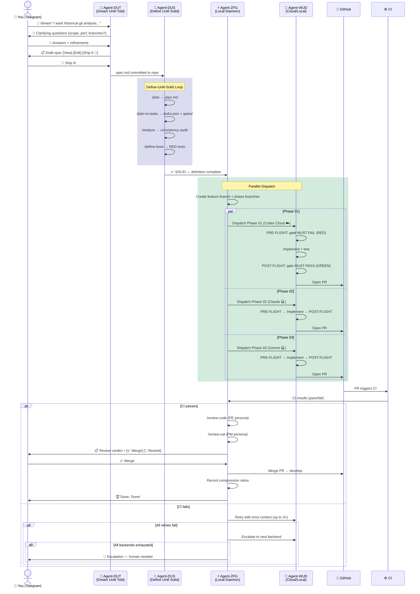

---

## 2. System Architecture — Top-Down

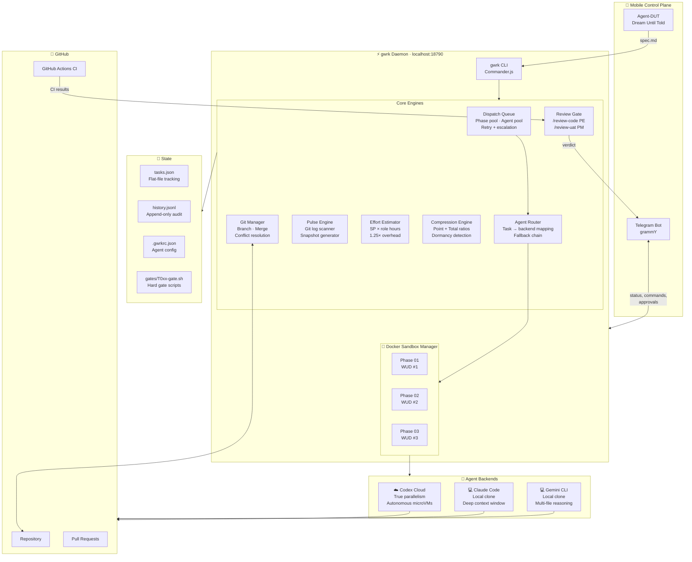

---

## 3. Done, Done! Protocol — Sequence

The retry-with-escalation flow that is core to gwrk's "maniacal commitment to completion."

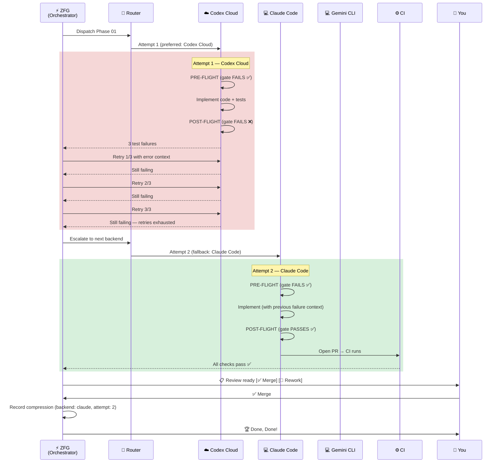

---

## 4. Git Branching — Flowchart

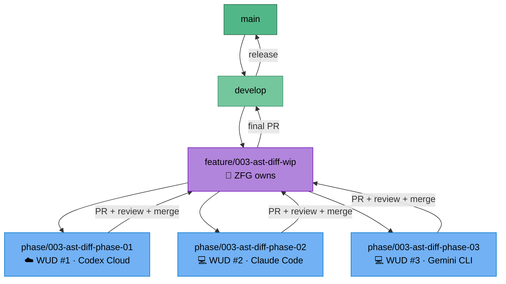

---

## 5. Build Phase Wave Strategy

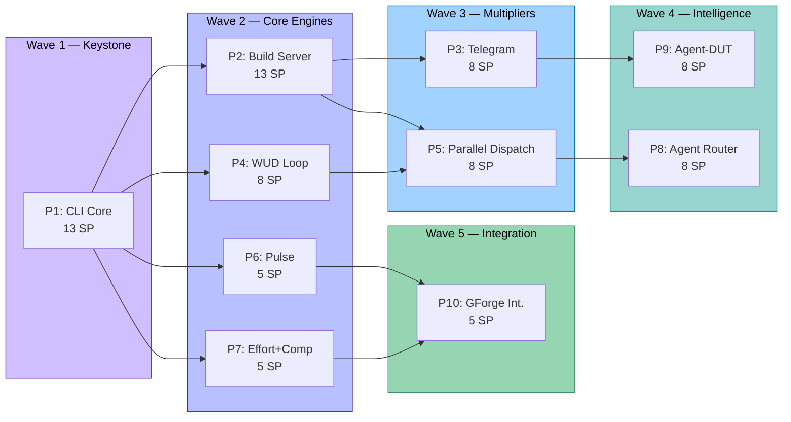

---

## 6. Observability: "What's Going On?" — The Noodling

You described the scenario perfectly: **the daemon runs silently, and you're curious what's happening.** The PRD is explicit that Pulse is NOT observability (§14). So there's actually a **gap** between what Pulse provides (productivity portrait) and what you want in this moment (real-time operational awareness).

### The Two Distinct Needs

| Need | What It Answers | PRD Coverage |
|---|---|---|
| **Pulse** (productivity) | "What have I shipped? What's in progress?" | ✅ Fully specced |
| **Ops View** (observability) | "What is the daemon *doing right now*?" | ❌ Gap |

### What the Ops View Would Show

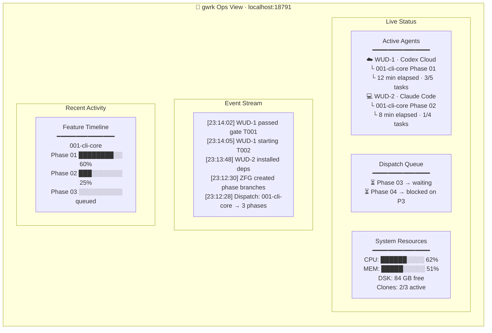

### Three Implementation Paths

#### Option A: Prometheus + Grafana + Loki (Full Observability Stack)

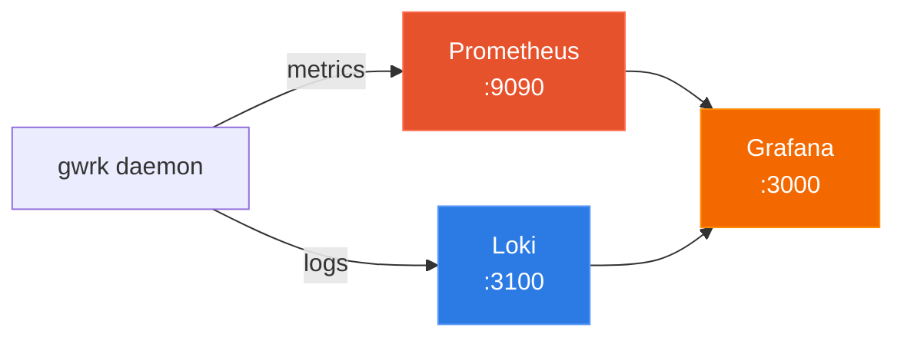

| Pro | Con |
|---|---|
| Battle-tested, industry-standard | Heavy — 3 separate services to run |
| Rich dashboards, alerting out of the box | Overkill for a single-user local daemon |
| Grafana panels are gorgeous | Config overhead: `prometheus.yml`, datasources |
| Grafana has built-in mobile-responsive views | Docker Compose bloat for a CLI tool |
| You already know the stack from GForge.ai | Three ports to tunnel for remote access |

**Verdict**: Too heavy for v1. But worth noting: Grafana *does* have mobile views, so if you ever go hosted/team, this becomes the right answer.

---

#### Option B: Lightweight Vite SPA + Tunnel (The "Glass Dashboard")

This is the answer. The daemon already runs Fastify. Embed a mobile-first SPA, add a tunnel, and you can watch your builds from a park bench.

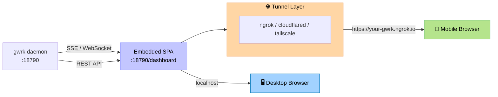

| Pro | Con |
|---|---|
| Zero external deps — bundled into the daemon | You're building a frontend |
| SSE from Fastify gives real-time streaming for free | Design work needed |
| Embedded at `:18790/dashboard` — one port, no CORS | — |
| Mobile-first responsive design = phone-native experience | — |
| `gwrk tunnel start` → instant remote access | — |
| Telegram handles commands; dashboard handles *watching* | — |
| Can serve Pulse + Ops + Compression in one view | — |

**Architecture Sketch**:

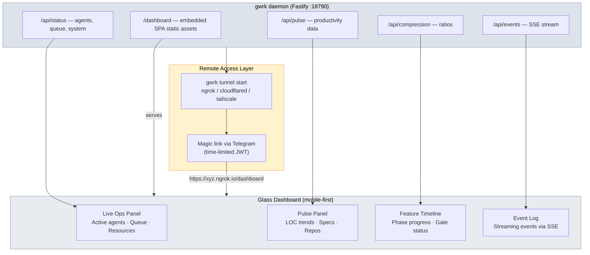

---

#### Option C: Terminal-Only (Ink TUI)

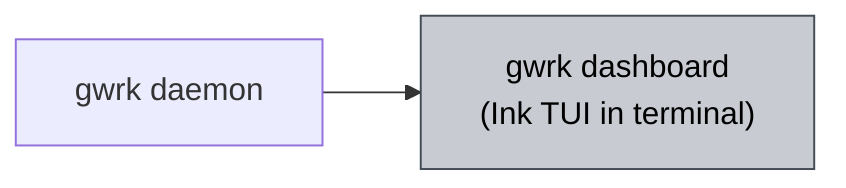

| Pro | Con |
|---|---|
| No browser, no port, no frontend build | Ink is explicitly deferred in the PRD (§4) |
| Fits the CLI-native ethos | Can't run while agents are using the terminal |
| Zero infrastructure | **No remote viewing at all** — you must be at your desk |

**Verdict**: Good for `gwrk status` quick checks. Dead end for the "on a walk" experience.

---

### Recommended: Option B — "Glass Dashboard" with Remote Access

#### The Insight

gwrk already has **Telegram for commands** (approve, reject, dispatch, status). What Telegram is *not* great at is the **ambient watching experience** — a live-updating view of agents working, gates firing, resources breathing. That's a visual, spatial experience that belongs in a browser.

The two channels complement each other perfectly:

| Channel | Best For | Interaction Model |
|---|---|---|
| **Telegram** | Commands, approvals, alerts, DUT ideation | Push (gwrk → you) + Pull (you → gwrk) |
| **Glass Dashboard** | Watching, monitoring, exploring, understanding | Pull (you open it and watch) |

#### Remote Access: Tunnel Options

The daemon runs on `localhost:18790`. To reach it from your phone on a walk, gwrk needs a tunnel. Three strong options:

| Tunnel | Command | URL You Get | Auth Model | Trade-off |
|---|---|---|---|---|
| **ngrok** | `ngrok http 18790` | `https://xyz.ngrok-free.app` | Token + optional OAuth | Easiest setup, free tier available, random URLs unless paid |
| **Cloudflare Tunnel** | `cloudflared tunnel run gwrk` | `https://gwrk.yourdomain.com` | Cloudflare Access (Zero Trust) | Stable URL with your domain, needs Cloudflare account |
| **Tailscale Funnel** | `tailscale funnel 18790` | `https://macbook.tail1234.ts.net` | Tailscale identity (WireGuard) | P2P encrypted, no third-party relay, already installed? |

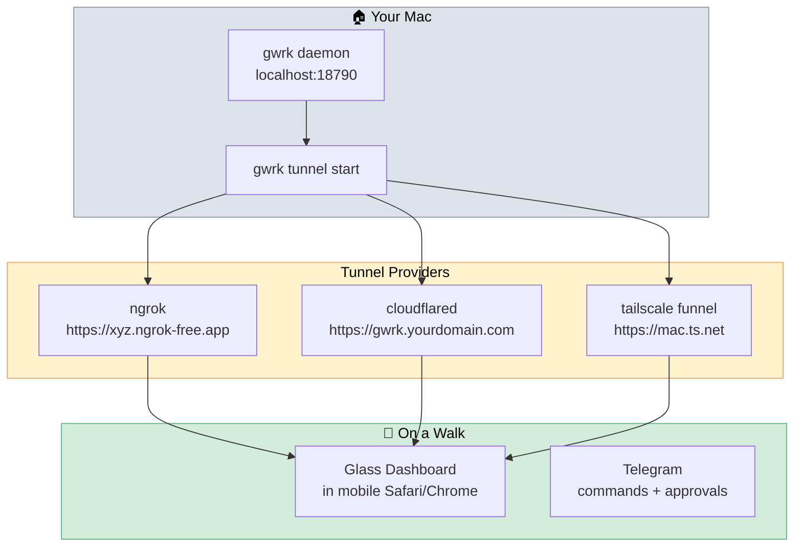

#### The Magic Link (Telegram Auth)

You don't want to scan QR codes or copy tokens when you're leaving the house. Since gwrk is already authenticated with Telegram (Phase 3), the authentication loop for the dashboard is trivial:

```bash
You (in Telegram): /dashboard
gwrk (in Telegram): 🌐 Here's your live dashboard: 
                    https://your-gwrk.ngrok.io/dashboard?token=temp_xyz123
```

**The Auth Flow**:
1. You text `/dashboard` to the gwrk bot.
2. The daemon generates a one-time, time-limited JWT.
3. The daemon replies with the tunnel URL + the token.
4. You tap the link. The SPA loads, consumes the token, stores it in memory or `sessionStorage`, and removes it from the URL.

If the token expires or you open a different browser, you just text `/dashboard` again. Zero friction, fully secure.

#### Security Model

The dashboard is personal. It's *your* machine, *your* data. But a public tunnel demands auth:

| Layer | Mechanism |
|---|---|
| **Transport** | HTTPS (all three tunnels provide TLS) |
| **Authentication** | Magic link via Telegram `/dashboard` (short-lived JWT) |
| **Session** | In-memory token used for SSE connection auth |
| **Rate limiting** | Fastify rate-limit plugin — 100 req/min per IP |
| **Read-only by default** | Dashboard is view-only; mutations go through Telegram |

The last point is key: **the dashboard is read-only**. You *watch* through the dashboard, you *act* through Telegram. This keeps the security surface tiny — even if someone got your tunnel URL, they can only see status, not dispatch agents.

#### Mobile-First Design Principles

The dashboard must be designed for a phone screen first:

| Principle | Implementation |
|---|---|
| **Touch targets** | Minimum 44px tap targets, generous spacing |
| **Viewport** | Standard responsive meta tag, no horizontal scroll |
| **Progressive disclosure** | Summary cards → tap to expand details |
| **SSE reconnect** | Auto-reconnect when phone wakes from sleep |
| **Dark mode** | Respect `prefers-color-scheme` — you're checking on a walk at night |
| **Pull-to-refresh** | For the non-streaming panels (Pulse, Compression) |
| **Offline indicator** | Clear banner when SSE connection drops |

---

### What This Means for the Build Plan

The Glass Dashboard + tunnel is a **new spec** — it doesn't fold neatly into P6 (Pulse) because Pulse is about *productivity data* while the dashboard is about *ops visibility + remote access*. Proposed placement:

| Spec Slot | Content | Dependencies |
|---|---|---|
| `011-glass-dashboard` | Embedded SPA, SSE endpoints, mobile-first UI, Pulse/Ops/Compression views | P2 (Build Server) |
| `012-tunnel` | `gwrk tunnel` command, provider abstraction, auth, QR code | P2 (Build Server), `011` |

Or collapse into one: `011-glass-dashboard` with the tunnel as Phase 2 of that spec.

---

## 7. "Global View" — Cross-Project Resource Monitor

The dashboard's Ops View naturally extends to a **global multi-project view** — the daemon already knows about multiple repos via Pulse.

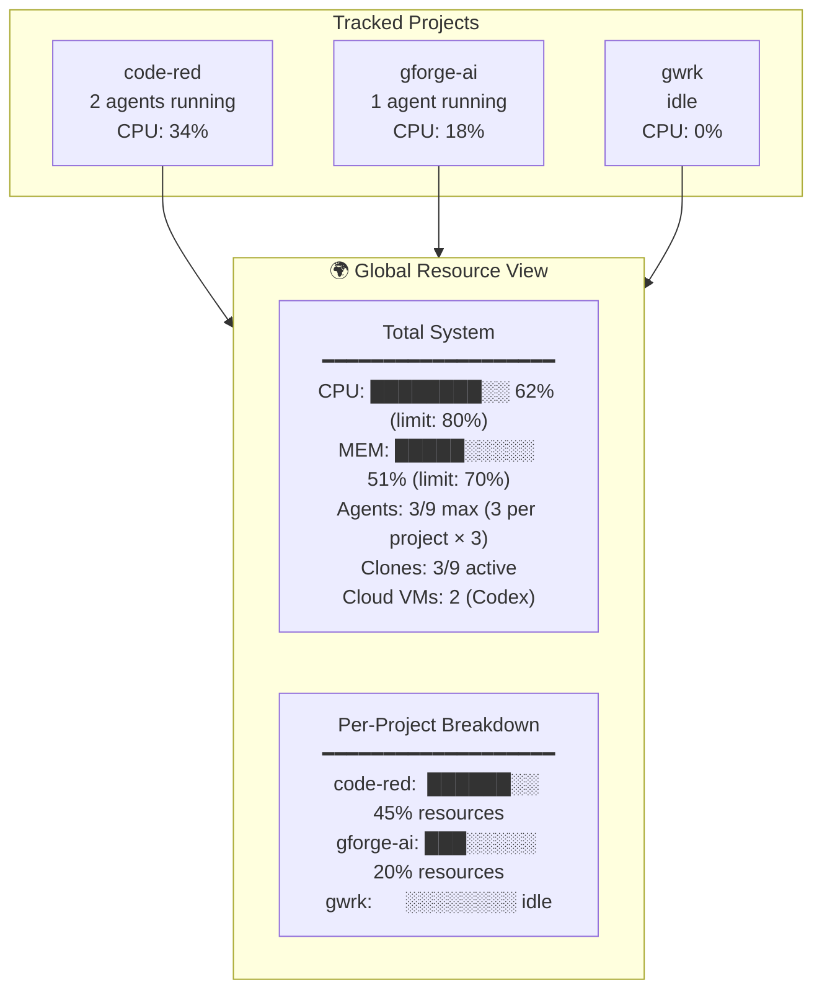

On your phone via the tunnel, this becomes the **"am I running hot?"** glance — one scroll tells you which projects have active agents, how much of your machine they're eating, and whether Codex Cloud is doing the heavy lifting so your laptop stays cool.
