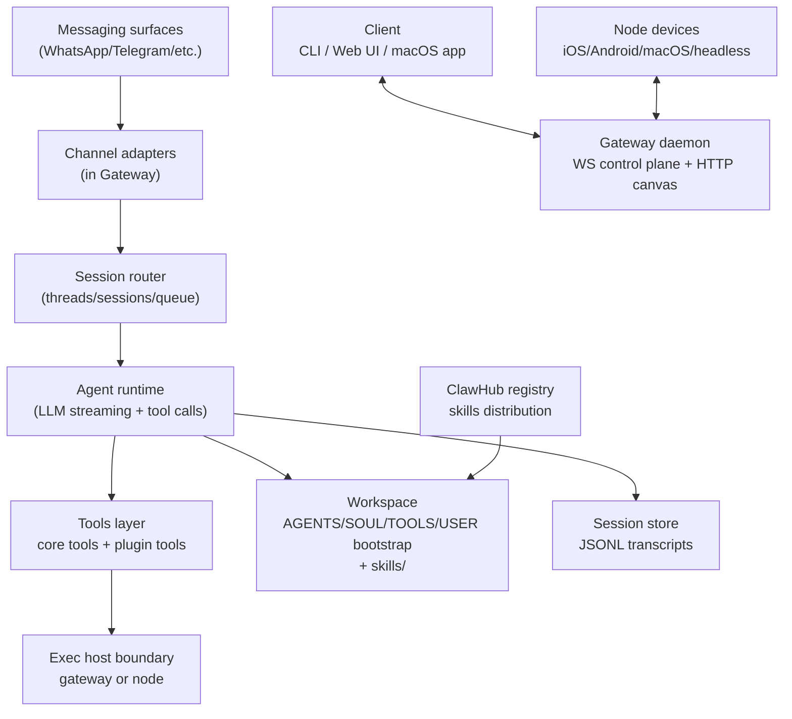

# OpenClaw Deep Research Report for gwrk Adaptation

## Executive summary

OpenClaw is a “local-first” personal AI assistant platform built around a single long-lived Gateway that owns messaging integrations, session state, and a typed WebSocket control plane used by clients (CLI, web UI, companion apps) and paired “nodes” (mobile/desktop/headless execution endpoints). citeturn30view0turn16view0turn30view1 Its architecture is intentionally opinionated: one Gateway per host, explicit pairing and device identity, and a strict, typed protocol with schema validation and code generation (TypeBox → JSON Schema → Swift models). citeturn30view0turn30view2turn4search5

Adoption has been unusually fast, with public reporting and the creator’s blog citing 100k+ GitHub stars within ~two months of the initial “WhatsApp Relay” prototype and a dramatic surge in attention. citeturn19search0turn19search4turn18view1 By mid‑March 2026 the GitHub repo shows ~313k stars and ~59.7k forks (as rendered on GitHub). citeturn11view1

China vs US adoption diverged sharply in *distribution channels, localization, and government posture*. In China, adoption was amplified through domestic community channels (notably WeChat groups), localized documentation/forks (including a entity["company","Gitee","code hosting platform china"] mirror), offline “install fest”–style events, and municipal “AI plus” incentives—even as central authorities and security bodies issued strong warnings and workplace restrictions. citeturn24view0turn25view0turn20news42turn20news41turn22view2turn23view0 In the US, visibility is strongest in public web exposure data: multiple scanning-based analyses show the US as the largest share of *internet-visible* deployments, with China commonly second and Singapore third, though these are *exposure* proxies rather than total usage. citeturn29view0turn29view1turn27view2

For gwrk (a personal productivity + development environment), the most transferable ideas are not “AI hype features,” but *operational primitives*: a workspace bootstrap contract (AGENTS/SOUL/TOOLS/USER files injected into sessions), typed control plane APIs, device pairing + capability advertisement, plugin/skill packaging discipline, and safety interlocks like exec approvals and least-privilege defaults. citeturn30view1turn30view0turn14search2turn14search4turn18view0 The recommendation section maps these into a concrete, prioritized implementation roadmap for gwrk without changing its nature.

## OpenClaw overview

OpenClaw’s stated purpose is a personal assistant that runs on your devices, speaks through your existing channels, and can take real actions (files, shell, browser, messaging) under operator control. citeturn16view0turn19search0turn18view1 The core product framing is explicit: “the Gateway is just the control plane — the product is the assistant.” citeturn16view0

The project’s history is unusually transparent. The creator’s blog describes it as a weekend hack that began as “WhatsApp Relay,” later announced as “OpenClaw” on 2026‑01‑29. citeturn19search0 The project’s vision doc also records a longer naming arc—Warelay → Clawdbot → Moltbot → OpenClaw—emphasizing fast iteration and a focus on secure defaults, stability, and onboarding reliability. citeturn18view1

Governance is best described as a benevolent-dictator model with a named lead maintainer, plus a broad maintainer bench owning subsystems (channels, agents, apps, security, docs). citeturn17view0 Key roles are documented publicly in CONTRIBUTING.md, naming **entity["people","Peter Steinberger","openclaw creator"]** as “Benevolent Dictator” and listing subsystem maintainers (e.g., Android, iOS, Telegram, memory, UI, security). citeturn17view0

OpenClaw is MIT-licensed and distributed as an npm package with a `openclaw` CLI binary entry point. citeturn10view0 The repository also indicates companion apps for macOS and iOS/Android “nodes,” and a broader ecosystem of plugins, skills, and a public skills registry (“ClawHub”). citeturn16view0turn13search6turn14search2turn30view0

Ecosystem surfaces to note (because they shape adoption and extension patterns):

OpenClaw supports a plugin system intended to keep core lean and optional capabilities out-of-tree, with npm-package distribution as the preferred path. citeturn18view1turn14search2

“Skills” are folder bundles (centered on `SKILL.md`) that teach tool usage patterns; they can be bundled, managed locally, or workspace-scoped with explicit precedence rules. citeturn30view1turn14search3

ClawHub is described as a public, versioned skill registry and discovery surface, with CLI workflows for install/update/publish and explicit moderation hooks (report/hide/ban). citeturn14search10

## Architecture and design

### Architectural center of gravity

OpenClaw’s architecture is anchored on a single long‑lived Gateway daemon per host that owns messaging-provider sessions and exposes a typed WebSocket control plane to clients and nodes. citeturn30view0 The Gateway’s default bind host is documented as `127.0.0.1:18789` (with remote access via VPN/Tailscale or SSH tunneling), and it also serves a “canvas” and A2UI host under the same port. citeturn30view0

The embedded “agent runtime” is derived from an upstream runtime (“pi-mono”), but key responsibilities—session management, discovery, and tool wiring—are explicitly OpenClaw-owned. citeturn30view1 This matters because it reveals a design choice: treat the LLM runtime as replaceable plumbing, while the “assistant product” is the orchestration substrate (sessions, tools, routing, onboarding, safety). citeturn30view1turn18view1

### Core components, modules, and data flows

At the conceptual level (as documented), the main components are:

Gateway daemon: maintains provider connections; exposes typed WS API; validates frames against JSON Schema; emits server-push events (agent/presence/health/cron/heartbeat). citeturn30view0  
Clients: macOS app, CLI, web admin; one WS connection per client; send requests and subscribe to events. citeturn30view0  
Nodes: macOS/iOS/Android/headless endpoints that connect as `role: node`, advertise capabilities, and expose commands (camera/screen/location/canvas). citeturn30view0turn3search18  
WebChat: a static UI using the same Gateway WS API for history/sends. citeturn30view0  
Agent workspace + bootstrap contract: workspace directory is the agent’s working directory; bootstrap files are injected into the first turn of a new session. citeturn30view1  
Sessions + transcripts: stored as JSONL under `~/.openclaw/agents/<agentId>/sessions/…`. citeturn30view1

The end-to-end data flow is therefore:

Inbound message (channel webhook/poll or local client) → Gateway normalizes + routes into a session model → agent runtime executes (LLM streaming + tool calls) → outputs written to session transcript + delivered back through the originating channel/client. citeturn30view0turn30view1turn16view0

A key streaming nuance is “steer while streaming”: queue mode `steer` will inject inbound messages mid-run after tool boundaries, skipping remaining tool calls from the current assistant message if a queued user message arrives. citeturn30view1 This is a pragmatic reliability design: treat tool calls as commit points, and give the operator a mechanism to interrupt/redirect runs without requiring a complete orchestrator rewrite. citeturn30view1

### Control plane API and protocol choices

OpenClaw uses a typed WS protocol with a mandatory handshake (`connect` must be the first frame), and a request/response/event frame shape. citeturn30view0 Requests are JSON objects of the form `{type:"req", id, method, params}` with `{type:"res", id, ok, payload|error}` responses; events use `{type:"event", event, payload, …}`. citeturn30view0

The protocol has several notable design decisions:

Schema validation at the Gateway boundary: inbound frames are validated against JSON Schema, reducing “undefined behavior” across client types. citeturn30view0

Idempotency keys for side-effecting methods: documented as required for methods like `send` and `agent`, with a short-lived dedupe cache to make retries safe. citeturn30view0

Strong device identity and pairing: device tokens are issued post-pairing, scoped to role + scopes; clients/nodes sign a nonce (`connect.challenge`) and can rotate/revoke tokens via privileged methods. citeturn30view2turn30view0 This is a “treat devices like identities” pattern rather than simple shared-secret auth. citeturn30view2

Protocol typing and codegen: TypeBox schemas define the protocol; JSON Schema is generated; Swift models are generated from that schema. citeturn30view0turn4search5turn4search2 This reduces drift across the multi-platform client surface (web UI, macOS/iOS apps, CLI). citeturn30view0

### Deployment, operations, and scalability posture

Operationally, OpenClaw favors an onboarding wizard that installs a background daemon (launchd/systemd user service), turning “set up an agent” into a day‑0 guided path. citeturn16view0turn12view2 The repo explicitly tracks multiple release channels (stable/beta/dev) with switch tooling (`openclaw update --channel …`). citeturn16view0

Remote access is designed to avoid public exposure: the docs prefer VPN/Tailscale and support SSH port-forwarding as an alternative, with the same handshake + auth token applying over tunnels. citeturn30view0 This interacts directly with public security incidents: multiple scanning reports observed large-scale exposure of control panels on the public internet, often traceable to default binding or unsafe deployment templates. citeturn27view2turn29view0turn21view1

Scalability is “personal-automation scale,” not web-service scale. The invariants emphasize one Gateway per host and non-replayed events (clients must refresh on gaps). citeturn13search7turn30view0 That said, OpenClaw does support multi-agent routing and presence as first-class concepts in the documentation set, implying that “scale” is expressed more as *concurrency and delegation within a personal stack* than as horizontal sharding. citeturn3search15turn12view0

### Security model and safety interlocks

OpenClaw’s project docs frame security as “strong defaults without killing capability,” with explicit knobs for trusted high-power workflows. citeturn18view1turn18view0 Several concrete mechanisms stand out:

Default DM trust controls on messaging channels: unknown senders receive pairing codes; processing is blocked until explicit approval, and `openclaw doctor` surfaces risky DM policies. citeturn16view0turn12view2

Gateway pairing and device auth: device identity, nonce signing, token scoping, and explicit pairing approvals form the baseline “operator boundary.” citeturn30view2turn30view0

Exec approvals: a local “safety interlock” on execution hosts (gateway host or node host), stored in `~/.openclaw/exec-approvals.json`, with explicit `deny/allowlist/full` modes plus “ask on miss” prompting and best-effort binding to a concrete file operand to prevent drift. citeturn14search4 This is a meaningful pattern: treat execution as the sharp edge, and require policy + allowlist + optional human approval to align before running. citeturn14search4

Plugin supply-chain guardrails: plugin docs describe path containment checks (extensions must remain inside the plugin directory after symlink resolution) and installing plugin dependencies with `npm install --ignore-scripts` to avoid lifecycle-script execution. citeturn14search2

Formal-ish security process: SECURITY.md sets a strict bar for vulnerability reports (reproduction, impact tied to trust boundaries, exact file/function/line ranges), explicitly deprioritizing “prompt-injection-only chains without a boundary bypass.” citeturn18view0

Threat modeling: the repo includes an ATLAS-based threat model atlas that scopes OpenClaw components (runtime, gateway, channels, ClawHub marketplace) and explicitly uses MITRE ATLAS methodology. citeturn14search1

OpenClaw’s design therefore pairs “power” with layered operator controls, but real-world scanning and official advisories show that unsafe deployments (exposure, weak auth, malicious skills) can be systemic when defaults are copied at scale. citeturn21view1turn27view2turn23view0

### Component relationship diagram

The diagram below summarizes the main runtime relationships described in the Gateway Architecture and Agent Runtime docs. citeturn30view0turn30view1



## Adoption and market analysis

### Adoption metrics and what they actually measure

OpenClaw’s “adoption” is measurable in at least three distinct ways, each with different bias:

Repository attention: GitHub stars/forks/commits are a strong proxy for developer mindshare. The GitHub repository UI (as rendered) shows ~313k stars, ~59.7k forks, and ~19k commits by mid‑March 2026. citeturn11view1turn11view2 The project’s npm package metadata shows a time-stamped semantic-date versioning scheme (e.g., 2026.3.14) and a Node engine floor (>=22.16.0), indicating an aggressive “ship daily” posture. citeturn10view0turn10view1

Website/attention spikes: the creator’s announcement blog cites 2 million visitors in a single week around rebranding, which aligns with press coverage of viral growth. citeturn19search0turn19search4

Internet-visible deployments: scanning reports count public control panels or internet-exposed instances. This is not the same as total usage (many deployments are local or tunneled), but it is highly relevant for adoption-by-operators who deploy on cloud/VPS. For example, entity["company","Censys","internet scanning company"] reported 21,639 exposed instances by 2026‑01‑31 and notes many operators used protective tunneling (e.g., Cloudflare Tunnel), which reduces visibility. citeturn29view0

### Adoption timeline


Milestone points in the chart are deliberately conservative and sourced as “reported” rather than asserted as exact counts: the creator’s 2026‑01‑29 blog announcement cites 100k+ stars; press coverage in February cites ~145k; the GitHub repo page shows ~313k stars by 2026‑03‑14. citeturn19search0turn19search12turn11view1

A parallel “security timeline” is critical to understand adoption outcomes:

Chinese state-connected bodies issued risk warnings and deployment guidance in March 2026 focused on over-permissioning, internet exposure, plugin/skills poisoning, and the need for isolation, auditing, and human confirmation on high-risk operations. citeturn22view2turn23view0turn21view2

Multiple security scanning analyses tracked tens of thousands of exposed control panels across dozens of countries; exposure counts changed rapidly over days as the tool spread. citeturn27view2turn29view0

### China vs US adoption dynamics

#### Distribution channels and community coordination

In China, community coordination emphasizes domestic IM platforms and offline onboarding. The “OpenClaw CN” community site explicitly describes WeChat group throttling (limited QR releases) and prioritizes building connectors to Chinese enterprise messaging (Feishu and WeCom are called out). citeturn24view0 A Chinese-language community portal frames OpenClaw as “真正能做事的 AI” and positions it as a cross-platform assistant for common Chinese chat apps (including DingTalk/WeCom/QQ), with installation and documentation as first-class front doors. citeturn24view1

A particularly telling China-specific adoption artifact is the “OpenClaw China tour / AI install fest” model: entity["organization","InfoQ","tech media community china"] describes a nationwide “AI Install Fest” concept (“让每个人 30 分钟跑通自己的 AI”), with volunteer install stations, live demos, project lightning talks, and Feishu-based coordination, explicitly modeled on historical Linux install fests. citeturn25view0 This is a community playbook optimized for *rapid mass onboarding*, not just developer-to-developer diffusion. citeturn25view0

In the US (and broadly English-speaking OSS space), the gravitational center is the GitHub/Discord/X loop described in the official Showcase (“share in #showcase on Discord or tag on X”), which is a classic open-source amplification path. citeturn12view0turn17view0 This asymmetry helps explain why China leaned harder on WeChat-based community funnels and offline events, while the US leaned on default OSS channels. citeturn24view0turn12view0turn17view0

#### Localization and “fork economics”

China shows unusually prominent localization initiative signals:

A dedicated Gitee mirror/fork (“OpenClaw‑CN/openclaw‑cn”) exists, reflecting both accessibility constraints and the practical need for Chinese-language UX (branches named for translating wizard/dashboard). citeturn24view2

This complements broader Chinese-language documentation and local-channel positioning. citeturn24view1turn24view0

The US side’s “localization” pressure is different: it tends to be provider-model compatibility and enterprise hardening rather than language/hosting access. That difference shows up in the OpenClaw maintainer list, which includes roles assigned to “Chinese model APIs, cloud, pi,” implying first-class attention to China-oriented model/provider integration inside core governance rather than as an afterthought. citeturn17view0

#### Regulatory and institutional posture

China’s posture is characterized by simultaneous promotion and restriction:

Reuters reported local governments in tech/manufacturing hubs promoting OpenClaw adoption with subsidies and ecosystem building, describing “one-person companies” as a key narrative. citeturn20news42

At the same time, state-connected security bodies issued detailed guidance: CCTV’s write-up of MIIT/NVDB recommendations includes “six do / six don’t” style advice emphasizing official versions, minimizing internet exposure, least privilege, careful skill usage, and human review for high-risk operations. citeturn22view2

CNCERT’s public risk notice highlights prompt injection, misoperation, skills poisoning, and known vulnerabilities, recommending isolation, credential management, audit logging, and strict plugin provenance controls. citeturn23view0

Reuters also reported that Chinese government agencies and state-owned enterprises warned staff against installing OpenClaw on office (and in some cases personal) devices due to security concerns, even while local initiatives continued. citeturn20news41

In contrast, the US market dynamic (as visible in sources here) is less about central government directives and more about ecosystem-driven governance: scanning reports show the US as the largest share of internet-visible deployments, which creates a strong incentive for enterprise security tooling, hardening guides, and “shadow IT” narratives. citeturn29view0turn29view1

#### Enterprise vs individual adoption signals

China’s adoption story is unusually institutional and bottom-up simultaneously (consumer install queues + municipal training sessions + cloud providers offering one-click deployment). citeturn21view2turn23view0turn20news41

US adoption signals, in contrast, skew toward developer/self-hosting infrastructure patterns. Censys explicitly frames exposure as the result of “open” interpretations (placing instances on the public internet) while noting many others use protective tunnels. citeturn29view0 This aligns with the OpenClaw docs strongly preferring tunneled access (VPN/Tailscale/SSH) and localhost binding as the intended deployment stance. citeturn30view0turn16view0

### Market share proxy chart

Because precise “users by country” metrics are not publicly authoritative, the chart below uses a *proxy*: share of identified internet-exposed instances attributed to China in one major scanning-based report, which states “37% of instances in China.” citeturn27view2


This proxy is directionally useful for “where public deployments cluster,” but it should not be mistaken for total usage: Chinese official warnings also emphasize that many deployments exist and that domestic cloud platforms offered one‑click deployment, which can include non-public instances. citeturn23view0turn21view2

## Codebase and engineering practices

### Repository structure and packaging

The npm package defines `name: "openclaw"`, `license: "MIT"`, a `bin` entry `openclaw: "openclaw.mjs"`, and includes docs, extensions, and skills in published files—signaling that “docs + skills + extensions” are treated as part of the distributable product, not just repository artifacts. citeturn10view0 The project enforces modern runtime floors (`node >= 22.16.0`) and pins the workspace via `packageManager: pnpm@10.23.0`, suggesting the maintainers optimize for a controlled toolchain rather than broad backward compatibility. citeturn10view1

The README describes multiple release channels (stable/beta/dev) and a CLI-driven upgrade mechanism, reinforcing the “fast ship, controlled channels” approach. citeturn16view0 GitHub releases show frequent patch activity and explicit handling of release/tag immutability constraints (e.g., `v2026.3.13-1` recovery release). citeturn14search9

### Gateway implementation patterns

The Gateway exposes a broad RPC surface divided into “server methods” modules; the aggregator file imports handler sets for `agent`, `agents`, `browser`, `channels`, `config`, `connect`, `cron`, `devices`, `exec-approvals`, `nodes`, `sessions`, `skills`, `tools-catalog`, `tts`, `update`, `usage`, `web`, and more. citeturn4search19 This is a recognizable pattern:

A single control-plane API surface area, organized by method namespaces, with central registration. citeturn4search19turn30view0

The Gateway architecture doc confirms it validates inbound frames against JSON Schema and emits typed events for state changes and runtime operation. citeturn30view0

A direct implication for maintainability is that adding capabilities tends to be “add a method namespace + schemas + permission scopes,” not “wire a new microservice.” That lowers friction for community contributions, but it increases the importance of disciplined API organization and schema governance. citeturn30view0turn17view0

### Protocol typing, schemas, and code generation

OpenClaw’s protocol approach is unusually rigorous for a viral OSS agent:

Docs state: TypeBox schemas define the protocol; JSON Schema is generated; Swift models are generated from the JSON Schema. citeturn30view0

The repository contains TypeBox schema modules in the Gateway protocol area (evidenced by imports of `@sinclair/typebox` and schema composition). citeturn4search2turn4search11

The package scripts include explicit protocol generation checks (`protocol:gen`, `protocol:gen:swift`, `protocol:check`) and enforce that generated artifacts match the repo state via `git diff --exit-code …`. citeturn10view0

For gwrk-relevant transfer: this is a strong example of “make cross-language clients boring by making the protocol authoritative and generated.” citeturn30view0turn10view0

### Skills and plugins as “product surface,” not afterthought

Skills have a well-defined load order (bundled → managed `~/.openclaw/skills` → workspace `<workspace>/skills`, with workspace taking precedence), and the docs specify that OpenClaw can gate skill loading by env/config and inject per-skill environment variables only for the duration of an agent run. citeturn14search3turn5search0turn30view1 This reflects a deliberate containment choice: secrets exposure for skills is scoped to runs, not permanently exported as global shell state. citeturn5search0

Plugins are “small code modules that extend OpenClaw with extra features (commands, tools, and Gateway RPC)” and the docs embed multiple supply-chain controls (path containment, ignore-scripts install). citeturn14search2turn4search7 The vision doc also sets a high bar for adding optional plugins to core and encourages plugin authors to host/maintain in their own repos. citeturn18view1

ClawHub’s docs frame it as a versioned store with discovery and moderation primitives (report/hide/delete/ban), which becomes essential once an extension ecosystem becomes a supply-chain target. citeturn14search10 Chinese official warnings explicitly call out skills/plugin poisoning as a major risk, reinforcing that the ecosystem surface is a primary security boundary in practice. citeturn23view0turn22view2

### Testing, CI/CD, and engineering hygiene

The repository uses entity["organization","Vitest","javascript test framework"] with multiple configs (unit, gateway, live, extensions) and a “test:all” script that composes lint, build, unit, e2e, live, and docker test suites. citeturn10view0turn5search1turn5search8 This is a notable maturity marker for a fast-moving project: “dockerized e2e smoke tests” are first-class scripts, not an aspirational roadmap. citeturn10view0turn8view4

The workflows directory includes multiple CI workflows (CI, CodeQL, install smoke, docker release, npm release, sandbox smoke, stale/labeler automation), indicating a multi-axis automated pipeline rather than a single monolithic CI job. citeturn7view0

Linting and hygiene include type-aware lint (`oxlint --type-aware`), markdown lint, Swift lint, and a set of bespoke lint scripts that enforce architectural boundaries (e.g., checks around plugin SDK imports, webhook auth ordering, UI window-open restrictions). citeturn9view3turn10view0

## Community and governance

### Governance and role ownership

OpenClaw documents its governance and subsystem ownership unusually explicitly. CONTRIBUTING.md names a benevolent dictator and lists maintainers assigned to domains (Discord subsystem + moderation; memory; Telegram; Android; iOS; security; docs; JS infra; web UI; multi-agents; CLI). citeturn17view0 This is a high-signal practice: contributors know who owns what, which reduces “orphan subsystem” risk and speeds review routing. citeturn17view0

The same doc also clarifies that community moderation is itself a maintained subsystem (“all community moderation”). citeturn17view0 That matters for gwrk if you anticipate extensions or shared configs: moderation isn’t optional once “plugins/skills” become a distribution surface. citeturn14search10turn23view0

### Contribution workflow and quality gates

The contribution rules emphasize “one PR = one issue/topic,” a soft cap on PR size (~5,000 lines), and explicitly require local testing (`pnpm build && pnpm check && pnpm test`) before PR submission. citeturn18view1turn17view0turn10view0 There is also an explicit push toward AI-assisted review standards (“if you have access to Codex, run codex review …”), which signals the project treats AI tooling as part of its engineering workflow rather than an external novelty. citeturn17view0

Security reporting is handled with a strict triage gate, rejecting low-signal scanner claims and forcing reports to connect to documented trust boundaries. citeturn18view0 This is a governance response to the realities of viral OSS: attention invites both contributors and noise. citeturn18view0turn19search4

### Documentation and onboarding as adoption engines

The docs are structured around “day‑0 smoothness”: onboarding flows (macOS and CLI), a workspace bootstrap ritual, and clear configuration examples. citeturn12view2turn30view1turn3search22 This is not cosmetic—China’s offline install-fest model explicitly frames onboarding friction as the barrier to adoption and organizes events around overcoming it quickly. citeturn25view0

The Showcase page functions as a social proof flywheel, linking community projects and encouraging submissions via Discord/X. citeturn12view0 This is an example of “documentation that markets,” but with technical authenticity (links to repos, skill bundles, workflows). citeturn12view0turn14search15

### Monetization and institutionalization

The repository README displays named sponsors and indicates subscription integrations (OAuth) with providers. citeturn16view0 Reuters reported that OpenClaw’s founder joined OpenAI and that the project would transition into a foundation with continued support from OpenAI—an explicit institutionalization step. citeturn19search4

In China, monetization appears more grassroots and service-economy driven (installation/uninstallation services) and policy-driven (subsidies), while also intersecting with heightened security scrutiny and official risk notices. citeturn20news42turn20news41turn23view0

## Recommendations for gwrk

### Assumptions and interpretation boundaries

Because gwrk’s exact stack is unspecified, I assume it is a local-first personal productivity + development environment that will likely include:

A durable workspace on disk (projects, notes, logs, configs)

An automation surface (CLI commands, scripts, background jobs)

An “assistant” interaction loop (chat-like or command-like)

Optional UIs (TUI/web/desktop) and remote access to other machines/devices

If gwrk is “CLI-only,” the recommendations below still apply; where a UI or remote nodes are mentioned, I provide alternatives that preserve a CLI-first nature.

### Prioritized adaptations from OpenClaw

#### Highest priority adaptations

Workspace bootstrap contract (AGENTS/SOUL/TOOLS/USER equivalents)

What to adapt: OpenClaw injects user-editable bootstrap files into the first turn of new sessions, with trimming, missing-file markers, and a one-time ritual file. citeturn30view1

Why it transfers: For a productivity/dev environment, “who am I, how do I work, what are my conventions” is not a prompt—it’s a durable contract. This pattern makes personalization explicit, reviewable, and versionable (git). citeturn3search13turn30view1

Implementation steps for gwrk:
Define a `gwrk/workspace/` layout with 4–6 canonical files (e.g., `USER.md`, `CONVENTIONS.md`, `TOOLS.md`, `PROJECTS.md`, optional `BOOTSTRAP.md`).
On session start (or command invocation), load and inject summaries + hashes; keep full content locally available for “read more” tooling.
Add a “skipBootstrap” config for pre-seeded workspaces, mirroring OpenClaw’s `agent.skipBootstrap`. citeturn30view1

Risks:
Context bloat if files become verbose; mitigate with OpenClaw’s “trim + truncate with marker” design. citeturn30view1
Users may store secrets in bootstrap files; mitigate with explicit “do not store secrets” guidance and optional secret scanning hooks (OpenClaw uses secret hygiene tooling in repo). citeturn16view0turn18view0

Estimated effort: Medium (core logic + ergonomics).

Typed control plane API (even if single-process)

What to adapt: OpenClaw’s typed WS protocol with schema validation, idempotency keys, and codegen. citeturn30view0turn30view2turn10view0

Why it transfers: gwrk will likely grow multiple surfaces (CLI, background daemon, editor integration). A typed protocol prevents “feature drift” between clients and reduces regression risk. citeturn30view0turn4search2turn10view0

Implementation steps for gwrk:
Define an RPC schema registry (TypeScript TypeBox + JSON schema, or protobuf if you prefer) and generate client bindings.
Make every side-effecting call idempotent by design (OpenClaw requires idempotency keys for retry-safe operations). citeturn30view0
Even if you start without WS, design as a transport-agnostic request/response/event contract.

Risks:
Upfront ceremony; mitigate by starting with a small method surface (health/status/run/logs) and growing gradually.

Estimated effort: Medium–High depending on existing stack.

Execution safety interlocks (exec approvals pattern)

What to adapt: OpenClaw’s exec approvals: local policy file, allowlist patterns, “ask on miss,” and binding execution context (argv/cwd/env + file operand binding). citeturn14search4turn22view2turn23view0

Why it transfers: gwrk is a dev environment; executing commands is unavoidable. The interlock pattern is one of OpenClaw’s strongest transferable safety ideas because it’s local, auditable, and doesn’t depend on “LLM behaving.” citeturn14search4turn19academia38

Implementation steps for gwrk:
Introduce an approvals file (JSON or TOML) with modes: deny / allowlist / full and prompting policy.
Implement “approval binding” to prevent TOCTOU drift (OpenClaw binds a concrete file operand when possible and denies if it changes). citeturn14search4
Expose CLI commands to inspect/edit approvals and view audit logs.

Risks:
UX friction; mitigate with good defaults (deny-by-default for destructive operations, allowlist common read-only tooling).
False confidence if “full” mode exists; mitigate with loud warnings and explicit “break-glass” semantics (OpenClaw uses “dangerouslyDisable…” naming for similar knobs). citeturn30view2

Estimated effort: Medium.

#### Secondary adaptations

Device pairing + capability advertisement for remote machines

What to adapt: OpenClaw’s pairing model: devices identified by keypair fingerprint, nonce signing, token issuance scoped to role + scopes; nodes advertise commands/capabilities. citeturn30view2turn30view0turn3search18

Why it transfers: gwrk likely touches multiple machines (laptop, dev box, CI runner). Pairing provides a principled way to add remote execution without immediately inventing multi-user auth. citeturn30view0turn30view2

Implementation steps:
Add a “node agent” that connects to the gwrk daemon and publishes a capability map (filesystem read, git ops, build/test, browser automation).
Require explicit pairing approval for new nodes; support token rotation.

Risks:
Expands attack surface; mitigate by adopting OpenClaw’s remote-access guidance (VPN/Tailscale/SSH tunnel) and by default binding to localhost. citeturn30view0turn27view2

Estimated effort: High.

Extension packaging discipline and marketplace lessons

What to adapt: OpenClaw’s separation: core stays lean; optional capability ships as plugins; skills are versioned bundles; install-time guardrails (`--ignore-scripts`, path containment). citeturn18view1turn14search2turn14search10

Why it transfers: gwrk will attract “recipes, automations, integrations.” OpenClaw’s ecosystem shows that marketplaces become supply-chain targets quickly, and official advisories explicitly warn about malicious skills. citeturn23view0turn22view2turn21view1

Implementation steps:
If you create a registry, start with “read-only bundles” (text + config) before allowing executable code.
Enforce provenance controls: signatures, review flows, or curated lists, especially for anything that runs commands.
Copy the “install without lifecycle scripts” stance for third-party packages by default. citeturn14search2

Risks:
Overbuilding prematurely; mitigate by starting with a private/local registry and a “curated list” model (OpenClaw’s Showcase is a low-friction version of this). citeturn12view0

Estimated effort: Medium–High depending on scope.

### Comparison table: OpenClaw → gwrk adaptation map

| OpenClaw feature / practice | Evidence in OpenClaw | Potential gwrk adaptation | Pros | Cons / risks | Priority |
|---|---|---|---|---|---|
| Workspace bootstrap files injected into sessions | Agent Runtime doc defines `AGENTS.md`, `SOUL.md`, `TOOLS.md`, `USER.md`, `BOOTSTRAP.md` and injection behavior. citeturn30view1 | Define a canonical “gwrk workspace contract” + automatic injection/summarization into runs | Personalization becomes explicit, reviewable, git-friendly | Context bloat if unmanaged; user may leak secrets into files | P0 |
| Typed WS/RPC control plane with schema validation | Gateway Architecture + Protocol docs (typed WS API, JSON Schema validation, req/res/events). citeturn30view0turn30view2 | Define a typed RPC layer (even if local IPC initially) with generated clients | Prevents client drift; makes automation reliable | More upfront engineering ceremony | P0 |
| Idempotency keys for side-effecting actions | Gateway Architecture requires idempotency keys for `send`/`agent` retries. citeturn30view0 | Require idempotency for actions like “apply patch,” “create branch,” “send notification” | Safe retries; fewer “double-commit” accidents | Needs thoughtful keying strategy | P0 |
| Exec approvals allowlist + ask-on-miss | Exec approvals doc: interlock, local JSON policy, allowlist patterns, binding semantics. citeturn14search4 | Approvals file + UI/CLI prompts before destructive commands | Real “seatbelt” for automation; auditable | UX friction; risk of users flipping to “full” | P0 |
| Device identity + pairing tokens | Gateway protocol: nonce signing + device tokens + rotation/revocation. citeturn30view2 | Pair remote machines/devices as “nodes” with scoped tokens | Clean path to multi-machine workflows | Increased attack surface; more ops complexity | P1 |
| Plugins with supply-chain guardrails | Plugin docs: path containment and `npm install --ignore-scripts`. citeturn14search2 | Plugin loader that forbids install scripts by default, enforces sandboxed paths | Reduces common extension risk | Limits some packages; requires clearer docs for plugin authors | P1 |
| “Showcase” as adoption flywheel | Showcase page encourages sharing; lists real projects. citeturn12view0 | Build a lightweight gwrk gallery of configs/workflows | Drives community contributions without a full marketplace | Needs moderation; can become noisy | P1 |
| Explicit governance + subsystem owners | CONTRIBUTING lists maintainers with domain ownership. citeturn17view0 | Predefine ownership areas (core/workspace/exec/UX/integrations) | Speeds review routing; reduces orphan subsystems | Requires sustained maintainer attention | P1 |
| Release channels stable/beta/dev | README describes channels + update command. citeturn16view0 | Adopt explicit release rings to protect users from unstable changes | Safer iteration; easier rollback stories | Release engineering overhead | P2 |
| Threat model + strict vuln triage | Threat model atlas + SECURITY reporting gates. citeturn14search1turn18view0 | Lightweight threat atlas + reproducible vuln-reporting template | Improves security signal; reduces scanner spam | Time cost; needs discipline | P2 |

## Appendices

### Key primary sources

Official/primary

OpenClaw GitHub repo (README, scripts, workflows): citeturn16view0turn7view0turn10view0  
OpenClaw docs (Gateway Architecture, Protocol, Agent Runtime, workspace): citeturn30view0turn30view2turn30view1turn3search13  
OpenClaw creator blog announcement: citeturn19search0  
Project governance + maintainers list (CONTRIBUTING): citeturn17view0  
Security policy + reporting requirements (SECURITY): citeturn18view0  
ClawHub registry concept + moderation verbs: citeturn14search10  
Plugin guardrails (ignore-scripts, path containment): citeturn14search2

Research and scanning analyses (useful for adoption proxies)

Censys exposure mapping (US largest visible share; China second; Singapore third): citeturn29view0  
SecurityScorecard STRIKE analysis (tens of thousands exposed; “37% in China” claim): citeturn27view2  
Academic analysis proposing HITL defense layer: citeturn19academia38

China-focused primary sources

MIIT/NVDB guidance as published by CCTV (six do/don’t; least privilege; avoid internet exposure; careful skills): citeturn22view2  
CNCERT risk notice (prompt injection, misoperation, skills poisoning, vuln risk; mitigations): citeturn23view0  
Xinhua summary of CNCERT warning: citeturn21view2  
Chinese community funnels (WeChat group throttling; connectors to Feishu/WeCom): citeturn24view0  
Offline install-fest style “OpenClaw China tour” plan: citeturn25view0  
Gitee China fork/mirror presence: citeturn24view2

### File and commit links for code-level follow-up

```text
GitHub repository root:
https://github.com/openclaw/openclaw

Gateway handler aggregation (server methods):
https://github.com/openclaw/openclaw/blob/main/src/gateway/server-methods.ts

Gateway architecture docs (repo copy):
https://github.com/openclaw/openclaw/blob/main/docs/concepts/architecture.md

TypeBox protocol schemas (example):
https://github.com/openclaw/openclaw/blob/main/src/gateway/protocol/schema/protocol-schemas.ts

Plugin docs (guardrails like ignore-scripts + path containment):
https://github.com/openclaw/openclaw/blob/main/docs/tools/plugin.md

Exec approvals (safety interlock design):
https://github.com/openclaw/openclaw/blob/main/docs/tools/exec-approvals.md

CONTRIBUTING (maintainers + workflow):
https://github.com/openclaw/openclaw/blob/main/CONTRIBUTING.md

SECURITY policy:
https://github.com/openclaw/openclaw/blob/main/SECURITY.md

Recent releases (tags/notes):
https://github.com/openclaw/openclaw/releases

Chinese community mirror/fork (Gitee):
https://gitee.com/OpenClaw-CN/openclaw-cn

China safety advisories (examples):
https://news.cctv.cn/2026/03/11/ARTIU9NPnXcPCDiU9cOfqTlD260311.shtml
https://www.cert.org.cn/publish/main/11/2026/20260312144519429724511/20260312144519429724511_.html
```