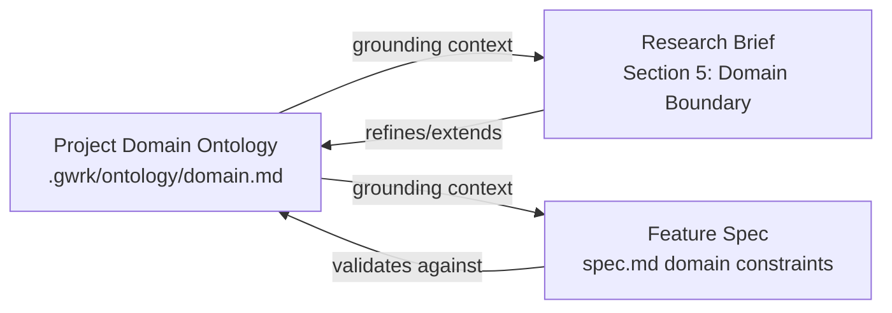

# R006 Draft — Pluginable Research Workflow

> **Status:** Draft — Awaiting Review
> **Initiative:** [R006 brief](brief.md)
> **Consumer:** F014 Plugin System, `gwrk define research` CLI surface
> **Reference:** [Gonzo Feature Research Brief v2](references/gonzo-feature-research-brief-v2.md)

---

## Executive Summary

Research is gwrk's upstream feeder to definition. Today, `gwrk-research` is a single builtin workflow PROMPT.md that implements one methodology: "read the brief, read inputs, answer questions, produce a draft." This works for technical architecture investigations (R001–R005) but cannot support JTBD research, market landscape analysis, domain ontology construction, or building a business case — methodologies that have fundamentally different inputs, prompts, and outputs.

The recommendation is: **research plugins are workflow plugins** — not a new plugin type. The existing `WorkflowRuntime` already handles plugin resolution, PROMPT.md loading, enforcement injection, and JSON intent parsing. Research methodologies are dispatched as named workflows with methodology-specific prompts, grounding context, and output schemas. The brief template itself (the Gonzo Feature Research Brief v2) becomes a **grounding reference** installed alongside the workflow plugin, not embedded in the PROMPT.md.

Domain ontology construction (Pack C from the brief template) is elevated to a **first-class research workflow** — independent from feature research briefs but deeply connected. A project's domain ontology feeds into every research brief and every feature spec. This is the bridge between R006 (research) and R007 (project perspective).

---

## Q1: Plugin Geometry for Research

### Findings

The existing plugin system (F014) supports three plugin types relevant to research:

| Plugin Type | How it dispatches | Output mechanism | Multi-file? |
|---|---|---|---|
| **Workflow** (`gwrk-research`) | `WorkflowRuntime.executeWorkflow()` → agent dispatch | Agent writes files directly | ✅ Yes |
| **Skill** (`gwrk-conventions`) | Injected into prompt stdin | stdout only | ❌ No |
| **Compound skill** | Multi-pass in one LLM call | stdout only | ❌ No |

Research produces multi-file output: `draft.md`, possibly `artifacts/`, ontology fragments, journey maps. Only workflow plugins support this.

A new plugin type (`research-pack`) was considered but rejected: it would require new schema, new resolver, new test surface — all for a dispatch pattern that already exists in `WorkflowRuntime`.

### Recommendation: Workflow plugins

Research methodologies are **named workflow plugins**. Each methodology gets its own PROMPT.md with methodology-specific prompts, but shares the same brief → draft lifecycle.

```
~/.gwrk/plugins/workflows/
  gwrk-research/                ← Default: technical architecture research (current)
    PROMPT.md
    manifest.yaml
  gwrk-research-jtbd/           ← JTBD methodology
    PROMPT.md                   ← Uses forces map, switching behavior, job stories
    manifest.yaml
    references/
      jtbd-synthesis-prompt.md  ← Pack G1 from the Gonzo Brief
  gwrk-research-ontology/       ← Domain ontology construction
    PROMPT.md                   ← Uses Pack C primitives (classes, properties, relations, axioms)
    manifest.yaml
    references/
      ontology-extraction-prompt.md  ← Pack G4 from the Gonzo Brief
```

The manifest declares the research methodology type:

```yaml
# manifest.yaml for JTBD research
type: workflow
name: gwrk-research-jtbd
category: research                     # marks it as a research methodology
methodology: jtbd                      # human-readable methodology name
brief_template: gonzo-feature-research-brief-v2   # which brief template to validate against
output_contract:
  - draft.md                           # required output
  - artifacts/forces-map.md            # methodology-specific artifacts
```

---

## Q2: Research CLI Surface

### Findings

Three options were evaluated:

| Option | Command | Grammar fit | Semantic clarity |
|---|---|---|---|
| Under `define` | `gwrk define research <initiative>` | ✅ Research is pre-definition | ✅ Clear |
| New pillar | `gwrk discover <initiative>` | ⚠️ Adds top-level command | ✅ Maps to FC "Truth" pillar |
| Under `plugin` | `gwrk plugin run research <initiative>` | ❌ Generic | ❌ Loses meaning |

### Recommendation: `gwrk define research`

Research is pre-definition work — it feeds `gwrk define spec`. Keeping it under `define` preserves the CLI grammar's pillar structure (Discovery → Definition → Shipping → Delivery).

**The research command follows the same pattern as `gwrk define spec`** ([specify.ts L64-72](../../../src/commands/specify.ts#L64-L72)): the user provides a **name**, not a number. The number (`R008`, `R009`, ...) is auto-incremented by the same [`getNextFeatureNumber()`](../../../src/utils/scaffold-feature.ts#L136-L158) pattern that specs use — scanning `docs/research/` for the highest existing `R0XX-*` directory and incrementing.

```bash
# Create new research initiative (auto-numbered → R008-pluginable-research)
gwrk define research "Pluginable Research Workflow"

# Create with explicit methodology
gwrk define research "User Switching Behavior" --methodology jtbd

# Domain ontology construction (independent workflow)
gwrk define research "EnergyWork Domain Model" --methodology ontology

# Run existing initiative by ID or slug (like `gwrk define spec 014`)
gwrk define research R006
gwrk define research pluginable-research

# List available research methodologies
gwrk define research --list-methodologies
```

The `--methodology` flag resolves to a workflow plugin name: `gwrk-research-<methodology>`. If omitted, uses `gwrk-research` (the default technical architecture methodology).

### Scaffolding flow (new initiative)

Just like `gwrk define spec "Add OAuth2 integration"` creates `specs/047-add-oauth2-integration/`, the research command creates `docs/research/R008-<slug>/` with a templated `brief.md`:

```
gwrk define research "User Switching Behavior" --methodology jtbd
  │
  ├── getNextResearchNumber("docs/research/")  → R008
  ├── generateSlug("User Switching Behavior")  → user-switching-behavior
  ├── Create docs/research/R008-user-switching-behavior/
  │     ├── brief.md (seeded from methodology template — JTBD sections pre-populated)
  │     └── references/ (empty)
  ├── Register in plan DB (status: RESEARCHING)
  └── Print: "Created: R008-user-switching-behavior"
```

### Dispatch flow (existing initiative)

```
gwrk define research R008 --run
  │
  ├── Resolve initiative: docs/research/R008-user-switching-behavior/
  ├── Validate brief.md exists
  ├── Read brief frontmatter → methodology: jtbd
  ├── Resolve workflow: gwrk-research-jtbd
  ├── Load PROMPT.md from plugin
  ├── Inject brief.md path as context
  ├── Inject project domain ontology (if exists) as grounding
  ├── Dispatch via WorkflowRuntime
  └── Agent reads brief, executes methodology, writes draft.md
```

---

## Q3: Brief Schema Standardization

### Findings

The Gonzo Feature Research Brief v2 defines a structured format with:
- **Brief Control** (L82–93): metadata table with status, mode, owner, dates
- **Decision Options** (L111–117): Stop / Park / Probe / Prototype / Move to PRD
- **Optional Packs** (A–H): invoked by need, not by ritual

Current briefs (R001–R007) are freeform markdown. They share a loose convention (`## Objective`, `## Questions to Answer`, `## Output Contract`) but no enforced schema.

### Recommendation: Zod-validated YAML frontmatter + freeform body

Standardize the control metadata as YAML frontmatter. Keep the body freeform — the brief template provides structure but shouldn't be rigidly enforced.

```yaml
---
title: Pluginable Research Workflow
methodology: technical    # which workflow plugin to dispatch
created: 2026-06-02
updated: 2026-06-02
---
```

This enables:
- **Methodology routing**: `gwrk define research R006` reads `methodology` to pick the right workflow plugin

---

## Q4: Research Output as Spec Input

### Findings

Today: `gwrk define spec --refs docs/research/R006/draft.md` (manual path specification). This works and is explicit.

### Recommendation: `--refs` is the handoff

```bash
gwrk define spec 014 --refs docs/research/R006-pluginable-research/draft.md
```

The research → spec handoff is a human decision, not an automated one. The user knows which research feeds which spec. `--refs` is the mechanism. No auto-discovery needed — it would require forward-biasing the brief with a `consumer` field at creation time, which presumes knowledge we don't have.

---

## Q5: Domain Ontology as Independent Research Workflow

### Findings (from user direction)

Domain ontology construction is:
1. **Independent from feature research briefs** — an ontology models the project's domain, not a specific feature
2. **Connected to research and specs** — an ontology feeds into every research brief (Section 5: Domain Boundary) and every spec
3. **Optional but powerful** — not every project needs one, but projects that have one get dramatically better research briefs and specs
4. **Project-scoped** — the ontology belongs to the project, not to gwrk

The Gonzo Brief v2 already defines the ontology primitives in Pack C:
- **Classes** (C2): kinds of things, not instances
- **Properties** (C3): identifier, intrinsic, state, derived, extrinsic
- **Relations** (C4): typed edges with cardinality and direction
- **Axioms** (C5): rules stating what must always/never be true
- **Glossary** (C6): term disambiguation
- **Failure Scan** (C7): overloading, undergeneralizing, missing middle, etc.

### Recommendation: `gwrk-research-ontology` workflow + `.gwrk/ontology/` storage

Domain ontology construction is a first-class research workflow:

```bash
# Construct or update project domain ontology
gwrk define research --methodology ontology

# This reads:
#   .gwrk/ontology/domain.md (if exists — iterative refinement)
#   docs/research/*/draft.md (existing research as input)
#   Codebase analysis (extract domain concepts from code)
#
# This writes:
#   .gwrk/ontology/domain.md (the ontology document)
#   .gwrk/ontology/glossary.md (term disambiguation)
```

The ontology is stored in `.gwrk/ontology/` (project-local) and injected as grounding context into:
- Research workflows (when `domain_ontology` frontmatter is set, or auto-discovered from `.gwrk/ontology/`)
- Spec workflows (injected alongside enforcement skills)
- Implement workflows (injected as domain context so agents understand the project's vocabulary)

```
.gwrk/
  ontology/
    domain.md       ← Pack C output: classes, properties, relations, axioms
    glossary.md     ← Pack C6: term disambiguation
  plugins/
    skills/
      ...
  rules/
    ...
```

### Ontology ↔ Research Brief interaction



The ontology is a living document — each research brief and spec cycle may extend or refine it. The `gwrk-research-ontology` workflow supports both initial construction and iterative refinement.

---

## Plugin Manifest Example: JTBD Research

```yaml
# ~/.gwrk/plugins/workflows/gwrk-research-jtbd/manifest.yaml
type: workflow
name: gwrk-research-jtbd
version: "1.0"
category: research
methodology: jtbd
description: >
  Jobs-to-Be-Done research methodology. Extracts progress under pressure,
  switching forces, hiring/firing criteria, and functional/social/emotional
  progress from interview notes and field observations.
brief_template: gonzo-feature-research-brief-v2
required_packs:
  - core         # Sections 0-7 (always)
  - pack_a       # Actor and Buying Committee Map
  - pack_g       # Agentic Research Prompts (G1: JTBD Interview Synthesis)
optional_packs:
  - pack_b       # UX Journey / Surface Map
  - pack_f       # GTM / Field Validation
output_contract:
  - draft.md
  - artifacts/forces-map.md
  - artifacts/job-stories.md
```

---

## CLI Integration Sketch

```typescript
// src/commands/define.ts — add 'research' subcommand

defineCommand
  .command("research <initiative>")
  .description("Run a research initiative")
  .option("--methodology <name>", "Research methodology (default: technical)")
  .option("--list-methodologies", "List available research workflows")
  .action(async (initiative, options) => {
    if (options.listMethodologies) {
      // Scan plugins for category: research workflows
      const loader = new PluginLoader();
      const plugins = await loader.listPlugins({ category: "research" });
      // Display table: name, methodology, description
      return;
    }

    const methodology = options.methodology || "technical";
    const workflowName = methodology === "technical"
      ? "gwrk-research"
      : `gwrk-research-${methodology}`;

    const briefDir = resolveResearchInitiative(initiative);  // R006 → docs/research/R006-*/
    const briefPath = path.join(briefDir, "brief.md");

    // Inject domain ontology if present
    const ontologyPath = path.join(process.cwd(), ".gwrk/ontology/domain.md");
    const ontologyContext = fs.existsSync(ontologyPath)
      ? fs.readFileSync(ontologyPath, "utf-8")
      : "";

    await dispatchToAgent({
      workflow: workflowName,
      workDir: process.cwd(),
      prompt: `Research initiative: ${briefDir}`,
      stdin: [
        ontologyContext ? `<domain_ontology>\n${ontologyContext}\n</domain_ontology>` : "",
        `<research_brief>\n${fs.readFileSync(briefPath, "utf-8")}\n</research_brief>`,
      ].filter(Boolean).join("\n\n"),
    });
  });
```

---

## Open Items

| Item | Status | Decision needed |
|---|---|---|
| Ontology storage location | Proposed: `.gwrk/ontology/` | Confirm vs. `docs/ontology/` |
| Community registry for research plugins | Deferred | No registry infrastructure exists |

---

## Spec Alignment Notes

- F014 spec needs amendment: add `category: research` to manifest schema
- F014 plugin loader needs `listPlugins({ category })` filter
- `gwrk define` command needs `research` subcommand
- `WorkflowRuntime` needs ontology injection (similar to enforcement injection)
