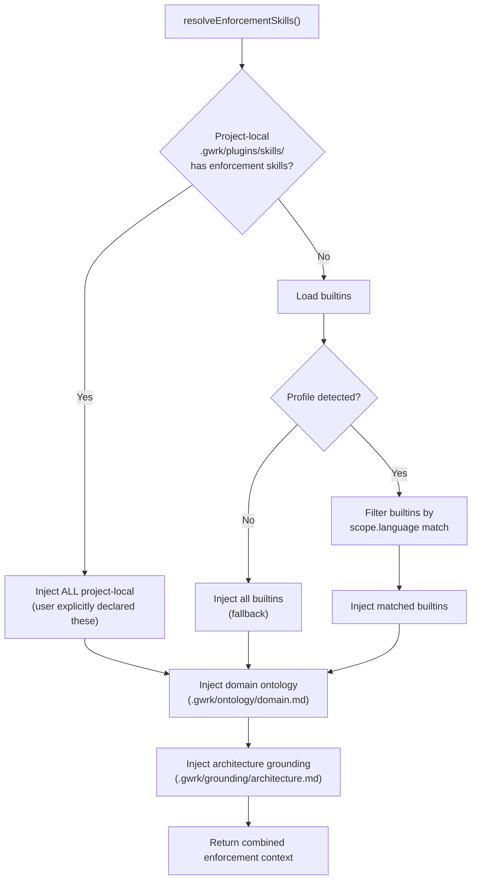

# R007 Draft — Project Perspective & Enforcement Skills

> **Status:** Draft — Awaiting Review
> **Initiative:** [R007 brief](brief.md)
> **Consumer:** F014 Plugin System, `gwrk init`, `resolveEnforcementSkills()`
> **Related:** [R006 draft](../R006-pluginable-research/draft.md) — shared plugin resolution chain

---

## Executive Summary

Project perspective is how gwrk understands "how we build" for any given project. Today this only works for gwrk itself (`_isGwrk` flag, `gwrk-native` type guards, hardcoded `gwrk-conventions` and `typescript-standards` enforcement skills). Every other project gets `generic` fallback content with wrong-language standards.

The recommendation splits project perspective into three independent-but-connected layers:

1. **Enforcement skills** — "How we build" (code conventions, architecture patterns, quality gates). Scoped by language/framework. Resolved via profile → skill matching.
2. **Domain ontology** — "What we're building" (domain concepts, vocabulary, relationships, axioms). Optional but dramatically amplifies research and spec quality. Stored in `.gwrk/ontology/`.
3. **Architecture grounding** — "The shape of the system" (service boundaries, data flow, deployment topology). Stored in `.gwrk/grounding/architecture.md`.

All three are project-local, user-authored (or agent-assisted), and injected into agent prompts through the existing enforcement injection path. gwrk ships the **mechanism**, not the content — projects declare their own perspective.

Domain ontology is the bridge between R007 (perspective) and R006 (research). A project's ontology feeds into every research brief, every spec, and every implement prompt. Constructing a brief and constructing a domain ontology are independent workflows, but the ontology makes briefs and specs dramatically sharper by eliminating synonym collision, concept mush, and assumption burial.

---

## Q1: Project Perspective Authoring

### Findings

Four approaches were evaluated:

| Approach | Friction | Fidelity | Maintenance |
|---|---|---|---|
| `gwrk init` scaffolds templates | Low | Low (generic) | User must edit |
| `gwrk plugin create --tier enforcement` | Medium | High (explicit) | User-maintained |
| Agent-generated from codebase analysis | Very low | Medium (may hallucinate) | Needs review |
| Import from community registry | Low | Variable | Community-maintained |

### Recommendation: Hybrid — scaffold + agent-assist

`gwrk init` creates the directory structure and a starter skill based on profile detection. Then `gwrk define research --methodology ontology` can refine it with agent assistance.

```bash
# Step 1: gwrk init detects Python/Django + React + Go
gwrk init
# Creates:
#   .gwrk/plugins/skills/   (empty directory, ready for project skills)
#   .gwrk/ontology/          (empty directory, ready for domain modeling)
#   .gwrk/grounding/         (empty directory, ready for architecture doc)

# Step 2: User creates enforcement skills (manual or agent-assisted)
gwrk plugin create django-conventions --tier enforcement --scope.language Python --scope.framework Django
# Creates .gwrk/plugins/skills/django-conventions/SKILL.md + manifest.yaml

# Step 3: User constructs domain ontology (agent-assisted)
gwrk define research --methodology ontology
# Agent scans codebase, extracts domain concepts, writes .gwrk/ontology/domain.md

# Step 4: User writes architecture grounding (manual)
# .gwrk/grounding/architecture.md — service boundaries, data flow, deployment
```

### Init scaffolding additions

```diff
  // src/commands/init.ts — new directories for project perspective
  const dirs = [
    "specs",
    ".gwrk/rules",
+   ".gwrk/plugins/skills",    // project-scoped enforcement skills
+   ".gwrk/ontology",          // domain ontology storage
+   ".gwrk/grounding",         // architecture grounding docs
  ];
```

---

## Q2: Profile → Enforcement Routing

### Findings

Today, `resolveEnforcementSkills()` (skill-runtime.ts L149) loads every enforcement skill unconditionally. A Python project gets `typescript-standards` — wrong language.

Three routing options:

| Option | Behavior | Risk |
|---|---|---|
| (a) Filter by profile match | Only inject skills whose `scope.language` matches `profile.stack.language` | Might miss relevant skills |
| (b) Always inject project-local, filter builtins | User explicitly chose project-local skills; filter only builtins | Good balance |
| **(c) Project-local wins, builtins filtered** | Project-local always injected. Builtins only if no project-local AND profile matches. | Most predictable |

### Recommendation: Option (c) — project-local wins, builtins filtered

```typescript
async function resolveEnforcementSkills(
  projectRoot: string,
  scope: "implementation" | "review",
  profile?: ProjectProfile,  // NEW: pass detected profile
): Promise<string> {
  const projectSkills = await loadProjectLocalSkills(projectRoot, scope);
  
  if (projectSkills.length > 0) {
    // Project declared its own enforcement — use those exclusively
    return projectSkills.map(s => s.content).join("\n\n");
  }
  
  // No project-local enforcement — fall back to builtins, filtered by profile
  const builtins = await loadBuiltinSkills(scope);
  if (!profile) return builtins.map(s => s.content).join("\n\n");
  
  return builtins
    .filter(s => matchesProfile(s.manifest.scope, profile))
    .map(s => s.content)
    .join("\n\n");
}

function matchesProfile(
  skillScope: { language?: string; framework?: string },
  profile: ProjectProfile,
): boolean {
  if (!skillScope.language) return true;  // no language constraint → always match
  return skillScope.language.toLowerCase() === profile.stack?.language?.toLowerCase();
}
```

### Manifest schema extension

```yaml
# manifest.yaml for enforcement skills — add scope fields
type: skill
name: django-conventions
tier: enforcement
scope:
  language: Python          # NEW: profile matching
  framework: Django         # NEW: more specific matching
  context: implementation   # existing: implementation | review
```

---

## Q3: Architecture Grounding for Non-gwrk Projects

### Findings

gwrk's own `docs/grounding/architecture.md` is injected into prompts so agents understand the codebase. For non-gwrk projects, no equivalent exists.

### Recommendation: `.gwrk/grounding/architecture.md` — manual authoring, agent-assisted

```
.gwrk/
  grounding/
    architecture.md     ← System shape: services, data flow, deployment
```

The prompt conditioner (`prompt-conditioner.ts`) injects this as `<project_architecture>` context when present. If absent, agents rely on enforcement skills and profile detection (which still works — just less precise).

Agent-assisted generation is a future enhancement: `gwrk init --discover` scans the codebase and produces a draft architecture doc. But the manual path works now and is reliable.

---

## Q4: Polyglot Routing

### Findings

In a monorepo (Python + Go + TypeScript), enforcement skills need scoping:

| Strategy | When to use | Complexity |
|---|---|---|
| **Per-project** (all skills loaded) | Small monorepo, <3 languages | Low |
| **Per-file** (match by file extension) | Large monorepo, many languages | High — requires file-aware dispatch |
| **Per-workspace** (each package gets its own profile) | Nx/Turborepo-style workspace | Medium — requires workspace detection |

### Recommendation: Per-project for now, per-workspace later

Load all project-local enforcement skills for every dispatch. This is slightly noisy for large monorepos but correct — the agent sees all relevant conventions. Per-workspace routing is a future refinement that requires workspace boundary detection in the profile detector.

The domain ontology is always project-wide — domain concepts span all services in a monorepo.

---

## Q5: Escape from gwrk-Specific Builtins

### Findings

Current builtins are gwrk-specific:
- `gwrk-conventions` — commit message format, spec conventions, flamingo branding
- `typescript-standards` — strict TypeScript patterns

For non-gwrk projects, these are wrong.

### Recommendation: Split builtins into generic + gwrk-specific

```
src/plugins/builtins/skills/
  generic-conventions/          ← NEW: project-agnostic (commit messages, PR format)
    SKILL.md
    manifest.yaml               ← scope.language: null (all projects)
  typescript-standards/         ← EXISTING: add scope.language: TypeScript
    SKILL.md
    manifest.yaml
  gwrk-conventions/             ← EXISTING: only loads when _isGwrk
    SKILL.md
    manifest.yaml               ← scope.project: gwrk (special case)
```

The `_isGwrk` flag already exists in the prompt conditioner. Use it to gate `gwrk-conventions`. Filter `typescript-standards` by profile match. `generic-conventions` loads for all projects.

---

## Domain Ontology — Detailed Design

### Why domain ontology is a perspective concern, not just a research concern

A domain ontology answers: "What are the core concepts of this project, what do they mean, and how do they relate?" This is distinct from:
- **Enforcement skills** → "How do we write code?" (syntax, patterns, conventions)
- **Architecture grounding** → "What is the shape of the system?" (services, data flow)
- **Research briefs** → "What should we build next?" (features, progress, evidence)

But the ontology feeds all three:

| Consumer | How ontology helps |
|---|---|
| **Enforcement skills** | Agent knows domain vocabulary → writes idiomatic code using correct terms |
| **Architecture grounding** | Ontology classes map to services, tables, API resources |
| **Research briefs** | Section 5 (Domain Boundary) inherits from the project ontology |
| **Feature specs** | Spec constraints reference ontology axioms → no concept mush |
| **Implement prompts** | Agent understands what "Order", "Fulfillment", "Assessment" mean in this project |

### Ontology storage and structure

```
.gwrk/
  ontology/
    domain.md           ← Primary ontology document (Pack C format)
    glossary.md          ← Term disambiguation (Pack C6)
    modules/             ← Optional: per-domain-area ontology fragments
      billing.md
      assessment.md
      fulfillment.md
```

The primary `domain.md` follows the Pack C structure from the Gonzo Brief:

```markdown
# Project Domain Ontology: [Project Name]

> **Status:** Living document — updated as domain understanding deepens
> **Last updated:** [date]

## Classes

| Class | Definition | Boundary | Example Individuals |
|---|---|---|---|
| Assessment | A structured evaluation of [subject] against [criteria] | Not a Survey (assessments have verdicts; surveys collect data) | Q3 Risk Assessment, Annual Compliance Review |
| ...

## Properties

| Class | Property | Kind | Description | Constraint |
|---|---|---|---|---|
| Assessment | status | state | Current lifecycle position | enum: draft, active, completed, archived |
| ...

## Relations

| Relation | Domain | Range | Cardinality | Direction | Required? |
|---|---|---|---|---|---|
| evaluates | Assessment | Subject | N:1 | uni | Y |
| ...

## Axioms

| ID | Type | Rule | What It Prevents |
|---|---|---|---|
| AX-001 | disjointness | An Assessment is never a Survey | Concept mush between evaluation and data collection |
| ...

## Glossary

| Term | Canonical Meaning | Synonyms | Must Not Be Confused With |
|---|---|---|---|
| Assessment | Structured evaluation with verdict | Review, Evaluation, Audit | Survey (no verdict), Report (output, not process) |
| ...
```

### Ontology injection into prompts

The ontology is injected alongside enforcement skills in `dispatchToAgent()`:

```typescript
// After enforcement skill injection (agent.ts L432-455)

// ADR-008 + R007: Inject domain ontology as grounding context
const ontologyPath = path.join(task.workDir || projectRoot, ".gwrk/ontology/domain.md");
if (fs.existsSync(ontologyPath) && dispatch.stdin) {
  const ontology = fs.readFileSync(ontologyPath, "utf-8");
  dispatch.stdin = dispatch.stdin.replace(
    /{{ontology}}/,
    `<domain_ontology>\n${ontology}\n</domain_ontology>`
  );
  // If no placeholder, append as context
  if (!dispatch.stdin.includes("<domain_ontology>")) {
    dispatch.stdin = `<domain_ontology>\n${ontology}\n</domain_ontology>\n\n${dispatch.stdin}`;
  }
}
```

### Constructing vs. consuming ontology

| Activity | Workflow | Input | Output |
|---|---|---|---|
| **Construct ontology** | `gwrk define research --methodology ontology` | Codebase, existing docs, interviews | `.gwrk/ontology/domain.md` + `glossary.md` |
| **Consume in research** | `gwrk define research R00X` | ontology auto-injected as grounding | Research draft informed by domain vocabulary |
| **Consume in spec** | `gwrk define spec 00X` | ontology auto-injected as grounding | Spec uses correct domain terms |
| **Consume in implement** | `gwrk ship` | ontology injected via enforcement | Agent writes code using correct domain vocabulary |

Construction and consumption are independent workflows. A project can:
1. Have no ontology (works fine — enforcement skills + profile detection)
2. Manually write `.gwrk/ontology/domain.md` (full control)
3. Use `gwrk define research --methodology ontology` to agent-generate one
4. Iteratively refine through research → ontology → spec cycles

---

## Profile → Enforcement Routing Spec

### Matching algorithm

```
1. Scan .gwrk/plugins/skills/ for enforcement-tier skills
2. If any found → inject all project-local enforcement skills (user chose these)
3. If none found → fall back to builtins:
   a. Load all builtins with tier: enforcement
   b. Filter by scope.language matching profile.stack.language
   c. Always include skills with scope.language: null (generic)
   d. Include gwrk-conventions only if _isGwrk
4. Inject domain ontology from .gwrk/ontology/domain.md (if exists)
5. Inject architecture grounding from .gwrk/grounding/architecture.md (if exists)
```

### Resolution order diagram



---

## Project Init Scaffold

### What `gwrk init` should generate

Current scaffolding:
```
specs/
.gwrk/rules/
.gitattributes
```

Proposed additions:
```
.gwrk/plugins/skills/      ← Ready for project-scoped enforcement skills
.gwrk/ontology/             ← Ready for domain ontology
.gwrk/grounding/            ← Ready for architecture grounding
```

These are empty directories — zero-config by default. A project works fine without any of them. But when a user creates enforcement skills, writes an ontology, or adds architecture grounding, gwrk picks them up automatically through the resolution chain.

### First-run guidance

After `gwrk init`, print:

```
  ✓ .gwrk/plugins/skills/  (project enforcement skills — optional)
  ✓ .gwrk/ontology/         (domain ontology — optional)
  ✓ .gwrk/grounding/        (architecture grounding — optional)

  Tip: Create enforcement skills for your project:
    gwrk plugin create my-conventions --tier enforcement

  Tip: Generate a domain ontology from your codebase:
    gwrk define research --methodology ontology
```

---

## Migration Path

### Existing builtins

| Builtin | Change | Risk |
|---|---|---|
| `gwrk-conventions` | Add `scope.project: gwrk` — only loads when `_isGwrk` | None — behavior preserved for gwrk |
| `typescript-standards` | Add `scope.language: TypeScript` — only loads for TS projects | Existing TS projects unaffected |
| NEW: `generic-conventions` | Extract project-agnostic rules (commit format, PR hygiene) | Additive |

### Enforcement resolver

| Change | Impact |
|---|---|
| Add `profile` parameter to `resolveEnforcementSkills()` | Signature change — update all callers |
| Add project-local skill scanning | New code path — needs tests |
| Add ontology/grounding injection | New injection point — additive |

---

## Open Items

| Item | Status | Decision needed |
|---|---|---|
| Ontology module splitting (per-domain-area) | Proposed | Defer until a project needs it |
| Agent-assisted architecture grounding (`--discover`) | Deferred | Good idea, not urgent |
| Per-workspace enforcement routing | Deferred | Needs workspace boundary detection |
| Community plugin registry | Deferred | No infrastructure exists |
| Ontology versioning / diffing | Proposed | Track in `.gwrk/ontology/` via git |
