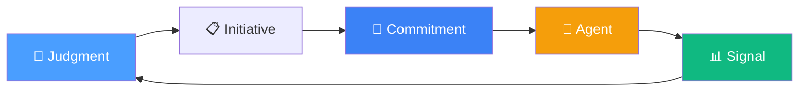
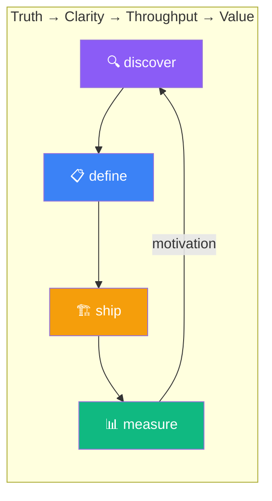
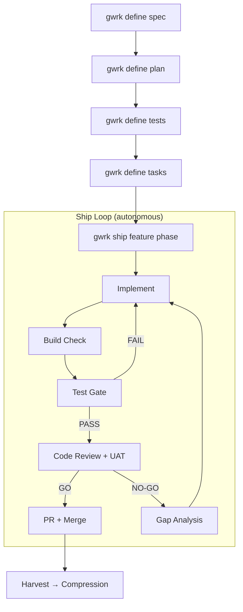
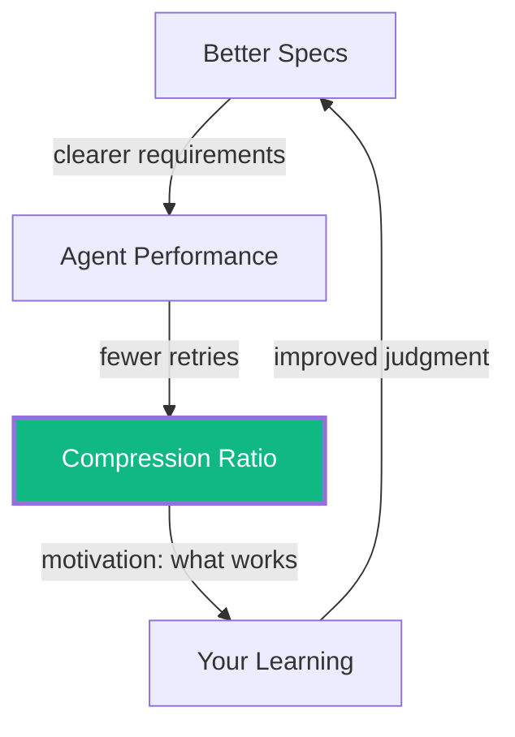
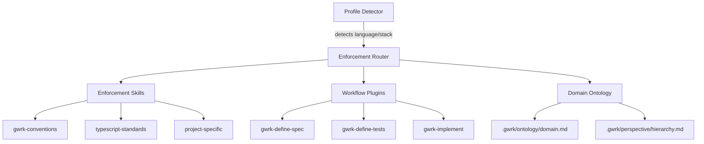

# What is gwrk?

> **The scarce resource in AI-assisted engineering isn't code generation — it's architectural judgment.**

gwrk is a Principal Engineer's operating system. It takes the thinking you've already done — the decomposition, the interface contracts, the dependency ordering, the review rigor — and turns it into shipped code at a speed that was previously impossible. Then it measures how fast you shipped, so your next spec is sharper than the last.

gwrk doesn't think for you. The better your judgment, the better it performs.

---

## The Ontology: Six Primitives

gwrk operates on six kinds of things. Understanding them is understanding the product.

| Primitive | What It Is | What It Is Not |
|-----------|-----------|----------------|
| **Initiative** | A unit of work with a lifecycle: discovered → defined → shipped → delivered | Not a ticket. Not a task. An initiative has phases, gates, and a compression ratio at the end. |
| **Commitment** | A written artifact that binds execution — `spec.md`, `plan.md`, `tasks.json`, gate scripts | Not a conversation. Not a narrative. If it's not in the repo, it doesn't exist. |
| **Agent** | An ephemeral executor that receives a task and produces a diff | Not gwrk. gwrk orchestrates; agents implement. They're disposable — if one fails, gwrk retries on another backend. |
| **Judgment** | A human decision that shapes what gets built, how it's decomposed, and what "done" means | Not automatable. Not delegable. This is the scarce resource the thesis names. |
| **Signal** | Measured evidence of shipping efficiency — compression ratios, gate pass/fail, test deltas | Not opinion. Not delivery (adoption, usage, impact). Computable from artifacts. Signals motivate better specs; they don't prove value to customers. |
| **Methodology** | A repeatable intellectual process with inputs, passes, and outputs | Not a tool. Not a command. JTBD discovery, ontology construction, and spec-sharpening are methodologies. gwrk is the tool that assists them. |

These connect in a loop:

Your judgment creates initiatives. Initiatives produce commitments (specs, plans, gates). Commitments constrain agents. Agents produce signals (compression, test results, gate verdicts). Signals motivate your next judgment. The system tightens around reality with every cycle.

---

## The Operating Model: Foxtrot Charlie

gwrk is the automation of [Foxtrot Charlie](FOXTROT-CHARLIE.md) — an operating model built for outcomes, not ceremony. The cleanest truth behind it:

> **What gets built is 1,000% more important than how it gets built.**

Foxtrot Charlie distills execution into four pillars. Each maps directly to a gwrk CLI surface:

| Pillar | Mantra | CLI | What It Does Today |
|--------|--------|-----|-------------------|
| **Discovery** | Truth > narratives | `gwrk define research` | Scaffold research initiatives. Apply methodologies (JTBD, ontology, technical). Produce structured briefs. |
| **Definition** | If it's not written, it's not committed | `gwrk define spec → plan → tests → tasks` | Strict pipeline — each step gates the next. Binary acceptance criteria. Gate scripts that exit 0 or 1. |
| **Shipping** | Ship to learn. Fast reds surface problems early. | `gwrk ship <feature> <phase>` | Autonomous loop: implement → build → test → review → PR. Circuit breaker at 3 iterations. Gap analysis on failure. |
| | | `gwrk measure compression` | Shipping accountability: LOC-derived effort forecast vs. actual delivery time. Motivation metric, not a value claim. |
| **Delivery** | Shipped ≠ delivered. Value = adoption + outcomes. | *Not yet in gwrk's purview.* | If Discovery and Definition are done well, then Shipping is likely to be successful but measuring value recieved is outside the scope of gwrk. |

The mantra that connects them: **Truth → Clarity → Throughput → Value.**

### The Five Invariants (Enforced by Machinery)

| Invariant | How gwrk Enforces It |
|-----------|---------------------|
| Every initiative has a single accountable owner | Each phase has one assigned agent. No shared ownership. |
| Reality is expressed as state, not narrative | Gate scripts pass or fail. `tasks.json` has RAGB status. No interpretation. |
| All commitments exist as written artifacts | `spec.md`, `plan.md`, `tasks.json`, gate scripts. If it's not in the repo, it doesn't exist. |
| Shipping happens frequently enough to surface truth | Short phases, autonomous retry, daily compression snapshots. |
| Value is measured in adoption or outcome, not effort | Compression ratio. Not "how many hours did agents run" but "did the feature ship, and how fast." |

### When Things Break

Foxtrot Charlie assumes three failure modes. No new process is added. No ceremonies are created.

| Failure | Diagnosis | gwrk Response |
|---------|-----------|--------------|
| Truth is missing | Return to Discovery | `gwrk define research` — re-extract, re-clarify |
| Clarity is broken | Rewrite commitments | `gwrk define spec` — regenerate spec, plan, tasks, gates |
| Throughput is stalled | Reduce batch size | `gwrk ship` with smaller phases — 3-iteration circuit breaker, retry on different backend |

---

## The Define → Ship Pipeline

This is the product's core loop. Each step must complete before the next begins.

Key points this diagram makes visible:
- **Strict ordering**: tests before tasks, plan before tests — you can't skip
- **Autonomous retry**: NO-GO triggers gap analysis and reimplementation, not human intervention
- **Circuit breaker**: 3 iterations max, then the human decides
- **Harvest**: closes the loop back to compression on merge

The ship loop is autonomous. On each iteration:
1. **Implement** — dispatch an agent with the task prompt, enforcement skills, and project context
2. **Build Check** — `pnpm build` must pass
3. **Test Gate** — scoped tests must pass (failures from before this phase are excluded)
4. **Code Review** — agent reviews for correctness, standards, and spec alignment
5. **UAT Review** — agent verifies user stories from the plan
6. **PR + CI** — create PR, push, wait for CI (if configured)

If review returns NO-GO, the loop retries with gap analysis. After 3 iterations, the circuit breaker trips and the human decides.

---

## The Compression Flywheel

Compression is a motivation metric. It answers: **how fast did we ship relative to how long it would have taken without agents?** It does not measure value. It does not prove the feature was the right thing to build. It's an accountability measure for the shipping pillar — and it's the feedback signal that motivates sharper specs.

### Real Data (as of June 2026)

| Metric | Value |
|--------|-------|
| Features measured | 13 |
| Total SP delivered (LOC-derived) | 1,376 |
| Avg point compression | 144.68x |
| Source lines | 46,494 |
| Test cases | 845 |
| Gate scripts | 347 |
| Specs | 17 |

These aren't aspirational. Run `gwrk measure compression --all` and see them.

Compression is an imprecise measurement that backs into motivation: if your compression ratio is climbing, your specs are getting better. If it's declining, something in your definition pipeline is degrading. The number itself is secondary to the trend.

---

## The Plugin System

gwrk is project-aware, not a generic agent launcher.

**Profile Detection** — auto-detects language, build system, and project layout from filesystem markers (`package.json`, `Cargo.toml`, `pyproject.toml`). Routes enforcement skills accordingly.

**Enforcement Skills** — coding standards, conventions, and constraints injected into every agent prompt. `gwrk-conventions` and `typescript-standards` ship as builtins; projects can add their own.

**Workflow Plugins** — the prompts and methodologies behind `define spec`, `define tests`, `define tasks`, `ship`, and research methodologies. Extensible — add a new methodology and `gwrk define research` can use it.

**Domain Ontology** (ADR-009) — projects may declare a domain ontology (`.gwrk/ontology/domain.md`), information hierarchy, and UX posture. These are injected as agent grounding so the agent understands what concepts mean in your project, not just what language you use.

---

## The Name

**gwrk** is pronounced **"gwerk"** — one syllable, rhymes with *work*.

The name draws from the same well as `grep`, `sed`, `awk`, `gawk` — terse commands that do exactly one thing and do it ruthlessly well. Those tools didn't need pretty names. They needed to *work*.

But gwrk isn't just a Unix throwback. The name channels something else:

> **"You better work!"**
> — RuPaul, Joan Rivers, Betty White, and every creative who ever turned ambition into art.

The **precision of GNU tooling** meets the **audacity of the runway**. Utilitarian power wrapped in unapologetic flair.

🦩 **The gwrk Flamingo** — fierce, fabulous, and structurally absurd. A flamingo stands on one leg in the mud and looks like it owns the place.

---

## What's Shipped vs. What's Planned

| Status | Capability |
|--------|-----------|
| ✅ Shipped | Define pipeline (`spec → plan → tests → tasks`), ship loop (autonomous implement → review → PR), compression engine (LOC-derived SP + effort forecast), harvest (auto-records on PR merge), plugin system (skills, workflows, enforcement), profile detection, gate scripts, execution ledger (SQLite), agent router (Gemini/Claude backend selection), research scaffolding |
| 🔧 In Progress | Slack control plane (Socket Mode wired, DUT conversation not shipped), effort profiles (role-based LOC rates) |
| 📋 Planned | Parallel dispatch (multi-phase concurrent shipping), Obsidian integration, build plan DAG visualization |
| 🗄️ Deferred | Docker sandboxes, Codex Cloud integration, App Home Tab |

---

## Lineage

gwrk emerged from workflow infrastructure built across two production codebases — [Code-Red](https://github.com/) (courtroom code forensics, Rust + TypeScript + Tauri) and [GForge.ai](https://gforge.ai) (epistemic engine, Fastify + React + Prisma + PostgreSQL). The infrastructure was project-agnostic. gwrk is the extraction into a standalone tool: 46K+ lines of TypeScript, 845 tests, 17 feature specs, 347 gate scripts.

---

🦩 **You better gwrk.** 🦩

*Truth extracted. Clarity committed. Throughput shipped. Value delivered.*

