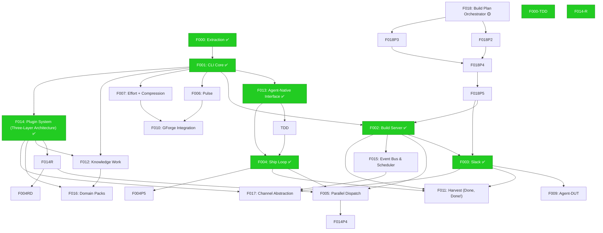

# 000 Build Plan — gwrk

> **Status:** Authoritative · **Date:** 2026-05-29
> **Anchored to:** [architecture.md](docs/architecture.md), [GWRK-PRD-PRFAQ.md](docs/GWRK-PRD-PRFAQ.md)
> **Decisions:** [ADR-001](docs/decisions/ADR-001-task-tracking.md), [ADR-002](docs/decisions/ADR-002-sqlite-execution-ledger.md), [ADR-003](docs/decisions/ADR-003-state-contract.md), [ADR-004](docs/decisions/ADR-004-agent-native-output.md), [ADR-005](docs/decisions/ADR-005-tdd-gate-architecture.md), [ADR-006](docs/decisions/ADR-006-plugin-agent-backends.md), [ADR-007](docs/decisions/ADR-007-single-dispatch-path.md)

---

## Terminology

| Term | Meaning | Example |
|---|---|---|
| **Feature** | A spec subdirectory under `specs/`. Has its own spec.md, plan.md, contracts/, gates/, etc. | `specs/001-cli-core/` = Feature 001 |
| **Phase** | An implementation stage *within* a feature's `plan.md`. A feature has 1+ phases. | Phase 1 of Feature 013 = "Foundation (7 SP)" |
| **Wave** | A scheduling group of features that can execute concurrently. | Wave 2 = {F013, F006, F007, F012} |

---

## Dependency Graph

---

## Critical Path

```mermaid
gantt
    title Critical Path
    dateFormat X
    axisFormat %s

    Agent Mode                :done, F013_P3, 0, 11
```

---

## Features

### Feature 001-cli-core — CLI Core ✅

**Status:** SHIPPED + TDD-HARDENED (spec rewrite v3)

> Shipped pre-TDD. Subsequently hardened via F013 phases 9, 12 (gap analysis, test backfill).
> Spec rewritten to TDD standard (revision 3, 2026-05-30).
> Artifacts: `specs/001-cli-core/refs/`

### Feature 002-build-server — 002-build-server 🟡

**Status:** DEFINED

### Feature 003-slack — 003-slack 🟡

**Status:** DEFINED

### Feature 004-ship-loop — Ship Loop ✅🔧

**Status:** DONE — active rework: gate pipeline redesign (ADR-005 amendment)

> Ship orchestrator functional. Gate verdict pipeline identified 5 failure modes
> (LLM gate hallucination, SIGPIPE, define-tests MODIFY isolation, parser phase numbering).
> Redesign documented in `specs/004-ship-loop/refs/gate-pipeline-redesign.md`.
> Root cause: `specs/004-ship-loop/refs/ship-failure-diagnosis.md`.

### Feature 005-parallel-dispatch — 005-parallel-dispatch 🟡

**Status:** DEFINED

### Feature 006-pulse — 006-pulse 🟡

**Status:** DEFINED

### Feature 007-effort-compression — 007-effort-compression 🟡

**Status:** DEFINED

### Feature 008-agent-router — 008-agent-router 🟡

**Status:** DEFINED

### Feature 011-harvest — 011-harvest 🟡

**Status:** DEFINED

### Feature 012-knowledge-work — 012-knowledge-work ⚪

**Status:** PLANNED

### Feature 013-agent-native-interface — 013-agent-native-interface 🟡

**Status:** DEFINED

### Feature 014-plugin-system — 014-plugin-system 🟡

**Status:** SPECIFIED

### Feature 018-build-plan-orchestrator — 018-build-plan-orchestrator 🟡

**Status:** DEFINED

### Feature 000 — Extraction ✅

**Status:** DONE

### Feature 000-TDD — TDD Infrastructure ✅

**Status:** DONE

### Feature 001 — CLI Core ✅

**Status:** SHIPPED + TDD-HARDENED (consolidated with 001-cli-core above)

### Feature 002 — Build Server ✅

> [!WARNING]
> **Status:** ⚠️ Shipped but not yet TDD-hardened or verified.

### Feature 003 — Slack ✅

> [!WARNING]
> **Status:** ⚠️ Shipped but not yet TDD-hardened or verified.

### Feature 004 — Ship Loop ✅🔧

**Status:** DONE — rework pending (consolidated with 004-ship-loop above)

### Feature 005 — Parallel Dispatch ⚪

**Status:** PLANNED

### Feature 006 — Pulse ⚪

**Status:** PLANNED

### Feature 007 — Effort + Compression ⚪

**Status:** PLANNED

### Feature 009 — Agent-DUT ⚪

**Status:** PLANNED

### Feature 010 — GForge Integration ⚪

**Status:** PLANNED

### Feature 011 — Harvest (Done, Done!) ⚪

**Status:** PLANNED

### Feature 012 — Knowledge Work ⚪

**Status:** PLANNED

### Feature 013 — Agent-Native Interface ✅

**Status:** DONE

| Phase | Name | Status | SP |
|---|---|---|---|
| 1 | Foundation | DONE ✅ | 7 |
| 2 | Discovery | DONE ✅ | 10 |
| 3 | Agent Mode | DONE ✅ | 11 |
| 4 | `src/utils/signal.ts`, `output.ts`, `agent-layer.ts` | DONE ✅ | 0 |
| 5 | `src/commands/gate-check.ts`, `project.ts` | DONE ✅ | 0 |
| 6 | `src/engine/discover.ts`, `classify.ts` | DONE ✅ | 0 |
| 7 | -- | DONE ✅ | 0 |
| 8 | 003 to the TDD standard established by 000-tdd-infrastructure. Regenerate all legacy garbage gates | DONE ✅ | 0 |
| 9 | cli-core | Rewrite spec to TDD standard. Fix `dispatchAgent | DONE ✅ | 0 |
| 10 | build-server | Rewrite spec to TDD standard. Add lifecycle integration tests. Implement `server clean` | DONE ✅ | 0 |
| 11 | slack | Rewrite gap-analysis as test-coverage audit. Verify contracts against shipped code. Remediate ❌ items. | `gwrk test 003-slack` = 0 failed | | DONE ✅ | 0 |
| 12 | cli-core | 44 | ~40 | ~91% | | DONE ✅ | 0 |
| 13 | build-server | 26 | 18 | 69% | | DONE ✅ | 0 |
| 14 | slack | 31 | 3 | 10% ✅ | DONE ✅ | 0 |
| 15 | -- | DONE ✅ | 0 |

### Feature 014 — Plugin System (Three-Layer Architecture) ✅

**Status:** DONE

| Phase | Name | Status | SP |
|---|---|---|---|
| 1 | Plugin Loader + Registry | DONE ✅ | 0 |
| 2 | Skill Runtime | DONE ✅ | 0 |
| 3 | Agent Backend Adapters | DONE ✅ | 0 |
| 4 | Routing Intelligence | DONE ✅ | 0 |
| 5 | Three layers | DONE ✅ | 0 |
| 6 | manifest.yaml** = contract | DONE ✅ | 0 |
| 7 | Global only** for skills | DONE ✅ | 0 |
| 8 | Anti-MCP | DONE ✅ | 0 |
| 9 | Config ownership | DONE ✅ | 0 |
| 10 | -- | DONE ✅ | 0 |

### Feature 014-R — WorkflowRuntime Rework ✅

**Status:** DONE

### Feature 015 — Event Bus & Scheduler ⚪

**Status:** PLANNED

### Feature 016 — Domain Packs ⚪

**Status:** PLANNED

### Feature 017 — Channel Abstraction ⚪

**Status:** PLANNED

### Feature 018 — Build Plan Orchestrator 🟡

**Status:** SPECIFIED

| Phase | Name | Status | SP |
|---|---|---|---|
| 1 | Data Model + Seed | PLANNED ⚪ | 5 |
| 2 | Solver + CLI | PLANNED ⚪ | 5 |
| 3 | Graph Mutation | PLANNED ⚪ | 5 |
| 4 | Event Hooks + Verify + Render | PLANNED ⚪ | 5 |
| 5 | Viz + Heartbeat + Governance | PLANNED ⚪ | 5 |
| 6 | better-build-plan/seed-payload.md) — structured YAML inventory of all 19 features with status, health, SP, artifacts, rework count, dependency edges, per-phase breakdown | PLANNED ⚪ | 0 |
| 7 | -- | PLANNED ⚪ | 0 |

---

## Wave Strategy

| Wave | Features | Theme |
|---|---|---|
| Wave 1 | F013, F014, F018 | TBD |

---

## Estimated Effort

| Feature | SP | Status |
|---|---|---|
| 001-cli-core | 0 | SHIPPED ✅ |
| 002-build-server | 0 | SHIPPED ✅ |
| 003-slack | 0 | SHIPPED ✅ |
| 004-ship-loop | 0 | DONE 🔧 |
| 005-parallel-dispatch | 0 | PLANNED |
| 006-pulse | 0 | DEFINED |
| 007-effort-compression | 0 | DEFINED |
| 008-agent-router | 0 | DEFINED |
| 011-harvest | 0 | DEFINED |
| 012-knowledge-work | 0 | PLANNED |
| 013-agent-native-interface | 0 | DEFINED |
| 014-plugin-system | 0 | SPECIFIED |
| 018-build-plan-orchestrator | 0 | DEFINED |
| F000 | 0 | DONE |
| F000-TDD | 0 | DONE |
| F001 | 0 | SHIPPED ✅ |
| F002 | 0 | SHIPPED ✅ |
| F003 | 0 | SHIPPED ✅ |
| F004 | 0 | DONE 🔧 |
| F005 | 0 | PLANNED |
| F006 | 0 | PLANNED |
| F007 | 0 | PLANNED |
| F009 | 0 | PLANNED |
| F010 | 0 | PLANNED |
| F011 | 0 | PLANNED |
| F012 | 0 | PLANNED |
| F013 | 28 | DONE |
| F014 | 0 | DONE |
| F014-R | 0 | DONE |
| F015 | 0 | PLANNED |
| F016 | 0 | PLANNED |
| F017 | 0 | PLANNED |
| F018 | 25 | SPECIFIED |
| **Total** | **53** | |

---

## Open Questions

| # | Question | Status |
|---|---|---|
| 1 | TBD | 🟡 Open |

---

## Changelog

- **2026-05-29:** F001 consolidated — TDD-hardened via F013 phases 9/12. F004 updated with gate pipeline redesign (5 failure modes diagnosed, 2 solutions proposed). ADR-007 added to decisions.
- **2026-05-01:** Regenerated from graph state via `gwrk plan render`.
