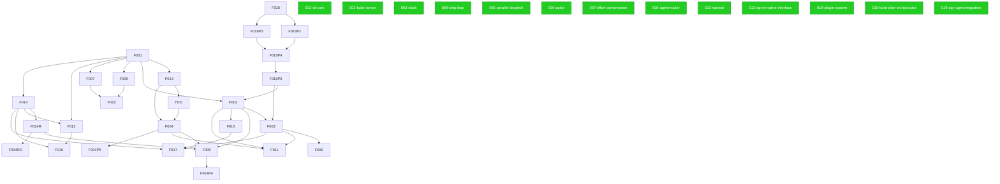

# 000 Build Plan — gwrk

> **Status:** Authoritative · **Date:** 2026-06-02
> **Anchored to:** [architecture.md](docs/architecture.md), [GWRK-PRD-PRFAQ.md](docs/GWRK-PRD-PRFAQ.md)
> **Decisions:** [ADR-001](docs/decisions/ADR-001-task-tracking.md), [ADR-002](docs/decisions/ADR-002-sqlite-execution-ledger.md), [ADR-003](docs/decisions/ADR-003-state-contract.md), [ADR-004](docs/decisions/ADR-004-agent-native-output.md), [ADR-005](docs/decisions/ADR-005-tdd-gate-architecture.md), [ADR-006](docs/decisions/ADR-006-plugin-agent-backends.md)

---

## Terminology

| Term | Meaning | Example |
|---|---|---|
| **Feature** | A spec subdirectory under `specs/`. Has its own spec.md, plan.md, contracts/, gates/, etc. | `specs/001-cli-core/` = Feature 001 |
| **Phase** | An implementation stage *within* a feature's `plan.md`. A feature has 1+ phases. | Phase 1 of Feature 013 = "Foundation (7 SP)" |
| **Wave** | A scheduling group of features that can execute concurrently. | Wave 2 = {F013, F006, F007, F012} |

---

## Dependency Graph

---

## Critical Path

```mermaid
gantt
    title Critical Path
    dateFormat X
    axisFormat %s

    Agent Mode (Layer 2, stdin, Classify, PhaseSchema) :done, 013_agent_native_interface_phase_03, 0, 11
```

---

## Features

### Feature 001-cli-core — 001-cli-core ✅

> [!WARNING]
> **Status:** ⚠️ Shipped but not yet TDD-hardened or verified.

| Phase | Name | Status | SP |
|---|---|---|---|
| 1 | Project Bootstrap & Config ✅ | SHIPPED ✅ | 0 |
| 2 | SQLite Execution Ledger ✅ | SHIPPED ✅ | 0 |
| 3 | Clarity Pillar — Define ✅ | SHIPPED ✅ | 0 |
| 4 | Throughput Pillar — Ship ✅ | SHIPPED ✅ | 0 |
| 5 | Task Engine — State, Gates & History ✅ | SHIPPED ✅ | 0 |
| 6 | Value Pillar — Measure ✅ | SHIPPED ✅ | 0 |
| 7 | Init Hardening ✅ | SHIPPED ✅ | 0 |
| 8 | E2E Surface Hardening ✅ | SHIPPED ✅ | 0 |
| 9 | State Contract — Execution Manifests & Merge Safety | SHIPPED ✅ | 0 |
| 10 | Unified Init — Project Onboarding ⭐ **REWRITE (R3)** | SHIPPED ✅ | 0 |
| 11 | CLI UX Polish ✅ | SHIPPED ✅ | 0 |
| 12 | Define Pillar Output Parity | SHIPPED ✅ | 0 |
| 13 | Project Awareness — Prompt Conditioning & PROMPT.md Refactoring ⭐ **NEW (R3)** | SHIPPED ✅ | 0 |
| 14 | Project-Scoped DB Isolation ⭐ **NEW (2026-06-01)** | SHIPPED ✅ | 0 |

### Feature 002-build-server — 002-build-server ✅

> [!WARNING]
> **Status:** ⚠️ Shipped but not yet TDD-hardened or verified.

| Phase | Name | Status | SP |
|---|---|---|---|
| 1 | Daemon Lifecycle & Service Management | SHIPPED ✅ | 0 |
| 2 | Resilience & System Status | SHIPPED ✅ | 0 |
| 3 | Slack Event Bridge & Bless Actions | SHIPPED ✅ | 0 |
| 4 | Execution Ledger | SHIPPED ✅ | 0 |

### Feature 003-slack — 003-slack ✅

> [!WARNING]
> **Status:** ⚠️ Shipped but not yet TDD-hardened or verified.

| Phase | Name | Status | SP |
|---|---|---|---|
| 1 | Slack Definition Pillar (P0) | SHIPPED ✅ | 0 |
| 2 | Conversational Agent Surface (P1) | SHIPPED ✅ | 0 |
| 3 | Webhook Hardening & Topology (P1) | SHIPPED ✅ | 0 |

### Feature 004-ship-loop — 004-ship-loop ✅

> [!WARNING]
> **Status:** ⚠️ Shipped but not yet TDD-hardened or verified.

| Phase | Name | Status | SP |
|---|---|---|---|
| 1 | Digest & Phase-Skip | SHIPPED ✅ | 0 |
| 2 | Resilience & Bail | SHIPPED ✅ | 0 |
| 3 | Verification & Artifacts | SHIPPED ✅ | 0 |
| 4 | Plugin Dispatch Boundary | SHIPPED ✅ | 0 |
| 5 | DispatchOrchestrator — TypeScript Ship Loop (F004-R) | SHIPPED ✅ | 0 |

### Feature 005-parallel-dispatch — 005-parallel-dispatch ✅

> [!WARNING]
> **Status:** ⚠️ Shipped but not yet TDD-hardened or verified.

| Phase | Name | Status | SP |
|---|---|---|---|
| 1 | Worktree Sandbox Manager | SHIPPED ✅ | 0 |
| 2 | Parallel Dispatch Orchestrator | SHIPPED ✅ | 0 |

### Feature 006-pulse — 006-pulse ✅

> [!WARNING]
> **Status:** ⚠️ Shipped but not yet TDD-hardened or verified.

| Phase | Name | Status | SP |
|---|---|---|---|
| 1 | Engine & Git Utility Refinement | SHIPPED ✅ | 0 |
| 2 | CLI Commands & Terminal Rendering | SHIPPED ✅ | 0 |
| 3 | Final Verification & E2E | SHIPPED ✅ | 0 |

### Feature 007-effort-compression — 007-effort-compression ✅

> [!WARNING]
> **Status:** ⚠️ Shipped but not yet TDD-hardened or verified.

| Phase | Name | Status | SP |
|---|---|---|---|
| 1 | Effort Engine | SHIPPED ✅ | 0 |
| 2 | Compression Engine | SHIPPED ✅ | 0 |
| 3 | CLI Commands + Integration | SHIPPED ✅ | 0 |

### Feature 008-agent-router — 008-agent-router ✅

> [!WARNING]
> **Status:** ⚠️ Shipped but not yet TDD-hardened or verified.

| Phase | Name | Status | SP |
|---|---|---|---|
| 1 | Agent Registry & Zod Validation | SHIPPED ✅ | 0 |
| 2 | Quota Prober & Cache | SHIPPED ✅ | 0 |
| 3 | Backend Selector (Core Logic) | SHIPPED ✅ | 0 |
| 4 | Integration & Wiring | SHIPPED ✅ | 0 |

### Feature 011-harvest — 011-harvest ✅

> [!WARNING]
> **Status:** ⚠️ Shipped but not yet TDD-hardened or verified.

| Phase | Name | Status | SP |
|---|---|---|---|
| 1 | Webhook Infrastructure & Orchestration | SHIPPED ✅ | 0 |
| 2 | Finalization & Cleanup | SHIPPED ✅ | 0 |
| 3 | Compression Calculation | SHIPPED ✅ | 0 |
| 4 | Done, Done! Notification | SHIPPED ✅ | 0 |
| 5 | Post-Ship Issue Tracking | SHIPPED ✅ | 0 |

### Feature 012-knowledge-work — 012-knowledge-work ⚪

**Status:** PLANNED

### Feature 013-agent-native-interface — 013-agent-native-interface ✅

> [!WARNING]
> **Status:** ⚠️ Shipped but not yet TDD-hardened or verified.

| Phase | Name | Status | SP |
|---|---|---|---|
| 1 | Foundation (Signal, Format, Gate-Check, Exit Codes) | SHIPPED ✅ | 7 |
| 2 | Discovery (Discover Engine, Help Rewrite, Error-as-Nav) | SHIPPED ✅ | 10 |
| 3 | Agent Mode (Layer 2, stdin, Classify, PhaseSchema) | SHIPPED ✅ | 11 |

### Feature 014-plugin-system — 014-plugin-system ✅

> [!WARNING]
> **Status:** ⚠️ Shipped but not yet TDD-hardened or verified.

| Phase | Name | Status | SP |
|---|---|---|---|
| 1 | Foundation (Plugin Loader & Registry) | SHIPPED ✅ | 0 |
| 2 | Skill Runtime (Layer 2) | SHIPPED ✅ | 0 |
| 3 | Agent Backend Adapters (Layer 1 - ADR-006) | SHIPPED ✅ | 0 |
| 4 | Antigravity (agy) Adapter | SHIPPED ✅ | 0 |
| 5 | WorkflowRuntime (Layer 2.5 - F014-R) | SHIPPED ✅ | 0 |
| 6 | DefineOrchestrator & CLI Rewiring | SHIPPED ✅ | 0 |
| 7 | Provisioning & Migration | SHIPPED ✅ | 0 |
| 8 | Routing & Intelligence (ex-F008) | SHIPPED ✅ | 0 |
| 9 | Enforcement Skills (FR-014 / US-016) | SHIPPED ✅ | 0 |
| 11 | .agents/ Deletion & Verification (ADR-007) | SHIPPED ✅ | 0 |

### Feature 018-build-plan-orchestrator — 018-build-plan-orchestrator ✅

> [!WARNING]
> **Status:** ⚠️ Shipped but not yet TDD-hardened or verified.

| Phase | Name | Status | SP |
|---|---|---|---|
| 1 | Foundation & Data Model | SHIPPED ✅ | 0 |
| 2 | Solver Engine & Ready Queue | SHIPPED ✅ | 0 |
| 3 | Graph Mutation & Lifecycle Hooks | SHIPPED ✅ | 0 |
| 4 | Verification & Markdown Rendering | SHIPPED ✅ | 0 |
| 5 | Visualization & Monitoring | SHIPPED ✅ | 0 |

### Feature 019-agy-agent-migration — 019-agy-agent-migration ✅

> [!WARNING]
> **Status:** ⚠️ Shipped but not yet TDD-hardened or verified.

| Phase | Name | Status | SP |
|---|---|---|---|
| 1 | AgyAdapter Foundation | SHIPPED ✅ | 0 |
| 2 | Router Integration | SHIPPED ✅ | 0 |

---

## Wave Strategy

| Wave | Features | Theme |
|---|---|---|
| Wave 1 | 001-cli-core, 002-build-server, 003-slack, 004-ship-loop, 005-parallel-dispatch, 006-pulse, 007-effort-compression, 008-agent-router, 011-harvest, 013-agent-native-interface, 014-plugin-system, 018-build-plan-orchestrator, 019-agy-agent-migration | TBD |

---

## Estimated Effort

| Feature | SP | Status |
|---|---|---|
| 001-cli-core | 0 | SHIPPED |
| 002-build-server | 0 | SHIPPED |
| 003-slack | 0 | SHIPPED |
| 004-ship-loop | 0 | SHIPPED |
| 005-parallel-dispatch | 0 | SHIPPED |
| 006-pulse | 0 | SHIPPED |
| 007-effort-compression | 0 | SHIPPED |
| 008-agent-router | 0 | SHIPPED |
| 011-harvest | 0 | SHIPPED |
| 012-knowledge-work | 0 | PLANNED |
| 013-agent-native-interface | 28 | SHIPPED |
| 014-plugin-system | 0 | SHIPPED |
| 018-build-plan-orchestrator | 0 | SHIPPED |
| 019-agy-agent-migration | 0 | SHIPPED |
| **Total** | **28** | |

---

## Open Questions

| # | Question | Status |
|---|---|---|
| 1 | TBD | 🟡 Open |

---

## Changelog

- **2026-06-02:** Regenerated from graph state via `gwrk plan render`.
