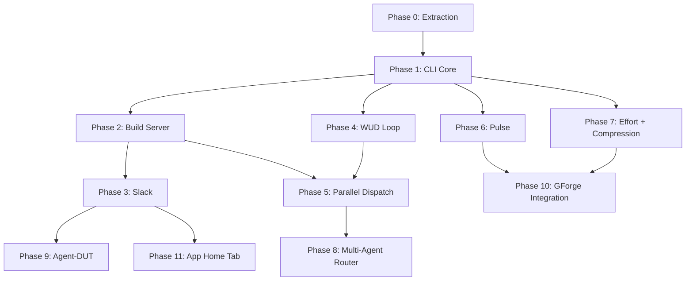

# 000 Build Plan — gwrk

> **Status:** Authoritative · **Date:** 2026-03-08 (v3)
> **Anchored to:** [architecture.md](file:///Users/gonzo/Code/gwrk/docs/architecture.md), [GWRK-PRD-PRFAQ.md](file:///Users/gonzo/Code/gwrk/docs/GWRK-PRD-PRFAQ.md)
> **Decisions:** [ADR-001](file:///Users/gonzo/Code/gwrk/docs/decisions/ADR-001-task-tracking.md) (gate architecture), [ADR-002](file:///Users/gonzo/Code/gwrk/docs/decisions/ADR-002-sqlite-execution-ledger.md) (SQLite execution ledger)

---

## Dependency Graph



---

## Critical Path

```
P0 → P1 → P2 → P3 → P11
              → P4 → P5 → P8
         → P6
         → P7
```

**P1 (CLI Core) is the keystone.** Everything depends on the CLI command infrastructure, multi-CLI provisioning, and the SQLite execution ledger (ADR-002). P2 (Build Server) and P4 (WUD Loop) are the next-order dependencies. P3 is now Slack (Socket Mode + Bolt SDK), replacing Telegram. P11 (App Home Tab) is Slack-native, depending only on P3.

---

## Phases

### Phase 0 — Extraction ✅

Extract the code-red agent workflow system into the gwrk repository.

| Feature | Content | Gate |
|---|---|---|
| `.agent/` | Workflows, rules, personas, templates | Files exist |
| `.specify/` | Templates, scripts, memory | Files exist |
| `scripts/dev/` | Shell orchestrators | `make agent-specify` runs |
| `Makefile` | Agent invocation targets | Targets fire |

**Status:** Complete. Committed on `develop`.

---

### Phase 1 — CLI Core

Bootstrap the gwrk TypeScript CLI with foundational commands, multi-CLI provisioning, and the SQLite execution ledger (ADR-002).

| Spec | Content | Gate |
|---|---|---|
| `001-cli-core` | CLI entry, Commander routing, `gwrk new`, `gwrk init`, multi-CLI provisioning, `specify`, `plan`, `plan-to-tasks`, `tasks`, SQLite init | `gwrk new <project>` scaffolds everything; `gwrk tasks done` enforces gates |

**Dependencies:** Phase 0
**Agent:** Gemini CLI (definition + multi-file generation)

#### What ships:

```bash
gwrk new <project-name>        # Full provisioning: dir, git, GitHub, Slack channel,
                                # CLI detection, scaffold, SQLite registration, server start
gwrk init                      # Add gwrk to existing project: scaffold + CLI provisioning
                                # + Slack channel + SQLite registration
gwrk specify <feature>         # Wrapper: invokes gemini with /specify workflow
gwrk plan <feature>            # Wrapper: invokes gemini with /plan workflow
gwrk tasks <feature>           # List tasks from SQLite (exported to .gwrk/tasks.json)
gwrk tasks done <feature> <id> # Gate-enforced state transition
```

#### `gwrk new` vs `gwrk init`:
- **`gwrk new <name>`** — From scratch. Requires explicit project name (or description → extracted name). Creates directory, `git init`, `gh repo create`, Slack channel, full scaffold, CLI provisioning, SQLite registration. Does everything it can, then reports what it couldn't with next steps.
- **`gwrk init`** — "I'm working here, add gwrk." Detects existing project context. Scaffolds `.agent/`, `.specify/`, `specs/`. Provisions detected CLIs (`GEMINI.md`, `CLAUDE.md`, `AGENTS.md`). Creates Slack channel. Registers in SQLite.

#### Multi-CLI provisioning:
- Detects `gemini`, `claude`, `codex` via `which`/`command -v`
- Provisions CLI-specific context files referencing shared `.agent/` directory
- Generates CLI-specific settings from `.gwrkrc.json` defaults

#### Key files:
- `src/cli.ts` — Commander entry point
- `src/commands/new.ts` — Full project provisioning
- `src/commands/init.ts` — Add gwrk to existing project
- `src/commands/specify.ts`, `plan.ts`, `tasks.ts`
- `src/utils/exec.ts` — Shell command runner
- `src/utils/config.ts` — `.gwrkrc.json` loader (Zod, fail-fast)
- `src/db/index.ts` — SQLite connection + schema init
- `src/db/migrations/` — Versioned schema files
- `src/utils/state.ts` — Task read/write via SQLite
- `src/utils/history.ts` — History inserts via SQLite
- `src/utils/parser.ts` — Extract phases/tasks from `plan.md`
- `src/utils/gate-gen.ts` — Generate `gates/T0xx-gate.sh` from contracts

#### Tech decisions:
- **Commander.js** for CLI routing (not Ink — see architecture.md §4)
- **better-sqlite3** for execution ledger (ADR-002)
- **Zod** for all schema validation
- **Vitest** for testing
- **Biome** for lint + format
- **ES2022** target, ESM modules

---

### Phase 2 — Build Server

Local persistent daemon that serves as the control plane. Includes macOS sleep/wake resilience, network connectivity awareness, and component-level health reporting.

| Spec | Content | Gate |
|---|---|---|
| `002-build-server` | Fastify daemon, dispatch queue, Docker sandbox manager, sleep/wake lifecycle, network monitor, rich health endpoint | `gwrk server start` creates sandboxes; dispatch queue pauses on sleep/offline |

**Dependencies:** Phase 1
**Agent:** Claude Code (long-context server architecture)

#### What ships:

```bash
gwrk server start              # Start localhost:18790 daemon
gwrk server stop               # Stop daemon
gwrk status                    # Active agents, clones, system resources
```

#### Key files:
- `src/server/index.ts` — Fastify bootstrap
- `src/server/dispatch.ts` — Phase dispatch queue + retry logic (writes to `runs` table)
- `src/server/sandbox.ts` — Docker container lifecycle
- `src/server/git-manager.ts` — Branch creation, merge, conflict resolution

---

### Phase 3 — Slack

Slack integration for the comms layer via Socket Mode + Bolt SDK. Channel-per-project model.

| Spec | Content | Gate |
|---|---|---|
| `003-slack` | Socket Mode app, Bolt SDK, slash commands, interactive messages, threads, channel provisioning | Send status update and approve a review verdict from Slack |

**Dependencies:** Phase 2
**Agent:** Gemini CLI

#### What ships:

```bash
gwrk setup slack               # Fully automated: create app, install, write tokens, test
# Slack commands: /gwrk status, /gwrk dispatch, /gwrk approve, /gwrk pulse
# Interactive: review verdict buttons, threaded DUT conversations
# Reactions: ✅ react-to-approve for lightweight confirmation
# Presence: notification throttling (active=verbose, away=batched)
```

#### Key files:
- `src/server/slack.ts` — Bolt SDK Socket Mode integration
- `src/server/slack-commands.ts` — Slash command handlers
- `src/server/slack-actions.ts` — Interactive message action handlers
- `src/commands/setup-slack.ts` — Automated Slack app provisioning

---

### Phase 4 — WUD Loop

Autonomous implement → review → PR → CI loop.

| Spec | Content | Gate |
|---|---|---|
| `004-wud-loop` | `gwrk wud`, `gwrk implement`, review gates, PR creation, run recording | Agent completes a phase and opens a PR |

**Dependencies:** Phase 1
**Agent:** Codex Cloud (autonomous execution)

#### What ships:

```bash
gwrk implement <feature> <phase>   # Execute a single phase
gwrk wud <feature>                 # Autonomous lifecycle
```

#### SQLite integration:
- Every WUD dispatch writes a `runs` record (backend, model, attempt, timestamps)
- Gate results recorded in `runs.gate_result`
- Review verdicts in `runs.review_verdict`
- Retry reasons in `runs.retry_reason`

---

### Phase 5 — Parallel Dispatch

Multi-phase concurrent execution with conflict resolution.

| Spec | Content | Gate |
|---|---|---|
| `005-parallel-dispatch` | Concurrent sandboxes, merge ordering, managed repo clones | Three agents work simultaneously |

**Dependencies:** Phase 2, Phase 4
**Agent:** Claude Code

#### What ships:

```bash
gwrk feature <feature>         # Full end-to-end lifecycle
gwrk config set parallelism.local.clones 3
```

---

### Phase 6 — Pulse

Productivity dashboard with historical git analysis.

| Spec | Content | Gate |
|---|---|---|
| `006-pulse` | Git log scanner, PulseSnapshot, historical scan | `gwrk pulse scan` produces data |

**Dependencies:** Phase 1
**Agent:** Gemini CLI

#### What ships:

```bash
gwrk pulse                     # Current snapshot across repos
gwrk pulse scan [path]         # Scan any existing git repo
```

---

### Phase 7 — Effort + Compression

SP-driven estimation and delivery speed measurement with leading compression indicators.

| Spec | Content | Gate |
|---|---|---|
| `007-effort-compression` | Story extraction, role bracketing, timestamp collection, compression ratios, leading indicators: convergence (first-pass rate, avg attempts), density (lines/SP, files/SP, tool calls/SP), spec quality (contract count, gate count) | `gwrk compression` produces a report with Point + Total ratios and leading indicators |

**Dependencies:** Phase 1, SQLite (ADR-002)
**Agent:** Gemini CLI

#### What ships:

```bash
gwrk effort <feature>          # Generate effort estimate from spec stories
gwrk compression <feature>     # Compression ratios + leading indicators
gwrk compression --all         # Summary across all features with trends
```

#### SP additivity invariant:
Feature SP = Σ Phase SP = Σ Task SP. No orphan points. gwrk validates on `plan-to-tasks`.

---

### Phase 8 — Multi-Agent Router

Agent backend selection, Done Done! protocol, retry + escalation, learning from execution history.

| Spec | Content | Gate |
|---|---|---|
| `008-agent-router` | Router logic, per-backend invocation, fallback chain, tandem dispatch, **SQLite-backed learning** | Dispatch to Codex, retry on Claude, feature ships |

**Dependencies:** Phase 5, SQLite (ADR-002)
**Agent:** Claude Code

#### Learning engine:
- Queries global SQLite `runs` + `task_types` tables
- Selects backend based on historical success rate × task SP × language
- Adapts over time as more execution data accumulates

---

### Phase 9 — Agent-DUT

Slack-native conversational ideation → spec generation, aligned to Foxtrot Charlie.

| Spec | Content | Gate |
|---|---|---|
| `009-agent-dut` | DUT conversational loop in Slack threads, FC-aligned protocol (SPARK→PROBE→DISAMBIGUATE→SHAPE→PRESS→GROUND→REVIEW→COMMIT), analyze-as-core-perspective | `/dream` in Slack produces a `spec.md` from threaded conversation |

**Dependencies:** Phase 3
**Agent:** Gemini CLI

#### Foxtrot Charlie alignment:
- **Discovery (Truth):** SPARK → PROBE → DISAMBIGUATE (analyze lens active)
- **Definition (Clarity):** SHAPE → PRESS → GROUND → REVIEW → COMMIT
- Analyze perspective runs continuously, not as a separate step

---

### Phase 10 — GForge Integration

Unified Pulse + Compression dashboard across repos.

| Spec | Content | Gate |
|---|---|---|
| `010-gforge-integration` | Pulse replaces PulseStore, unified dashboard | Single pane across repos |

**Dependencies:** Phase 6, Phase 7

---

### Phase 11 — App Home Tab

Slack App Home Tab as the real-time ops dashboard. Replaces the Glass Dashboard SPA.

| Spec | Content | Gate |
|---|---|---|
| `011-app-home-tab` | Block Kit views: Ops, Projects, Pulse, Compression, Events, Quick Actions. Auto-refresh. Tunnel for remote access. | Open gwrk in Slack → see live agent activity, project progress, compression |

**Dependencies:** Phase 3 (Slack)
**Agent:** Gemini CLI

#### What ships:

```bash
gwrk tunnel start                  # Start Cloudflare Tunnel
gwrk tunnel start --provider tailscale
gwrk tunnel status
gwrk tunnel stop
```

#### Why App Home Tab, not SPA:
- No separate web server to run
- No tunnel needed just for dashboard (tunnel is for remote Slack access)
- Already authenticated via Slack
- Already mobile
- One less thing to build

> **Tunnel resilience note:** The tunnel process manager (`gwrk tunnel start/stop`) ships in Phase 11 but depends on Phase 2's sleep/wake event bus (`server:wake` + `network:up` → tunnel auto-restart). This is a consumer relationship, not a new dependency edge — Phase 11 already depends on Phase 2 transitively via Phase 3.

---

## Wave Strategy

| Wave | Phases | Parallelizable? | Theme |
|---|---|---|---|
| **Wave 1** | P1 | No (keystone) | Bootstrap: CLI, SQLite, multi-CLI provisioning, gwrk new/init |
| **Wave 2** | P2, P4, P6, P7 | Yes (independent after P1) | Core engines: server, execution, productivity, compression |
| **Wave 3** | P3, P5 | Partially (P3 needs P2, P5 needs P2+P4) | Multipliers: Slack, parallelism |
| **Wave 4** | P8, P9, P11 | Yes (P8 needs P5; P9 needs P3; P11 needs P3) | Intelligence + Comms: smart routing, DUT ideation, App Home Tab |
| **Wave 5** | P10 | No (needs P6+P7) | Integration: unified dashboard |

---

## Estimated Effort

| Phase | SP | Primary Role | Est. Hours |
|---|---|---|---|
| P0 (Extraction) | 3 | PE | Done |
| P1 (CLI Core) | 21 | TS | 105h |
| P2 (Build Server) | 18 | TS | 90h |
| P3 (Slack) | 13 | TS | 65h |
| P4 (WUD Loop) | 8 | TS | 40h |
| P5 (Parallel Dispatch) | 8 | TS | 40h |
| P6 (Pulse) | 5 | TS | 25h |
| P7 (Effort + Compression) | 8 | TS | 40h |
| P8 (Agent Router) | 8 | TS | 40h |
| P9 (Agent-DUT) | 8 | TS | 40h |
| P10 (Integration) | 5 | TS | 25h |
| P11 (App Home Tab) | 5 | TS | 25h |
| **Total** | **110 SP** | | **535h** |

**Changes from v1:** P1 increased (13→21 SP: gwrk new, gwrk init, multi-CLI, SQLite). P3 increased (8→13 SP: Slack is richer than Telegram). P7 increased (5→8 SP: leading indicators). P11 decreased (8→5 SP: App Home Tab is simpler than SPA).

---

## Open Questions Blocking Architecture

None for P0→P1→P2 critical path. Remaining questions:

| # | Question | Affects | Status |
|---|---|---|---|
| 1 | SP → Phase → Task additivity enforcement: warn or hard fail? | P7 | 🟡 Open |
| 2 | Cloudflare Tunnel automation: can we provision without pre-config? | P11 | 🟡 Open (spike needed) |
| 3 | Slack presence throttling: granularity beyond active/away? | P3 | 🟡 Open |

---

## Changelog

- **2026-03-08 (v3):** Added resilience requirements to Phase 2 (Build Server). New user scenarios: US-011 (macOS sleep/wake), US-012 (network connectivity), US-013 (rich health). Seven new FRs (FR-015–FR-021). New Phase 6 in 002-build-server plan (Resilience & Connectivity). Phase 11 tunnel dependency on Phase 2 event bus clarified. P2 SP: 13→18 (+5 SP for resilience phase). Total: 105→110 SP.
- **2026-03-05 (v2):** Major update per strategic vision v2. Phase 3: Telegram → Slack (Socket Mode + Bolt SDK). Phase 11: Glass Dashboard → App Home Tab. P1 expanded (gwrk new/init, multi-CLI provisioning, SQLite). SQLite execution ledger (ADR-002) replaces flat JSON. P7 adds leading compression indicators. P9 DUT moves to Slack, aligns to Foxtrot Charlie. Telegram cut from MVP. Updated SP estimates. Total: 92→105 SP.
- 2026-02-27: Added Spec 011 (Glass Dashboard). Wave 4. Dependencies: [P2, P3]. Impact: +8 SP.
