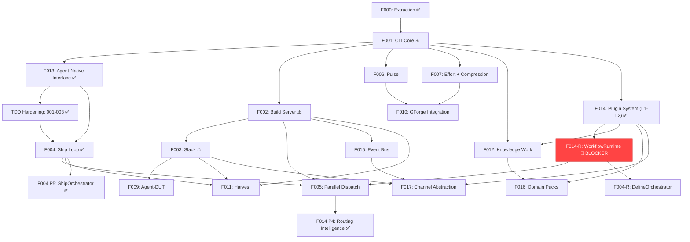

# 000 Build Plan — gwrk

> **Status:** Authoritative · **Date:** 2026-03-31 (v13)
> **Anchored to:** [architecture.md](file:///Users/gonzo/Code/gwrk/docs/architecture.md), [GWRK-PRD-PRFAQ.md](file:///Users/gonzo/Code/gwrk/docs/GWRK-PRD-PRFAQ.md)
> **Decisions:** [ADR-001](file:///Users/gonzo/Code/gwrk/docs/decisions/ADR-001-task-tracking.md) (gate architecture), [ADR-002](file:///Users/gonzo/Code/gwrk/docs/decisions/ADR-002-sqlite-execution-ledger.md) (SQLite execution ledger), [ADR-003](file:///Users/gonzo/Code/gwrk/docs/decisions/ADR-003-state-contract.md) (execution state contract), [ADR-004](file:///Users/gonzo/Code/gwrk/docs/decisions/ADR-004-agent-native-output.md) (agent-native output protocol), [ADR-005](file:///Users/gonzo/Code/gwrk/docs/decisions/ADR-005-tdd-gate-architecture.md) (TDD gate architecture), [ADR-006](file:///Users/gonzo/Code/gwrk/docs/decisions/ADR-006-plugin-agent-backends.md) (plugin agent backends)
> **Research:** [R004 Shareability Readiness](file:///Users/gonzo/Code/gwrk/docs/research/R004-shareability-readiness/draft.md) — F014-R rework scope, PM decisions locked

---

## Terminology

| Term | Meaning | Example |
|---|---|---|
| **Feature** | A spec subdirectory under `specs/`. Has its own spec.md, plan.md, contracts/, gates/, etc. | `specs/001-cli-core/` = Feature 001 |
| **Phase** | An implementation stage *within* a feature's `plan.md`. A feature has 1+ phases. | Phase 1 of Feature 013 = "Foundation (7 SP)" |
| **Wave** | A scheduling group of features that can execute concurrently. | Wave 2 = {F013, F006, F007, F012} |

> [!IMPORTANT]
> **Feature ≠ Phase.** A Feature is a deliverable unit with its own spec directory. A Phase is a stage of implementation within a single feature. Features have phases. The build plan orders *features*. Workflows execute *phases within features*.

---

## Dependency Graph



---

## Critical Path

```mermaid
gantt
    title Critical Path (updated per R004 decisions)
    dateFormat X
    axisFormat %s

    section Main Chain
    F000 Extraction          :done,    f000, 0, 1
    F001 CLI Core            :done,    f001, after f000, 1
    F013 Agent-Native        :done,    f013, after f001, 1
    TDD Hardening 001-003   :done,    tdd,  after f013, 1
    F004 Ship Loop (P1-P5)   :done,    f004, after tdd, 2
    F014 P1-P4 Plugin Core   :done,    f014, after f001, 2

    section Shareability Blocker
    F014-R WorkflowRuntime   :crit,    f014r, after f014, 2
    F004-R DefineOrchestrator:         f004rd, after f014r, 1

    section Post-F014-R
    F011 Harvest             :         f011, after f004, 1
    F005 Parallel Dispatch   :         f005, after f014r, 1

    section Server Branch
    F002 Build Server        :done,    f002, after tdd, 1
    F003 Slack               :done,    f003, after f002, 1

    section Independent (off F001)
    F006 Pulse               :         f006, after f001, 1
    F007 Effort+Compression  :         f007, after f001, 1
```



**F014-R (WorkflowRuntime) is the new critical path** (per R004 decisions, cascade §2.6). F014-R is a hard shareability blocker — gwrk cannot be distributed until CLI commands resolve workflows through the plugin system instead of hardcoding `.agents/` paths. Implementation order: **F014-R (shareability blocker, 25-40 SP) → F004-R DefineOrchestrator (depends on F014-R for workflow delivery) → F011 (small, self-contained) → F005 (highest complexity, benefits from F014-R)**.

---

## Features

### Feature 000 — Extraction ✅

Extract the code-red agent workflow system into the gwrk repository.

| Content | Gate |
|---|---|
| `.agents/`, `.specify/`, `scripts/dev/`, `Makefile` | Files exist, agent invocation targets fire |

**Status:** Complete ✅. Committed on `develop`.

---

### Feature 000-TDD — TDD Infrastructure ✅

Establish a rigorous, programmatically-enforced TDD standard. Replace file-existence gate stubs with authored executable assertions. Wire `gwrk define tasks` to produce LLM-authored gates from contracts. Retroactively audit 001 and 002. Fix 22 failing tests in 003-slack.

| Content | Gate |
|---|---|
| Gate standard (FR-001), AUTHORED/GATE_STUB preservation (FR-002), `gwrk test` command (FR-009), `gwrk ship` pre-flight block (FR-008), gap analyses for 001+002 (FR-005/006), 003-slack test remediation (FR-007) | `pnpm vitest run` = 0 failed; no gate is purely `test -f` |

**Status:** Complete. Merged via PR #7. UAT GO (`75a0a51`). Code review GO (`3ca5954`).

**Deliverables produced:**
- Hard gate enforcement (`GATE_STUB` blocks `tasks done`, `# AUTHORED` preserves gates through reconcile)
- `gwrk test <feature>` command
- `gwrk ship` pre-flight block (FR-008: exits 1 if no `.test.ts` files for phase)
- Gap analyses: `specs/001-cli-core/gap-analysis.md`, `specs/002-build-server/gap-analysis.md`
- 22 failing 003-slack tests fixed → full suite 60 files, 303 tests, 0 failed

---

### Feature 001 — CLI Core ✅

Bootstrap the gwrk TypeScript CLI with foundational commands, multi-CLI provisioning, and the SQLite execution ledger (ADR-002).

| Spec | Content | Gate |
|---|---|---|
| `001-cli-core` | CLI entry, Commander routing, `gwrk new`, `gwrk init`, multi-CLI provisioning, `specify`, `plan`, `plan-to-tasks`, `tasks`, SQLite init | `gwrk new <project>` scaffolds everything; `gwrk tasks done` enforces gates |

**Dependencies:** Feature 000
**Agent:** Gemini CLI (definition + multi-file generation)

**Status:** ⚠️ Shipped. Code on `develop`. Gates pass but most are `test -f` stubs (91% contamination). Not TDD-hardened.

> [!WARNING]
> **Gap analysis (000-tdd FR-005) identified issues:** Most gates are `test -f` stubs. `gate-gen.ts` is heuristic-based, not contract-derived. `dispatchAgent()` return type has contract mismatch. Remediation deferred to TDD Hardening.

#### What ships:

```bash
gwrk new <project-name>        # Full provisioning
gwrk init                      # Add gwrk to existing project
gwrk specify <feature>         # Wrapper: invokes gemini with /specify workflow
gwrk plan <feature>            # Wrapper: invokes gemini with /plan workflow
gwrk tasks <feature>           # List tasks from SQLite
gwrk tasks done <feature> <id> # Gate-enforced state transition
```

#### Key files:
- `src/cli.ts` — Commander entry point
- `src/commands/new.ts`, `init.ts`, `specify.ts`, `plan.ts`, `tasks.ts`
- `src/utils/exec.ts`, `config.ts`, `state.ts`, `history.ts`, `parser.ts`, `gate-gen.ts`
- `src/db/index.ts`, `src/db/migrations/`

#### Tech decisions:
- **Commander.js** for CLI routing (not Ink — see architecture.md §4)
- **better-sqlite3** for execution ledger (ADR-002)
- **Zod** for all schema validation
- **Vitest** for testing, **Biome** for lint + format
- **ES2022** target, ESM modules

---

### Feature 002 — Build Server ✅

Local persistent daemon that serves as the control plane. Includes macOS sleep/wake resilience, network connectivity awareness, and component-level health reporting.

| Spec | Content | Gate |
|---|---|---|
| `002-build-server` | Fastify daemon, dispatch queue, worktree sandbox manager (R001), sleep/wake lifecycle, network monitor, rich health endpoint, `gwrk harvest` manifest ETL | `gwrk server start` creates sandboxes; dispatch queue pauses on sleep/offline |

**Dependencies:** Feature 001
**Agent:** Claude Code (long-context server architecture)

**Status:** ⚠️ Shipped. Code on `develop`. Gates pass but 69% are `test -f` stubs. Not TDD-hardened.

> [!WARNING]
> **Gap analysis (000-tdd FR-006) identified issues:** FR-012 (Dockerfile ⚠️), FR-016/018/019 (weak assertions), FR-024 (`server clean` ❌ missing). Remediation deferred to TDD Hardening.

#### What ships:

```bash
gwrk server start              # Start localhost:18790 daemon
gwrk server stop               # Stop daemon
gwrk status                    # Active agents, clones, system resources
```

#### Key files:
- `src/server/index.ts` — Fastify bootstrap
- `src/server/dispatch.ts`, `sandbox.ts`, `git-manager.ts`

---

### Feature 003 — Slack ✅

Slack integration for the comms layer via Socket Mode + Bolt SDK. Channel-per-project model.

| Spec | Content | Gate |
|---|---|---|
| `003-slack` | Socket Mode app, Bolt SDK, slash commands, interactive messages, threads, channel provisioning, App Home Tab dashboard | Send status update and approve a review verdict from Slack |

**Dependencies:** Feature 002
**Agent:** Gemini CLI

**Status:** ⚠️ Shipped. Code on `develop`. 000-tdd fixed 20 test failures. Gates pass but not TDD-hardened (10% stub contamination).

> [!IMPORTANT]
> **2026-03-14**: FR-014 (Slack Incoming Webhook) added — primary notification path for cloud agents. See spec.md for details.

> [!WARNING]
> **Gap analysis is a greenfield inventory (2026-03-10), NOT a test-coverage audit.** Needs rewrite as proper FR-by-FR ✅/⚠️/❌ classification. Deferred to TDD Hardening.

#### What ships:

```bash
gwrk setup slack               # Fully automated: create app, install, write tokens, test
# Slack commands: /gwrk status, /gwrk dispatch, /gwrk approve, /gwrk pulse
# Interactive: review verdict buttons, threaded DUT conversations
```

#### Key files:
- `src/server/slack.ts`, `slack-commands.ts`, `slack-actions.ts`
- `src/commands/setup-slack.ts`

---

### Feature 013 — Agent-Native Interface ✅

Make gwrk a dual-mode CLI that operates identically for humans and LLM agents, with structured output, operational signals, project discovery, and a presentation layer that protects agents from context corruption.

| Spec | Content | Gate |
|---|---|---|
| `013-agent-native-interface` | Operational signal (`[exit:N \| Xs]`), `--format json`, `--agent` mode (Layer 2), `gwrk project discover/specs/gates`, `gwrk gate-check`, error-as-navigation, exit code standardization, help text enrichment | `gwrk status 2>/dev/null` produces clean stdout; `gwrk project discover --format json \| jq .` succeeds |

**Dependencies:** Feature 001 ✅
**Spec:** [spec.md](file:///Users/gonzo/Code/gwrk/specs/013-agent-native-interface/spec.md) ✅
**Plan:** [plan.md](file:///Users/gonzo/Code/gwrk/specs/013-agent-native-interface/plan.md) ✅
**Decision:** [ADR-004](file:///Users/gonzo/Code/gwrk/docs/decisions/ADR-004-agent-native-output.md)

#### What ships:

```bash
gwrk project discover          # Full project state (git, specs, tasks, gates, config)
gwrk project specs             # Spec inventory with status
gwrk project gates             # Aggregate gate results
gwrk gate-check <task_id>      # Structured gate verification result
gwrk <any> --format json       # Machine-readable structured output
gwrk <any> --agent             # Layer 2: ANSI-stripped, bounded, guarded output
# [exit:N | Xs] on stderr for every command invocation
```

#### Implementation phases (within this feature):
1. **Phase 1 — Foundation (7 SP):** `withSignal()` wrapper, `--format json`, `gwrk gate-check`, exit code audit
2. **Phase 2 — Discovery (10 SP):** `gwrk project discover`, `gwrk project specs/gates`, help text rewrite, error-as-navigation
3. **Phase 3 — Agent Mode (11 SP):** `--agent` / Layer 2, stdin acceptance for `define plan`, classification inference, phase schema enrichment

#### Key files (new):
- `src/utils/signal.ts`, `output.ts`, `agent-layer.ts`
- `src/commands/gate-check.ts`, `project.ts`
- `src/engine/discover.ts`, `classify.ts`

---

### TDD Hardening — 001, 002, 003 ✅

Rewrite shipped features 001–003 to the TDD standard established by 000-tdd-infrastructure. Regenerate all legacy garbage gates (`test -f` stubs) to functional assertions. Audit actual implementation state. Remediate gaps.

| Scope | Content | Gate |
|---|---|---|
| 001-cli-core | Rewrite spec to TDD standard. Fix `dispatchAgent()` contract mismatch. Regenerate all 44 gates. | `gwrk test 001-cli-core` = 0 failed |
| 002-build-server | Rewrite spec to TDD standard. Add lifecycle integration tests. Implement `server clean` (FR-024). Regenerate 26 gates. | `gwrk test 002-build-server` = 0 failed |
| 003-slack | Rewrite gap-analysis as test-coverage audit. Verify contracts against shipped code. Remediate ❌ items. | `gwrk test 003-slack` = 0 failed |

**Dependencies:** Feature 013 ✅
**Estimated effort:** ~15 SP (5 + 7 + 3)

**Status:** Complete ✅. Hardened through 004 Ship Loop development. Gate contamination cleared.

#### Gate contamination baseline (pre-hardening):

| Feature | Total Gates | `test -f` Only | Contamination |
|---|---|---|---|
| 001-cli-core | 44 | ~40 | ~91% |
| 002-build-server | 26 | 18 | 69% |
| 003-slack | 31 | 3 | 10% ✅ (fixed by 000-tdd) |

---

### Feature 004 — Ship Loop ✅

Autonomous implement → review → PR → CI loop. (Renamed from WUD to align with Foxtrot Charlie Pillar 3: Shipping.)

| Spec | Content | Gate |
|---|---|---|
| `004-ship-loop` | `gwrk ship`, review gates, PR creation, execution manifests, run recording. WUD-as-CLI-consumer: agent operates through `gwrk tasks next`, `gwrk gate-check`, `gwrk tasks done` (F013 contracts). | Agent completes a feature phase and opens a PR |

**Dependencies:** Feature 013 ✅, TDD Hardening ✅
**Agent:** Codex Cloud (autonomous execution)

#### What ships:

```bash
gwrk ship <feature> [phase]        # Full autonomous lifecycle
gwrk ship <feature> <phase>        # Ship a single phase
gwrk gate <feature> [-p <phase>]   # Run gate scripts for a feature/phase
```

#### F013 integration (WUD-as-CLI-consumer):
- WUD calls `gwrk tasks next --json`, `gwrk gate-check <task_id> --json`, `gwrk tasks done`
- All output parsed via `--format json`; operational signals via `[exit:N | Xs]`

#### SQLite integration:
- Every Ship dispatch writes a `runs` record (backend, model, attempt, timestamps)
- Gate results, review verdicts, retry reasons recorded

#### Plugin Dispatch Boundary (FR-019–021, ADR-006):
- **FR-019**: All dispatch through `dispatchToAgent(TaskDispatch): Promise<TaskResult>` — ship loop MUST NOT spawn CLI processes directly
- **FR-020**: Exit code normalization — proprietary codes (e.g., Gemini `53`) mapped to gwrk standard (`0`/`1`/`2`/`127`) with `errorType` classification
- **FR-021**: Context delivered via stdin pipe — inline `-p "<prompt>"` MUST NOT be used for context >4096 bytes
- Contract: `specs/004-ship-loop/contracts/dispatch.md` (Phase 4)
- See [architecture.md §6.1](file:///Users/gonzo/Code/gwrk/docs/architecture.md) (Dispatch Boundary)

> **Scope (2026-03-14):** Ship Loop = steps 1-7 (DISPATCH → NOTIFY). Harvest (post-merge lifecycle) moved to F011. See architecture.md §6.2-6.3.

**Status:** Complete ✅. Merged via PR #12. 28/28 gates PASS. 68 test files, 404 tests, 0 failures. `gwrk gate` command promoted as Foxtrot Charlie pillar. `resolveFormat()` DRY refactor shipped. Also includes: dispatch idempotency guard, plugin dispatch boundary (Phase 4), execution manifests, `dispatchToAgent()` abstraction.

**Deliverables produced:**
- `gwrk ship <feature> [phase]` — full autonomous Ship Loop lifecycle (4 phases)
- `gwrk gate <feature> [-p <phase>]` — promoted gate-check to CLI pillar command
- `dispatchToAgent()` dispatch boundary (ADR-006 contract)
- `resolveFormat()` DRY format resolution (killed "human" format)
- Dispatch idempotency guard (prevents double-dispatch)
- Execution manifests + dispatch log
- 7 e2e tests via `scripts-e2e.test.ts`, 2 unit test suites

---

### ~~Feature 004-R — Ship Loop Rework (DispatchOrchestrator)~~

> **2026-03-31:** ShipOrchestrator folded into **F004 Phase 5** ✅ (landed on develop). DefineOrchestrator rework (replacing `define-until-solid.sh`) now tracked separately — depends on F014-R for workflow delivery.

**Status:** ⚫ ShipOrchestrator absorbed into F004 Phase 5 ✅. DefineOrchestrator pending (post-F014-R).

---

### Feature 005 — Parallel Dispatch

Multi-task concurrent execution using git worktree sandboxes. Scope: dispatch + sandbox lifecycle + PR creation. **No merge ownership, no conflict resolution** (per cascade §2.5 item 1 — orchestrator scope ends at `gh pr create`).

| Spec | Content | Gate |
|---|---|---|
| `005-parallel-dispatch` | Worktree sandboxes (`.runs/sandboxes/`), `TaskDispatch`/`TaskResult` (ADR-006), per-backend capacity gate, resource gating (`maxClones`, `maxCpu`, `maxMem`). **Phase 1: `local-cli` only** (cloud agents deferred per cascade §2.5 item 3). | Three local agents work simultaneously in separate worktrees without exceeding backend rate limits |

**Dependencies:** Feature 002, Feature 004, **Feature 014 P1–P2** (plugin loader for `AgentBackend` adapters, per cascade §5)
**Agent:** Claude Code
**Gating:** ⚠️ R003 (Agent Stage Containment) outcome may add containment enforcement requirements. See OQ-6.

#### What ships:

```bash
gwrk ship <feature> --parallel     # Dispatch independent tasks concurrently
gwrk config set parallelism.local.maxClones 3
```

#### Sandbox model (R001):
- Each task dispatched into an isolated git worktree under `.runs/sandboxes/<feature>-<task>-<uuid>/`
- Agent runs `gwrk ship` within the worktree (hexagonal dispatch per R001)
- On completion: agent pushes branch, creates PR via `gh pr create`, worktree auto-cleaned
- Merge serialization handled by F004 Ship Loop (not F005)

#### Agent capacity gate:
- Before `processNext()` assigns a backend: check `maxConcurrent` and `rateLimit` sliding window
- On 429/rate-limit: record in `runs`, exponential backoff with jitter
- Resource gating: `maxCpu`, `maxMem`, `minDiskGb` checked pre-dispatch (R001)

---

### Feature 006 — Pulse

Productivity dashboard with historical git analysis.

| Spec | Content | Gate |
|---|---|---|
| `006-pulse` | Git log scanner, PulseSnapshot, historical scan | `gwrk pulse scan` produces data |

**Dependencies:** Feature 001
**Agent:** Gemini CLI

```bash
gwrk pulse                     # Current snapshot across repos
gwrk pulse scan [path]         # Scan any existing git repo
```

---

### Feature 007 — Effort + Compression

SP-driven estimation and delivery speed measurement with leading compression indicators.

| Spec | Content | Gate |
|---|---|---|
| `007-effort-compression` | Story extraction, role bracketing, compression ratios, leading indicators | `gwrk compression` produces a report |

**Dependencies:** Feature 001, SQLite (ADR-002)
**Agent:** Gemini CLI

```bash
gwrk effort <feature>          # Generate effort estimate
gwrk compression <feature>     # Compression ratios + leading indicators
gwrk compression --all         # Summary across all features with trends
```

#### SP additivity invariant:
Feature SP = Σ Phase SP = Σ Task SP. No orphan points. gwrk validates on `plan-to-tasks`.

---

### ~~Feature 008 — Multi-Agent Router~~ ⚫ RETIRED

> **2026-03-17:** Folded into **F014 Phase 4: Routing Intelligence.** F008's agent registry (`.gwrkrc.json → agents.registry`) conflicted with F014's plugin registry. Quota probing is CLI-specific knowledge that belongs in AgentBackend adapter plugins (ADR-006). Routing intelligence (quota-weighted selection, fallback chains, historical learning) survives as F014 Phase 4. Full analysis: [plugin-strategy-audit.md](file:///Users/gonzo/Code/gwrk/docs/reference/plugin-strategy-audit.md).
>
> **Original spec preserved at:** `specs/008-agent-router/` (archived, not deleted).
> **SP absorbed by F014:** 12 SP → F014 Phase 4.

---

### Feature 009 — Agent-DUT

Slack-native conversational ideation → spec generation, aligned to Foxtrot Charlie.

| Spec | Content | Gate |
|---|---|---|
| `009-agent-dut` | DUT conversational loop in Slack threads, FC-aligned protocol (SPARK→PROBE→DISAMBIGUATE→SHAPE→PRESS→GROUND→REVIEW→COMMIT) | `/dream` in Slack produces a `spec.md` from threaded conversation |

**Dependencies:** Feature 003
**Agent:** Gemini CLI

---

### Feature 010 — GForge Integration

Unified Pulse + Compression dashboard across repos.

| Spec | Content | Gate |
|---|---|---|
| `010-gforge-integration` | Pulse replaces PulseStore, unified dashboard | Single pane across repos |

**Dependencies:** Feature 006, Feature 007

---

### Feature 011 — Harvest (Done, Done!)

Post-merge lifecycle. Triggered by GitHub webhook when a **Phase Rollup PR** is merged (per cascade §2.5 item 2). Rehomes logs, finalizes DB records, calculates compression, posts "🏆 Done, Done!" to Slack.

> **Harvest trigger (cascade §2.5 item 2):** Harvest MUST trigger on a Phase Rollup PR merge, NOT on individual Sandbox `feat/*` PRs. With parallel dispatch (F005), a phase produces N task PRs — Harvest MUST wait for all sub-task PRs to merge before finalizing the phase.

| Spec | Content | Gate |
|---|---|---|
| `011-harvest` | Merge webhook handler (Phase Rollup PR only), log finalization, DB record completion, point+total compression, done-done Slack notification, branch cleanup | Phase Rollup PR merge triggers harvest; compression recorded in SQLite; Slack 🏆 posted |

**Dependencies:** Feature 002 (build server webhook handler), Feature 003 (Slack notification), Feature 004 (produces PRs and logs)
**Spec:** [spec.md](file:///Users/gonzo/Code/gwrk/specs/011-harvest/spec.md)

#### What ships:

```bash
gwrk harvest <feature>              # Manual trigger (usually automatic via webhook)
gwrk compression <feature>          # View compression ratios
```

> **Scope (2026-03-14):** Separated from 004 Ship Loop. Ship Loop ends at PR issued + Slack notification (step 7). Harvest begins at PR merge (step 8). See architecture.md §6.3.

---

### Feature 012 — Knowledge Work

First-class support for Foxtrot Charlie's Discovery pillar. Fieldnote capture, discovery compilation, and knowledge work workflows as gwrk commands.

| Spec | Content | Gate |
|---|---|---|
| `012-knowledge-work` | `gwrk discover`, `gwrk kw`, fieldnotes, discovery digest, kw-specify/plan/build-plan, datetime orientation, SQLite `fieldnotes` table | `gwrk discover fieldnote` captures from stdin; `gwrk kw specify` produces `kw-spec.md` |

**Dependencies:** Feature 001, **Feature 014** (plugin system for domain plugins)
**Agent:** Gemini CLI
**SP:** 8 → 13 (amended: +5 SP for `--domain` flag and domain plugin interface)

```bash
gwrk discover fieldnote            # Capture fieldnote from stdin/file/URL
gwrk discover compile              # Assemble discovery digest
gwrk discover list                 # List fieldnotes with recency indicators
gwrk kw specify <deliverable>      # Knowledge work specification
gwrk kw plan <deliverable>         # Knowledge work execution plan
gwrk kw build-plan                 # Manage 000-deliverables-plan.md
```

#### Datetime orientation:
- Every fieldnote carries: `createdAt`, `sourceDate`, `source`, `project`, `tags`, `supersedes`
- Files stored as `docs/discovery/fieldnotes/YYYY-MM-DD-{slug}.md` with YAML frontmatter
- SQLite `fieldnotes` table enables recency queries, burst detection, staleness warnings

---

### Feature 014 — Plugin System (Three-Layer Architecture) ⚠️

Manifest-driven plugin architecture with three layers: **Agent Backend adapters** (Layer 1, ADR-006), **Skills** (Layer 2, two-tier hierarchy), **WorkflowRuntime** (Layer 2.5, JSON intent execution per cascade §2.5 item 5), and **Extensions** (Layer 3, domain packs + channel adapters). All plugins are CLI commands with full F013 contract: stdin/stdout, `--format json`, `[exit:N | Xs]`, pipe-composable. Anti-MCP: Unix-native, not server-coupled.

> **2026-03-17 (v10):** Absorbed F008 (Agent Router) as Phase 4: Routing Intelligence. See [plugin-strategy-audit.md](file:///Users/gonzo/Code/gwrk/docs/reference/plugin-strategy-audit.md).
> **2026-03-20 (cascade sync):** Layer 2.5 (WorkflowRuntime + JSON Schema Output Contracts) added per cascade §3 Stage 3. Config Isolation Rule added per cascade §2.5 item 4.
> **2026-03-31 (R004 audit):** L1 (Agent Backends) and L2 (Skills) shipped ✅. **Layer 2.5 (WorkflowRuntime) never implemented** — all CLI commands still hardcode `.agents/workflows/` paths. F014-R rework addendum created. See [R004 draft](file:///Users/gonzo/Code/gwrk/docs/research/R004-shareability-readiness/draft.md).

| Spec | Content | Gate |
|---|---|---|
| `014-plugin-system` | Manifest schema (YAML), plugin loader, skill runtime, `AgentBackend` adapter interface (ADR-006), **WorkflowRuntime** (JSON intent execution, Layer 2.5), routing intelligence (ex-F008), `gwrk plugin install\|remove\|list`, migration from `.agents/skills/`, config ownership + conflict detection, **strict config isolation** (sandbox `projectRoot` only, per cascade §2.5 item 4) | `gwrk skill narrative < brief.md` produces output; `gwrk plugin list` shows installed; `dispatchToAgent()` routes through plugin adapter |

**Dependencies:** Feature 001 ✅
**Spec:** [spec.md](file:///Users/gonzo/Code/gwrk/specs/014-plugin-system/spec.md) (Draft — needs Layer 2.5 rework addendum)
**Decisions:** [ADR-006](file:///Users/gonzo/Code/gwrk/docs/decisions/ADR-006-plugin-agent-backends.md) (plugin agent backends)
**SP:** 8 → 20 (absorbed F008's 12 SP)

**Status:** ⚠️ Partially shipped. L1 (Agent Backends) ✅, L2 (Skills) ✅, L2.5 (WorkflowRuntime) ❌ not implemented. See F014-R below.

#### What shipped (L1 + L2):

```bash
gwrk skill <name> [< input]        # Invoke atomic or compound skill
gwrk skill --help                  # Discover available skills
gwrk plugin install <name>         # Install plugin
gwrk plugin remove <name>          # Remove plugin
gwrk plugin list                   # List installed plugins
gwrk plugin disable <name>         # Disable without removing
gwrk plugin check                  # Validate CLI config for conflicts
gwrk plugin sync-context           # Regenerate CLI memory files from .gwrk/agent-context.md
```

#### Three-layer + WorkflowRuntime architecture:
- **Layer 1: Agent Backends** — `AgentBackend` plugin interface (ADR-006). Claude, Codex, Gemini adapters. Stdin delivery, exit normalization, config ownership. ✅ Shipped.
- **Layer 2: Skills** — Two-tier hierarchy (atomic + compound). `manifest.yaml` + `SKILL.md`. Global only. ✅ Shipped.
- **Layer 2.5: WorkflowRuntime** — JSON intent execution. Workflows produce structured JSON Intents; `WorkflowRuntime` executes them natively. LLMs MUST NOT directly mutate the filesystem (cascade §2.5 item 5). JSON Schema output contracts. ❌ **Not implemented — F014-R.**
- **Layer 3: Extensions** — Domain Packs (F016), Channel Adapters (F017). Not yet designed.

#### Implementation phases:
1. **Phase 1 — Plugin Loader + Registry:** ✅ Shipped
2. **Phase 2 — Skill Runtime:** ✅ Shipped
3. **Phase 3 — Agent Backend Adapters:** ✅ Shipped
4. **Phase 4 — Routing Intelligence (ex-F008):** ✅ Shipped

#### Key design decisions:
- **Three layers**: Agent Backends (ADR-006) + Skills (two-tier) + Extensions (future)
- **manifest.yaml** = contract (identity, interface, runtime); **SKILL.md** = reasoning program
- **Global only** for skills (`~/.gwrk/plugins/skills/`) — capabilities of the operator, not project
- **Anti-MCP**: CLI-native, pipe-composable, no server required
- **Config ownership**: Plugins declare which CLI config keys they manage; conflicts detected pre-dispatch (ADR-006 §2.5)

---

### Feature 014-R — WorkflowRuntime Rework (Shareability Blocker) 🔴

Implement Layer 2.5 (WorkflowRuntime) that F014 specified but never built. Internalize gwrk's core workflows as built-in plugins, rewire all CLI commands off `.agents/` paths, and make gwrk standalone-distributable. **This is the hard blocker for sharing gwrk with external users.**

> **2026-03-31 (R004):** PM decision — Path B (full WorkflowRuntime). No half-measures. Debt on the critical path compounds forever.

| Spec | Content | Gate |
|---|---|---|
| `014-plugin-system` (rework addendum) | WorkflowRuntime engine (JSON intent parser + executor), 10 core workflow plugins as `builtins/workflows/`, CLI command rewiring (6 commands off `.agents/` paths), `gwrk init` overhaul, DefineOrchestrator (TypeScript, mirrors ShipOrchestrator), governance defaults as builtins | `gwrk specify <feature>` works in a fresh project without `.agents/`; `gwrk init` provisions working workflows; no CLI command references `.agents/` |

**Dependencies:** Feature 014 ✅ (L1-L2 shipped)
**Research:** [R004 Shareability Readiness](file:///Users/gonzo/Code/gwrk/docs/research/R004-shareability-readiness/draft.md)
**SP:** 25-40 (estimated from R004)

**Status:** 🔴 Spec pending. Define pipeline not started.

#### What ships:

- **WorkflowRuntime engine** — JSON intent parser + executor. Actions: `WRITE_FILE`, `CREATE_DIR`, `RUN_COMMAND`. Zod validation against workflow `outputSchema`.
- **10 core workflow plugins** as `src/plugins/builtins/workflows/`:
  - Core (8): specify, plan, implement, define-tests, author-gates, plan-to-tasks, review-code, review-uat
  - Ship (beta/alpha): research, build-plan
  - Folded (not standalone): checklist → specify/plan subprocess, analyze → specify/plan subprocess
- **CLI rewiring** — 6 commands resolve workflows via plugin loader, not `.agents/` paths
- **`gwrk init` overhaul** — provisions from builtins, `.gwrk/` for project-local overrides, no `.agents/`
- **DefineOrchestrator** — TypeScript state machine mirroring ShipOrchestrator, replaces `define-until-solid.sh`
- **Governance defaults** — built-in rules, `context.ts` loads from `~/.gwrk/` not `.agents/`

#### Directory model (per ADR-006):
- `~/.gwrk/` = global home (all plugins, skills, workflows)
- `.gwrk/` = project-local overrides only (minimal by default)
- `.agents/` = never part of gwrk

#### What dies:
- All `.agents/workflows/gwrk-*.md` hardcoded paths in CLI commands
- `scripts/dev/define-until-solid.sh` as runtime dependency (gitignored, not deleted)
- `gwrk init` scaffolding `.agents/` directories
- Placeholder workflow content in `gwrk init`

---

### Feature 015 — Event Bus & Scheduler

WebSocket event bus on the build server + cron scheduler for periodic operations.

| Spec | Content | Gate |
|---|---|---|
| `015-event-bus` | WebSocket `/ws` via `@fastify/websocket`, event taxonomy (`dispatch:*`, `gate:*`, `cron:*`, `heartbeat`, `agent:*`), `@fastify/schedule` cron (pulse 4h, compression daily, heartbeat 5min) | `wscat -c ws://localhost:18790/ws` receives events |

**Dependencies:** Feature 002 ⚠️ (build server)

---

### Feature 016 — Domain Packs

Domain-specific plugin packs that extend Knowledge Work (F012) with specialized workflows.

| Spec | Content | Gate |
|---|---|---|
| `016-domain-packs` | `client-engagement`, `writing`, `comms`, `research` domain plugins | `gwrk kw specify --domain writing` uses domain-specific templates |

**Dependencies:** Feature 012 (amended), Feature 014

---

### Feature 017 — Channel Abstraction

`ChannelPlugin` interface to decouple comms from Slack-specific code. Enables future channel plugins.

| Spec | Content | Gate |
|---|---|---|
| `017-channel-abstraction` | `ChannelPlugin` interface, Slack refactor to plugin, event subscription, Teams (stretch) | Slack works through plugin interface; channel can be swapped |

**Dependencies:** Feature 014, Feature 015, Feature 003 ⚠️

---

## Wave Strategy

| Wave | Features | Parallelizable? | Theme |
|---|---|---|---|
| **Wave 1** | F001 ✅ | No (keystone) | Bootstrap: CLI, SQLite, multi-CLI provisioning |
| **Wave 2** | F013 ✅, F006, F007, F012 | Yes (F013 is critical path; others independent after F001) | Agent-native foundation + independent engines |
| **Wave 3** | TDD Hardening (001-003) ✅ | Partially (001/002 parallel, 003 independent) | Harden shipped work to TDD standard |
| **Wave 4a** | F004 ✅ (P1–P5), **F014 ✅** (L1-L2, P1-P4) | Done | Execution + plugin foundation |
| **Wave 4b** | **F014-R** (WorkflowRuntime) 🔴 | No (shareability blocker, must complete before share) | Internalize workflows, kill `.agents/` coupling |
| **Wave 4c** | **F004-R DefineOrchestrator**, **F011** | Partially (DefineOrchestrator depends on F014-R; F011 independent) | Complete bash eradication + harvest lifecycle |
| **Wave 5** | **F005**, F009, F015 | Partially (F005 needs F014-R; F009 needs F003; F015 needs F002) | Dispatch + comms + event bus |
| **Wave 6** | F010, F012 | Partially (F010 needs F006+F007; F012 needs F014) | Integration + knowledge work |
| **Wave 7** | F016, F017 | Yes (F016 needs F012+F014; F017 needs F014+F015+F003) | Domain packs + channel abstraction |

---

## Estimated Effort

| Role | Meaning |
|---|---|
| **PM** | Definitional: specs, architecture, protocol design, gap analysis, workflow design |
| **PE** | Construction: implementation, tests, gates, audit, remediation |

| Feature | SP | Role | Est. Hours |
|---|---|---|---|
| F000 (Extraction) ✅ | 3 | PE | Done |
| F000-TDD (TDD Infrastructure) ✅ | — | PE | Done |
| F001 (CLI Core) ✅ | 25 | PE | Done |
| F002 (Build Server) ✅ | 18 | PE | Done |
| F003 (Slack) ✅ | 13 | PE | Done |
| F013 (Agent-Native Interface) ✅ | 28 | PM+PE | Done |
| TDD Hardening (001-003) ✅ | ~15 | PE | Done |
| F004 (Ship Loop) ✅ (P1–P5) | 5 | PM+PE | Done (P1–P5, ShipOrchestrator landed). |
| F004-R DefineOrchestrator | 5-8 | PM+PE | 25-40h (post-F014-R) |
| F005 (Parallel Dispatch) | 8 | PE | 40h |
| F006 (Pulse) | 5 | PE | 25h |
| F007 (Effort + Compression) | 8 | PM+PE | 40h |
| ~~F008 (Agent Router)~~ | ~~12~~ | ~~PM+PE~~ | ⚫ Folded into F014 P4 |
| F009 (Agent-DUT) | 8 | PM+PE | 40h |
| F010 (Integration) | 5 | PE | 25h |
| F011 (Harvest) | 5 | PM+PE | 25h |
| F012 (Knowledge Work) | 13 | PM+PE | 65h |
| F014 (Plugin System) ⚠️ L1-L2 | 20 | PM+PE | Done (L1-L2). L2.5 → F014-R. |
| **F014-R (WorkflowRuntime)** 🔴 | **25-40** | **PM+PE** | **125-200h (shareability blocker)** |
| **F015 (Event Bus)** | **8** | **PE** | **40h** |
| **F016 (Domain Packs)** | **13** | **PM+PE** | **65h** |
| **F017 (Channel Abstraction)** | **8** | **PM+PE** | **40h** |
| **Total** | **~245-258 SP** | | **~655-730h remaining** |

---

## Open Questions

| # | Question | Affects | Status |
|---|---|---|---|
| 1 | SP → Phase → Task additivity enforcement: warn or hard fail? | F007 | 🟡 Open |
| 2 | ~~Cloudflare Tunnel automation~~ | ~~F011~~ | ⚫ Moot — Slack webhook replaces tunnel (2026-03-14) |
| 3 | Slack presence throttling: granularity beyond active/away? | F003 | 🟡 Open |
| 4 | TDD Hardening scope: extend beyond 001-003 to 004-008? | Hardening | 🟡 Open (004-008 have 64-92% `test -f` contamination but haven't shipped code) |
| 5 | ~~Should F008 fold into F014?~~ | ~~F008, F014~~ | ⚫ Decided: Yes — F008 folded into F014 Phase 4 (2026-03-17). See [plugin-strategy-audit.md](file:///Users/gonzo/Code/gwrk/docs/reference/plugin-strategy-audit.md). |
| 6 | R003 (Agent Stage Containment): How does gwrk prevent agents from exceeding pipeline stage mandate? Trigger incident: `define tests` agent wrote production code + tests, collapsing RED→GREEN cycle. | F005, F014, F004-R | 🟡 Open — [R003 brief](file:///Users/gonzo/Code/gwrk/docs/research/R003-agent-stage-containment/brief.md) active. Outcome may gate F005 implementation. |
| 7 | R004 decisions locked: F014-R rework addendum (Path B — full WorkflowRuntime), 10 core workflows classified, DefineOrchestrator mirrors ShipOrchestrator, directory model confirmed (`~/.gwrk/` global, `.gwrk/` project overrides, `.agents/` never gwrk), `scripts/dev/` gitignored. | F014-R, F004-R | ✅ Resolved — [R004 draft](file:///Users/gonzo/Code/gwrk/docs/research/R004-shareability-readiness/draft.md), [cascade §2.6](file:///Users/gonzo/Code/gwrk/docs/research/cascade.md). |

---

## Changelog

- **2026-03-31 (v13):** 🔴 **R004 Shareability Readiness.** F014 implementation audit revealed Layer 2.5 (WorkflowRuntime) was specified but never built — all CLI commands still hardcode `.agents/workflows/` paths, `gwrk init` writes placeholder files. PM decision: Path B (full WorkflowRuntime, no half-measures). **F014-R rework addendum** created as shareability blocker (25-40 SP). **F014 status:** ✅→⚠️ (L1-L2 shipped, L2.5 missing). **Critical path updated:** F014-R is now the hard blocker. **F004** status: P5 (ShipOrchestrator) landed on develop ✅; DefineOrchestrator extracted as separate work item post-F014-R. **Dependency graph:** F014-R inserted between F014 and F005; F004-R DefineOrchestrator depends on F014-R. **Wave strategy:** 4a→done, 4b→F014-R (blocker), 4c→DefineOrchestrator+F011. **Workflow classification locked:** 8 core + 2 shipped (research beta, build-plan alpha); checklist/analyze fold into parents; effort/cascade-sync/constitution excluded. **Effort:** F014-R 25-40 SP + F004-R DefineOrchestrator 5-8 SP added; total ~213→~245-258 SP, ~530h→~655-730h. **OQ-7 added:** R004 decisions resolved. **Directory model confirmed:** `~/.gwrk/` global, `.gwrk/` project overrides, `.agents/` never gwrk. `scripts/dev/` → gitignore + `git rm --cached`.
- **2026-03-20 (v12):** ✨ **Cascade Sync.** Full reconciliation of Wave 4 research findings from [`cascade.md`](file:///Users/gonzo/Code/gwrk/docs/research/cascade.md) (R001 ✅, R002 ✅, Stages 1–3 complete). **Critical path reversed:** F014 P1–P2 is now the immediate critical path (keystone infrastructure), replacing F005-first approach. **Dependency graph:** `F005→F014` reversed to `F014→F005` (per cascade §5); F014 P4 separated to its own node after F005; F004-R (DispatchOrchestrator rework) added per cascade §2.5 item 6. **Feature descriptions updated:** F005 scope narrowed (no merge ownership, worktree sandboxes, cloud agents deferred to Tier 3); F011 trigger logic updated (Phase Rollup PR only, not individual sandbox PRs); F014 expanded (Layer 2.5 WorkflowRuntime, Config Isolation Rule); F004-R added (bash → TypeScript DispatchOrchestrator). **Wave strategy:** Waves 4–5 restructured to match cascade ordering (4a: F014 P1-P2 + F004-R; 4b: F011; 5: F005 + F014 P3-P4). **Effort:** F005 SP 10→8 (scope reduced); F004-R 5 SP added; total ~210→~213 SP, ~515h→~530h. **OQ-6 added:** R003 (Agent Stage Containment) gating dependency on F005. **Terminology:** Docker sandbox → worktree sandbox, bash scripts → DispatchOrchestrator.
- **2026-03-18 (v11):** F004 (Ship Loop) completed and merged via PR #12. 28/28 gates PASS, 404 tests green. TDD Hardening marked ✅ (cleared through F004 dev). F013 confirmed ✅. `gwrk gate` promoted as FC pillar command. `resolveFormat()` DRY refactor shipped (killed "human" format). Critical path advanced: **F005 Parallel Dispatch is next.** Effort remaining: ~755h → ~515h. Wave 4 half-complete (F004 ✅; F011 and F014 P1-3 remain). Dependency graph, wave strategy, and effort table updated.
- **2026-03-17 (v10):** F008 (Agent Router, 12 SP) folded into F014 Phase 4: Routing Intelligence. F014 three-layer architecture established (Agent Backends, Skills, Extensions). F014 SP: 8→20 (absorbed F008). ADR-005 (TDD gates) and ADR-006 (plugin agent backends) added to decision registry. Dependency graph simplified (F008 node removed, F005→F014 replaces F005→F008). Wave 5 updated: F014 P4 replaces F008. OQ-5 resolved. F004 status updated with Phase 4 (Plugin Dispatch Boundary). Plugin strategy audit published: [plugin-strategy-audit.md](file:///Users/gonzo/Code/gwrk/docs/reference/plugin-strategy-audit.md). Total SP unchanged (~210).
- **2026-03-15 (v9):** Plugin architecture registered. F014 Plugin System (8 SP), F015 Event Bus (8 SP), F016 Domain Packs (13 SP), F017 Channel Abstraction (8 SP) added. F008 amended 7->12 SP (+5 for AgentBackend plugin interface). F012 amended 8->13 SP (+5 for --domain flag). Dependency graph updated with 7 new edges. Wave strategy expanded to 7 waves. Total: 163->~210 SP. Derived from OpenClaw research.
- **2026-03-14 (v8):** 004 rescoped to Ship Loop (steps 1-7). Harvest (steps 8-12) moved to F011. 003-slack FR-014 (Slack Incoming Webhook) added. Tunnel infrastructure removed (webhook + Socket Mode replaces). Status annotations corrected. Dependency graph updated with F011. Total: 158->~163 SP.
- **2026-03-13 (v7):** Terminology fix: "Phase N" → "Feature NNN" throughout the build plan. Features are spec subdirectories; Phases are implementation stages within features. F013 (Agent-Native Interface, 28 SP) added as critical path prerequisite for F004 and F008 (ADR-004). F004 SP: 8→5, F008 SP: 10→7 (F013 provides discovery, signals, structured output). TDD Hardening (~15 SP) added for 001-003: rewrite specs to TDD standard, regenerate gates, remediate gaps. F013 gates hardening. Hardening gates F004. F000/F000-TDD/F001/F002/F003 marked ✅. Wave strategy restructured to 6 waves. OQ-002 marked moot, OQ-004 added. Total: 121→~158 SP.
- **2026-03-10 (v6):** F011 (App Home Tab) retired — folded into F003 (003-slack). DUT scope extracted from 003-slack → deferred to F009. SP: 126→121.
- **2026-03-08 (v5):** Execution State Contract (ADR-003). Two-tier architecture: git-native manifests + SQLite harvest. F001 SP: 21→25. Total: 122→126 SP.
- **2026-03-08 (v4):** F004 renamed WUD→Ship. Agent Registry: F005 gets capacity gate, F008 gets registry + context estimator. F012 (Knowledge Work) added. Total: 110→122 SP.
- **2026-03-08 (v3):** Resilience requirements added to F002. F002 SP: 13→18. Total: 105→110 SP.
- **2026-03-05 (v2):** Telegram → Slack. F001 expanded (gwrk new/init, multi-CLI, SQLite). ADR-002. Total: 92→105 SP.
- 2026-02-27: Added F011 (Glass Dashboard). +8 SP.

