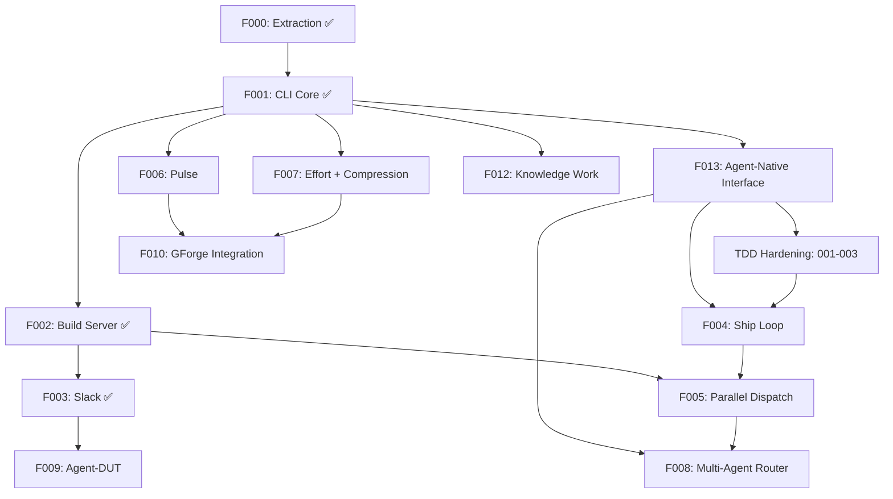

# 000 Build Plan — gwrk

> **Status:** Authoritative · **Date:** 2026-03-13 (v7)
> **Anchored to:** [architecture.md](file:///Users/gonzo/Code/gwrk/docs/architecture.md), [GWRK-PRD-PRFAQ.md](file:///Users/gonzo/Code/gwrk/docs/GWRK-PRD-PRFAQ.md)
> **Decisions:** [ADR-001](file:///Users/gonzo/Code/gwrk/docs/decisions/ADR-001-task-tracking.md) (gate architecture), [ADR-002](file:///Users/gonzo/Code/gwrk/docs/decisions/ADR-002-sqlite-execution-ledger.md) (SQLite execution ledger), [ADR-003](file:///Users/gonzo/Code/gwrk/docs/decisions/ADR-003-state-contract.md) (execution state contract), [ADR-004](file:///Users/gonzo/Code/gwrk/docs/decisions/ADR-004-agent-native-output.md) (agent-native output protocol)

---

## Terminology

| Term | Meaning | Example |
|---|---|---|
| **Feature** | A spec subdirectory under `specs/`. Has its own spec.md, plan.md, contracts/, gates/, etc. | `specs/001-cli-core/` = Feature 001 |
| **Phase** | An implementation stage *within* a feature's `plan.md`. A feature has 1+ phases. | Phase 1 of Feature 013 = "Foundation (7 SP)" |
| **Wave** | A scheduling group of features that can execute concurrently. | Wave 2 = {F013, F006, F007, F012} |

> [!IMPORTANT]
> **Feature ≠ Phase.** A Feature is a deliverable unit with its own spec directory. A Phase is a stage of implementation within a single feature. Features have phases. The build plan orders *features*. Workflows execute *phases within features*.

---

## Dependency Graph



---

## Critical Path

```
F000 ✅ → F001 ✅ → F013 ✅ (Agent-Native) → TDD Hardening (001-003) → F004 → F005 → F008
                                         → F002 ✅ → F003 ✅
               → F006
               → F007
```

**F013 (Agent-Native Interface) is the immediate critical path.** It depends only on F001 (✅ complete) and gates both TDD Hardening and F004 (Ship Loop). F013 provides `gwrk project discover`, `gwrk gate-check`, `--format json`, and `[exit:N | Xs]` operational signals — infrastructure that makes the subsequent hardening work structured and auditable. TDD Hardening gates F004: no new feature shipping until the shipped foundation (001-003) meets the TDD standard established by 000-tdd-infrastructure.

---

## Features

### Feature 000 — Extraction ✅

Extract the code-red agent workflow system into the gwrk repository.

| Content | Gate |
|---|---|
| `.agents/`, `.specify/`, `scripts/dev/`, `Makefile` | Files exist, agent invocation targets fire |

**Status:** Complete. Committed on `develop`.

---

### Feature 000-TDD — TDD Infrastructure ✅

Establish a rigorous, programmatically-enforced TDD standard. Replace file-existence gate stubs with authored executable assertions. Wire `gwrk define tasks` to produce LLM-authored gates from contracts. Retroactively audit 001 and 002. Fix 22 failing tests in 003-slack.

| Content | Gate |
|---|---|
| Gate standard (FR-001), AUTHORED/GATE_STUB preservation (FR-002), `gwrk test` command (FR-009), `gwrk ship` pre-flight block (FR-008), gap analyses for 001+002 (FR-005/006), 003-slack test remediation (FR-007) | `pnpm vitest run` = 0 failed; no gate is purely `test -f` |

**Status:** Complete. Merged via PR #7. UAT GO (`75a0a51`). Code review GO (`3ca5954`).

**Deliverables produced:**
- Hard gate enforcement (`GATE_STUB` blocks `tasks done`, `# AUTHORED` preserves gates through reconcile)
- `gwrk test <feature>` command
- `gwrk ship` pre-flight block (FR-008: exits 1 if no `.test.ts` files for phase)
- Gap analyses: `specs/001-cli-core/gap-analysis.md`, `specs/002-build-server/gap-analysis.md`
- 22 failing 003-slack tests fixed → full suite 60 files, 303 tests, 0 failed

---

### Feature 001 — CLI Core ✅

Bootstrap the gwrk TypeScript CLI with foundational commands, multi-CLI provisioning, and the SQLite execution ledger (ADR-002).

| Spec | Content | Gate |
|---|---|---|
| `001-cli-core` | CLI entry, Commander routing, `gwrk new`, `gwrk init`, multi-CLI provisioning, `specify`, `plan`, `plan-to-tasks`, `tasks`, SQLite init | `gwrk new <project>` scaffolds everything; `gwrk tasks done` enforces gates |

**Dependencies:** Feature 000
**Agent:** Gemini CLI (definition + multi-file generation)

**Status:** Complete. Code shipped on `develop`.

> [!WARNING]
> **Gap analysis (000-tdd FR-005) identified issues:** Most gates are `test -f` stubs. `gate-gen.ts` is heuristic-based, not contract-derived. `dispatchAgent()` return type has contract mismatch. Remediation deferred to TDD Hardening.

#### What ships:

```bash
gwrk new <project-name>        # Full provisioning
gwrk init                      # Add gwrk to existing project
gwrk specify <feature>         # Wrapper: invokes gemini with /specify workflow
gwrk plan <feature>            # Wrapper: invokes gemini with /plan workflow
gwrk tasks <feature>           # List tasks from SQLite
gwrk tasks done <feature> <id> # Gate-enforced state transition
```

#### Key files:
- `src/cli.ts` — Commander entry point
- `src/commands/new.ts`, `init.ts`, `specify.ts`, `plan.ts`, `tasks.ts`
- `src/utils/exec.ts`, `config.ts`, `state.ts`, `history.ts`, `parser.ts`, `gate-gen.ts`
- `src/db/index.ts`, `src/db/migrations/`

#### Tech decisions:
- **Commander.js** for CLI routing (not Ink — see architecture.md §4)
- **better-sqlite3** for execution ledger (ADR-002)
- **Zod** for all schema validation
- **Vitest** for testing, **Biome** for lint + format
- **ES2022** target, ESM modules

---

### Feature 002 — Build Server ✅

Local persistent daemon that serves as the control plane. Includes macOS sleep/wake resilience, network connectivity awareness, and component-level health reporting.

| Spec | Content | Gate |
|---|---|---|
| `002-build-server` | Fastify daemon, dispatch queue, Docker sandbox manager, sleep/wake lifecycle, network monitor, rich health endpoint, `gwrk harvest` manifest ETL | `gwrk server start` creates sandboxes; dispatch queue pauses on sleep/offline |

**Dependencies:** Feature 001
**Agent:** Claude Code (long-context server architecture)

**Status:** Complete. Code shipped on `develop`.

> [!WARNING]
> **Gap analysis (000-tdd FR-006) identified issues:** FR-012 (Dockerfile ⚠️), FR-016/018/019 (weak assertions), FR-024 (`server clean` ❌ missing). Remediation deferred to TDD Hardening.

#### What ships:

```bash
gwrk server start              # Start localhost:18790 daemon
gwrk server stop               # Stop daemon
gwrk status                    # Active agents, clones, system resources
```

#### Key files:
- `src/server/index.ts` — Fastify bootstrap
- `src/server/dispatch.ts`, `sandbox.ts`, `git-manager.ts`

---

### Feature 003 — Slack ✅

Slack integration for the comms layer via Socket Mode + Bolt SDK. Channel-per-project model.

| Spec | Content | Gate |
|---|---|---|
| `003-slack` | Socket Mode app, Bolt SDK, slash commands, interactive messages, threads, channel provisioning, App Home Tab dashboard | Send status update and approve a review verdict from Slack |

**Dependencies:** Feature 002
**Agent:** Gemini CLI

**Status:** Complete. Code shipped on `develop`. 000-tdd fixed 20 failing tests.

> [!WARNING]
> **Gap analysis is a greenfield inventory (2026-03-10), NOT a test-coverage audit.** Needs rewrite as proper FR-by-FR ✅/⚠️/❌ classification. Deferred to TDD Hardening.

#### What ships:

```bash
gwrk setup slack               # Fully automated: create app, install, write tokens, test
# Slack commands: /gwrk status, /gwrk dispatch, /gwrk approve, /gwrk pulse
# Interactive: review verdict buttons, threaded DUT conversations
```

#### Key files:
- `src/server/slack.ts`, `slack-commands.ts`, `slack-actions.ts`
- `src/commands/setup-slack.ts`

---

### Feature 013 — Agent-Native Interface ✅

Make gwrk a dual-mode CLI that operates identically for humans and LLM agents, with structured output, operational signals, project discovery, and a presentation layer that protects agents from context corruption.

| Spec | Content | Gate |
|---|---|---|
| `013-agent-native-interface` | Operational signal (`[exit:N \| Xs]`), `--format json`, `--agent` mode (Layer 2), `gwrk project discover/specs/gates`, `gwrk gate-check`, error-as-navigation, exit code standardization, help text enrichment | `gwrk status 2>/dev/null` produces clean stdout; `gwrk project discover --format json \| jq .` succeeds |

**Dependencies:** Feature 001 ✅
**Spec:** [spec.md](file:///Users/gonzo/Code/gwrk/specs/013-agent-native-interface/spec.md) ✅
**Plan:** [plan.md](file:///Users/gonzo/Code/gwrk/specs/013-agent-native-interface/plan.md) ✅
**Decision:** [ADR-004](file:///Users/gonzo/Code/gwrk/docs/decisions/ADR-004-agent-native-output.md)

#### What ships:

```bash
gwrk project discover          # Full project state (git, specs, tasks, gates, config)
gwrk project specs             # Spec inventory with status
gwrk project gates             # Aggregate gate results
gwrk gate-check <task_id>      # Structured gate verification result
gwrk <any> --format json       # Machine-readable structured output
gwrk <any> --agent             # Layer 2: ANSI-stripped, bounded, guarded output
# [exit:N | Xs] on stderr for every command invocation
```

#### Implementation phases (within this feature):
1. **Phase 1 — Foundation (7 SP):** `withSignal()` wrapper, `--format json`, `gwrk gate-check`, exit code audit
2. **Phase 2 — Discovery (10 SP):** `gwrk project discover`, `gwrk project specs/gates`, help text rewrite, error-as-navigation
3. **Phase 3 — Agent Mode (11 SP):** `--agent` / Layer 2, stdin acceptance for `define plan`, classification inference, phase schema enrichment

#### Key files (new):
- `src/utils/signal.ts`, `output.ts`, `agent-layer.ts`
- `src/commands/gate-check.ts`, `project.ts`
- `src/engine/discover.ts`, `classify.ts`

---

### TDD Hardening — 001, 002, 003 🔒

Rewrite shipped features 001–003 to the TDD standard established by 000-tdd-infrastructure. Regenerate all legacy garbage gates (`test -f` stubs) to functional assertions. Audit actual implementation state. Remediate gaps.

| Scope | Content | Gate |
|---|---|---|
| 001-cli-core | Rewrite spec to TDD standard. Fix `dispatchAgent()` contract mismatch. Regenerate all 44 gates. | `gwrk test 001-cli-core` = 0 failed |
| 002-build-server | Rewrite spec to TDD standard. Add lifecycle integration tests. Implement `server clean` (FR-024). Regenerate 26 gates. | `gwrk test 002-build-server` = 0 failed |
| 003-slack | Rewrite gap-analysis as test-coverage audit. Verify contracts against shipped code. Remediate ❌ items. | `gwrk test 003-slack` = 0 failed |

**Dependencies:** Feature 013 (structured tooling for audit: `gwrk project discover`, `gwrk gate-check`)
**Estimated effort:** ~15 SP (5 + 7 + 3)

#### Gate contamination baseline (pre-hardening):

| Feature | Total Gates | `test -f` Only | Contamination |
|---|---|---|---|
| 001-cli-core | 44 | ~40 | ~91% |
| 002-build-server | 26 | 18 | 69% |
| 003-slack | 31 | 3 | 10% ✅ (fixed by 000-tdd) |

---

### Feature 004 — Ship Loop

Autonomous implement → review → PR → CI loop. (Renamed from WUD to align with Foxtrot Charlie Pillar 3: Shipping.)

| Spec | Content | Gate |
|---|---|---|
| `004-ship-loop` | `gwrk ship`, review gates, PR creation, execution manifests, run recording. WUD-as-CLI-consumer: agent operates through `gwrk tasks next`, `gwrk gate-check`, `gwrk tasks done` (F013 contracts). | Agent completes a feature phase and opens a PR |

**Dependencies:** Feature 013, TDD Hardening
**Agent:** Codex Cloud (autonomous execution)

#### What ships:

```bash
gwrk ship <feature> [phase]        # Full autonomous lifecycle
gwrk ship <feature> <phase>        # Ship a single phase
```

#### F013 integration (WUD-as-CLI-consumer):
- WUD calls `gwrk tasks next --json`, `gwrk gate-check <task_id> --json`, `gwrk tasks done`
- All output parsed via `--format json`; operational signals via `[exit:N | Xs]`

#### SQLite integration:
- Every Ship dispatch writes a `runs` record (backend, model, attempt, timestamps)
- Gate results, review verdicts, retry reasons recorded

---

### Feature 005 — Parallel Dispatch

Multi-phase concurrent execution with conflict resolution.

| Spec | Content | Gate |
|---|---|---|
| `005-parallel-dispatch` | Concurrent sandboxes, merge ordering, managed repo clones, per-backend capacity gate | Three agents work simultaneously without exceeding backend rate limits |

**Dependencies:** Feature 002, Feature 004
**Agent:** Claude Code

#### What ships:

```bash
gwrk feature <feature>         # Full end-to-end lifecycle
gwrk config set parallelism.local.clones 3
```

#### Agent capacity gate:
- Before `processNext()` assigns a backend: check `maxConcurrent` and `rateLimit` sliding window
- On 429/rate-limit: record in `runs`, exponential backoff with jitter
- See [agent-backends.md](file:///Users/gonzo/Code/gwrk/docs/references/agent-backends.md)

---

### Feature 006 — Pulse

Productivity dashboard with historical git analysis.

| Spec | Content | Gate |
|---|---|---|
| `006-pulse` | Git log scanner, PulseSnapshot, historical scan | `gwrk pulse scan` produces data |

**Dependencies:** Feature 001
**Agent:** Gemini CLI

```bash
gwrk pulse                     # Current snapshot across repos
gwrk pulse scan [path]         # Scan any existing git repo
```

---

### Feature 007 — Effort + Compression

SP-driven estimation and delivery speed measurement with leading compression indicators.

| Spec | Content | Gate |
|---|---|---|
| `007-effort-compression` | Story extraction, role bracketing, compression ratios, leading indicators | `gwrk compression` produces a report |

**Dependencies:** Feature 001, SQLite (ADR-002)
**Agent:** Gemini CLI

```bash
gwrk effort <feature>          # Generate effort estimate
gwrk compression <feature>     # Compression ratios + leading indicators
gwrk compression --all         # Summary across all features with trends
```

#### SP additivity invariant:
Feature SP = Σ Phase SP = Σ Task SP. No orphan points. gwrk validates on `plan-to-tasks`.

---

### Feature 008 — Multi-Agent Router

Agent backend selection, Done Done! protocol, retry + escalation, learning from execution history. Agent registry with per-backend rate/token limits.

| Spec | Content | Gate |
|---|---|---|
| `008-agent-router` | Router logic, per-backend invocation, fallback chain, tandem dispatch, SQLite-backed learning, agent registry schema, context size estimator | Dispatch to Codex, retry on Claude, mini-model fallback |

**Dependencies:** Feature 005, SQLite (ADR-002)
**Agent:** Claude Code

#### F013 integration:
- Router reads `[exit:N | Xs]` duration data from execution ledger for cost models
- Task routing considers classification (greenfield/change/refactor) from F013
- `gwrk project discover --json` provides context for routing decisions

#### Agent registry:
- `.gwrkrc.json` → `agents.registry` map
- Context Size Estimator: token count vs backend `contextWindow`
- Mini-model fallback before escalation
- See [agent-backends.md](file:///Users/gonzo/Code/gwrk/docs/references/agent-backends.md)

---

### Feature 009 — Agent-DUT

Slack-native conversational ideation → spec generation, aligned to Foxtrot Charlie.

| Spec | Content | Gate |
|---|---|---|
| `009-agent-dut` | DUT conversational loop in Slack threads, FC-aligned protocol (SPARK→PROBE→DISAMBIGUATE→SHAPE→PRESS→GROUND→REVIEW→COMMIT) | `/dream` in Slack produces a `spec.md` from threaded conversation |

**Dependencies:** Feature 003
**Agent:** Gemini CLI

---

### Feature 010 — GForge Integration

Unified Pulse + Compression dashboard across repos.

| Spec | Content | Gate |
|---|---|---|
| `010-gforge-integration` | Pulse replaces PulseStore, unified dashboard | Single pane across repos |

**Dependencies:** Feature 006, Feature 007

---

### Feature 011 — RETIRED

> **Folded into Feature 003 (003-slack).** The App Home Tab is a Bolt event handler + Block Kit renderer that shares the same Bolt instance, OAuth scopes, and config as the rest of 003-slack.

---

### Feature 012 — Knowledge Work

First-class support for Foxtrot Charlie's Discovery pillar. Fieldnote capture, discovery compilation, and knowledge work workflows as gwrk commands.

| Spec | Content | Gate |
|---|---|---|
| `012-knowledge-work` | `gwrk discover`, `gwrk kw`, fieldnotes, discovery digest, kw-specify/plan/build-plan, datetime orientation, SQLite `fieldnotes` table | `gwrk discover fieldnote` captures from stdin; `gwrk kw specify` produces `kw-spec.md` |

**Dependencies:** Feature 001
**Agent:** Gemini CLI

```bash
gwrk discover fieldnote            # Capture fieldnote from stdin/file/URL
gwrk discover compile              # Assemble discovery digest
gwrk discover list                 # List fieldnotes with recency indicators
gwrk kw specify <deliverable>      # Knowledge work specification
gwrk kw plan <deliverable>         # Knowledge work execution plan
gwrk kw build-plan                 # Manage 000-deliverables-plan.md
```

#### Datetime orientation:
- Every fieldnote carries: `createdAt`, `sourceDate`, `source`, `project`, `tags`, `supersedes`
- Files stored as `docs/discovery/fieldnotes/YYYY-MM-DD-{slug}.md` with YAML frontmatter
- SQLite `fieldnotes` table enables recency queries, burst detection, staleness warnings

---

## Wave Strategy

| Wave | Features | Parallelizable? | Theme |
|---|---|---|---|
| **Wave 1** | F001 ✅ | No (keystone) | Bootstrap: CLI, SQLite, multi-CLI provisioning |
| **Wave 2** | F013, F006, F007, F012 | Yes (F013 is critical path; others independent after F001) | Agent-native foundation + independent engines |
| **Wave 3** | TDD Hardening (001-003) | Partially (001/002 parallel, 003 independent) | Harden shipped work to TDD standard |
| **Wave 4** | F004, F005 | Partially (F004 needs F013+Hardening, F005 needs F002+F004) | Execution: ship loop + parallel dispatch |
| **Wave 5** | F008, F009 | Yes (F008 needs F005; F009 needs F003) | Intelligence + Comms: smart routing, DUT |
| **Wave 6** | F010 | No (needs F006+F007) | Integration: unified dashboard |

---

## Estimated Effort

| Role | Meaning |
|---|---|
| **PM** | Definitional: specs, architecture, protocol design, gap analysis, workflow design |
| **PE** | Construction: implementation, tests, gates, audit, remediation |

| Feature | SP | Role | Est. Hours |
|---|---|---|---|
| F000 (Extraction) ✅ | 3 | PE | Done |
| F000-TDD (TDD Infrastructure) ✅ | — | PE | Done |
| F001 (CLI Core) ✅ | 25 | PE | Done |
| F002 (Build Server) ✅ | 18 | PE | Done |
| F003 (Slack) ✅ | 13 | PE | Done |
| **F013 (Agent-Native Interface)** | **28** | **PM+PE** | **140h** |
| **TDD Hardening (001-003)** | **~15** | **PE** | **~75h** |
| F004 (Ship Loop) | 5 | PM+PE | 25h |
| F005 (Parallel Dispatch) | 10 | PE | 50h |
| F006 (Pulse) | 5 | PE | 25h |
| F007 (Effort + Compression) | 8 | PM+PE | 40h |
| F008 (Agent Router) | 7 | PM+PE | 35h |
| F009 (Agent-DUT) | 8 | PM+PE | 40h |
| F010 (Integration) | 5 | PE | 25h |
| F011 (RETIRED) | — | — | Folded into F003 |
| F012 (Knowledge Work) | 8 | PM+PE | 40h |
| **Total** | **~158 SP** | | **~495h remaining** |

---

## Open Questions

| # | Question | Affects | Status |
|---|---|---|---|
| 1 | SP → Phase → Task additivity enforcement: warn or hard fail? | F007 | 🟡 Open |
| 2 | Cloudflare Tunnel automation | F011 (RETIRED) | ⚫ Moot |
| 3 | Slack presence throttling: granularity beyond active/away? | F003 | 🟡 Open |
| 4 | TDD Hardening scope: extend beyond 001-003 to 004-008? | Hardening | 🟡 Open (004-008 have 64-92% `test -f` contamination but haven't shipped code) |

---

## Changelog

- **2026-03-13 (v7):** Terminology fix: "Phase N" → "Feature NNN" throughout the build plan. Features are spec subdirectories; Phases are implementation stages within features. F013 (Agent-Native Interface, 28 SP) added as critical path prerequisite for F004 and F008 (ADR-004). F004 SP: 8→5, F008 SP: 10→7 (F013 provides discovery, signals, structured output). TDD Hardening (~15 SP) added for 001-003: rewrite specs to TDD standard, regenerate gates, remediate gaps. F013 gates hardening. Hardening gates F004. F000/F000-TDD/F001/F002/F003 marked ✅. Wave strategy restructured to 6 waves. OQ-002 marked moot, OQ-004 added. Total: 121→~158 SP.
- **2026-03-10 (v6):** F011 (App Home Tab) retired — folded into F003 (003-slack). DUT scope extracted from 003-slack → deferred to F009. SP: 126→121.
- **2026-03-08 (v5):** Execution State Contract (ADR-003). Two-tier architecture: git-native manifests + SQLite harvest. F001 SP: 21→25. Total: 122→126 SP.
- **2026-03-08 (v4):** F004 renamed WUD→Ship. Agent Registry: F005 gets capacity gate, F008 gets registry + context estimator. F012 (Knowledge Work) added. Total: 110→122 SP.
- **2026-03-08 (v3):** Resilience requirements added to F002. F002 SP: 13→18. Total: 105→110 SP.
- **2026-03-05 (v2):** Telegram → Slack. F001 expanded (gwrk new/init, multi-CLI, SQLite). ADR-002. Total: 92→105 SP.
- 2026-02-27: Added F011 (Glass Dashboard). +8 SP.
