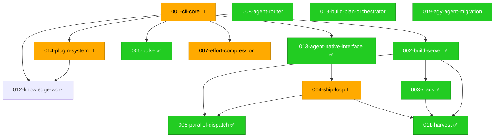

# 000 Build Plan — gwrk

> **Status:** Authoritative · **Date:** 2026-06-13
> **Anchored to:** [architecture.md](docs/grounding/architecture.md), [GWRK-PRD-PRFAQ.md](docs/product/GWRK-PRD-PRFAQ.md)
> **Decisions:** [ADR-001](docs/decisions/ADR-001-task-tracking.md), [ADR-002](docs/decisions/ADR-002-sqlite-execution-ledger.md), [ADR-003](docs/decisions/ADR-003-state-contract.md), [ADR-004](docs/decisions/ADR-004-agent-native-output.md), [ADR-005](docs/decisions/ADR-005-tdd-gate-architecture.md), [ADR-006](docs/decisions/ADR-006-plugin-agent-backends.md)

---

## Terminology

| Term | Meaning | Example |
|---|---|---|
| **Feature** | A spec subdirectory under `specs/`. Has its own spec.md, plan.md, contracts/, gates/, etc. | `specs/001-cli-core/` = Feature 001 |
| **Phase** | An implementation stage *within* a feature's `plan.md`. A feature has 1+ phases. | Phase 1 of Feature 013 = "Foundation (7 SP)" |
| **Wave** | A scheduling group of features that can execute concurrently. | Wave 2 = {F013, F006, F007, F012} |

---

## Dependency Graph



---

## Critical Path

```mermaid
gantt
    title Critical Path
    dateFormat X
    axisFormat %s

    Project Bootstrap & Config ✅ :, 001_cli_core_phase_01, 0, 1
    SQLite Execution Ledger ✅ :, 001_cli_core_phase_02, after 001_cli_core_phase_01, 1
    Clarity Pillar — Define ✅ :, 001_cli_core_phase_03, after 001_cli_core_phase_02, 1
    Throughput Pillar — Ship ✅ :, 001_cli_core_phase_04, after 001_cli_core_phase_03, 1
    Task Engine — State, Gates & History ✅ :, 001_cli_core_phase_05, after 001_cli_core_phase_04, 1
    Value Pillar — Measure ✅  :, 001_cli_core_phase_06, after 001_cli_core_phase_05, 1
    Init Hardening ✅          :done, 001_cli_core_phase_07, after 001_cli_core_phase_06, 1
    E2E Surface Hardening ✅   :done, 001_cli_core_phase_08, after 001_cli_core_phase_07, 1
    State Contract — Execution Manifests & Merge Safety :done, 001_cli_core_phase_09, after 001_cli_core_phase_08, 1
    Unified Init — Project Onboarding ⭐ **REWRITE (R3)** :done, 001_cli_core_phase_10, after 001_cli_core_phase_09, 1
    CLI UX Polish ✅           :done, 001_cli_core_phase_11, after 001_cli_core_phase_10, 1
    Define Pillar Output Parity :done, 001_cli_core_phase_12, after 001_cli_core_phase_11, 1
    Project Awareness — Prompt Conditioning & PROMPT.md Refactoring ⭐ **NEW (R3)** :done, 001_cli_core_phase_13, after 001_cli_core_phase_12, 1
    Project-Scoped DB Isolation ⭐ **NEW (2026-06-01)** :done, 001_cli_core_phase_14, after 001_cli_core_phase_13, 1
    Resilience & System Status :done, 002_build_server_phase_02, after 001_cli_core_phase_14, 1
    Slack Event Bridge & Bless Actions :done, 002_build_server_phase_03, after 002_build_server_phase_02, 1
    Execution Ledger          :done, 002_build_server_phase_04, after 002_build_server_phase_03, 1
    Conversational Agent Surface (P1) :done, 003_slack_phase_02, after 002_build_server_phase_04, 1
    Webhook Hardening & Topology (P1) :done, 003_slack_phase_03, after 003_slack_phase_02, 1
    Resilience & Bail         :, 004_ship_loop_phase_02, after 003_slack_phase_03, 1
    Verification & Artifacts  :, 004_ship_loop_phase_03, after 004_ship_loop_phase_02, 1
    Plugin Dispatch Boundary  :, 004_ship_loop_phase_04, after 004_ship_loop_phase_03, 1
    DispatchOrchestrator — TypeScript Ship Loop (F004-R) :done, 004_ship_loop_phase_05, after 004_ship_loop_phase_04, 1
    Parallel Dispatch Orchestrator :done, 005_parallel_dispatch_phase_02, after 004_ship_loop_phase_05, 1
    CLI Commands & Terminal Rendering :done, 006_pulse_phase_02, after 005_parallel_dispatch_phase_02, 1
    Final Verification & E2E  :done, 006_pulse_phase_03, after 006_pulse_phase_02, 1
    Compression Engine        :, 007_effort_compression_phase_02, after 006_pulse_phase_03, 1
    CLI Commands + Integration :, 007_effort_compression_phase_03, after 007_effort_compression_phase_02, 1
    LOC-Derived SP Fallback   :done, 007_effort_compression_phase_04, after 007_effort_compression_phase_03, 1
    Harvest Integration       :, 007_effort_compression_phase_05, after 007_effort_compression_phase_04, 1
    Agent Registry & Zod Validation :done, 008_agent_router_phase_01, after 007_effort_compression_phase_05, 1
    Quota Prober & Cache      :done, 008_agent_router_phase_02, after 008_agent_router_phase_01, 1
    Backend Selector (Core Logic) :done, 008_agent_router_phase_03, after 008_agent_router_phase_02, 1
    Integration & Wiring      :done, 008_agent_router_phase_04, after 008_agent_router_phase_03, 1
    Finalization & Cleanup    :done, 011_harvest_phase_02, after 008_agent_router_phase_04, 1
    Compression Calculation   :done, 011_harvest_phase_03, after 011_harvest_phase_02, 1
    Done, Done! Notification  :done, 011_harvest_phase_04, after 011_harvest_phase_03, 1
    Post-Ship Issue Tracking  :done, 011_harvest_phase_05, after 011_harvest_phase_04, 1
    Discovery ✅               :done, 013_agent_native_interface_phase_02, after 011_harvest_phase_05, 1
    Agent Mode ✅              :done, 013_agent_native_interface_phase_03, after 013_agent_native_interface_phase_02, 1
    Skill Runtime (Layer 2) ✅ SHIPPED :done, 014_plugin_system_phase_02, after 013_agent_native_interface_phase_03, 1
    Agent Backend Adapters (Layer 1 - ADR-006) ✅ SHIPPED :done, 014_plugin_system_phase_03, after 014_plugin_system_phase_02, 1
    Antigravity (agy) Adapter ✅ SHIPPED :done, 014_plugin_system_phase_04, after 014_plugin_system_phase_03, 1
    WorkflowRuntime (Layer 2.5 - F014-R) ✅ SHIPPED :done, 014_plugin_system_phase_05, after 014_plugin_system_phase_04, 1
    DefineOrchestrator & CLI Rewiring ✅ SHIPPED :done, 014_plugin_system_phase_06, after 014_plugin_system_phase_05, 1
    Provisioning & Migration ✅ SHIPPED :done, 014_plugin_system_phase_07, after 014_plugin_system_phase_06, 1
    Routing & Intelligence (ex-F008) ✅ SHIPPED :done, 014_plugin_system_phase_08, after 014_plugin_system_phase_07, 1
    Enforcement Skills (FR-014 / US-016) ✅ SHIPPED :done, 014_plugin_system_phase_09, after 014_plugin_system_phase_08, 1
    .agents/ Migration to Builtins (ADR-007) ✅ SHIPPED :done, 014_plugin_system_phase_10, after 014_plugin_system_phase_09, 1
    Research CLI (R006) ✅ SHIPPED :done, 014_plugin_system_phase_11, after 014_plugin_system_phase_10, 1
    Methodology Dispatch (R006) ✅ SHIPPED :done, 014_plugin_system_phase_12, after 014_plugin_system_phase_11, 1
    Grounding Injection (ADR-009) ✅ SHIPPED :done, 014_plugin_system_phase_13, after 014_plugin_system_phase_12, 1
    .agents/ Deletion & Verification (ADR-007) ✅ SHIPPED :, 014_plugin_system_phase_14, after 014_plugin_system_phase_13, 1
    Profile-Aware Enforcement Routing (R007) ✅ SHIPPED :done, 014_plugin_system_phase_15, after 014_plugin_system_phase_14, 1
    Toolchain Detection (R007) :done, 014_plugin_system_phase_16, after 014_plugin_system_phase_15, 1
    Context Gathering Mandate (R007) :done, 014_plugin_system_phase_17, after 014_plugin_system_phase_16, 1
    Ontology Construction Workflow (ADR-009) :done, 014_plugin_system_phase_18, after 014_plugin_system_phase_17, 1
    Foundation & Data Model   :done, 018_build_plan_orchestrator_phase_01, after 014_plugin_system_phase_18, 1
    Solver Engine & Ready Queue :done, 018_build_plan_orchestrator_phase_02, after 018_build_plan_orchestrator_phase_01, 1
    Graph Mutation & Lifecycle Hooks :done, 018_build_plan_orchestrator_phase_03, after 018_build_plan_orchestrator_phase_02, 1
    Verification & Markdown Rendering :done, 018_build_plan_orchestrator_phase_04, after 018_build_plan_orchestrator_phase_03, 1
    Visualization & Monitoring :done, 018_build_plan_orchestrator_phase_05, after 018_build_plan_orchestrator_phase_04, 1
    AgyAdapter Foundation     :done, 019_agy_agent_migration_phase_01, after 018_build_plan_orchestrator_phase_05, 1
    Router Integration        :done, 019_agy_agent_migration_phase_02, after 019_agy_agent_migration_phase_01, 1
    Configuration Schema & Profile Detection :, 020_polyglot_monorepo_phase_01, after 019_agy_agent_migration_phase_02, 1
    CLI Integration & Init Workspaces :, 020_polyglot_monorepo_phase_02, after 020_polyglot_monorepo_phase_01, 1
    Foundation ✅              :done, 013_agent_native_interface_phase_01, after 020_polyglot_monorepo_phase_02, 1
    Daemon Lifecycle & Service Management :done, 002_build_server_phase_01, after 013_agent_native_interface_phase_01, 1
    Engine & Git Utility Refinement :done, 006_pulse_phase_01, after 002_build_server_phase_01, 1
    Effort Engine             :, 007_effort_compression_phase_01, after 006_pulse_phase_01, 1
    Foundation (Plugin Loader & Registry) ✅ SHIPPED :done, 014_plugin_system_phase_01, after 007_effort_compression_phase_01, 1
    Slack Definition Pillar (P0) :done, 003_slack_phase_01, after 014_plugin_system_phase_01, 1
    Worktree Sandbox Manager  :done, 005_parallel_dispatch_phase_01, after 003_slack_phase_01, 1
    Webhook Infrastructure & Orchestration :done, 011_harvest_phase_01, after 005_parallel_dispatch_phase_01, 1
    Digest & Phase-Skip       :done, 004_ship_loop_phase_01, after 011_harvest_phase_01, 1
```

---

## Features

### Feature 001-cli-core 🔴

**Status:** IN_PROGRESS

| Phase | Name | Status | SP |
|---|---|---|---|
| 1 | Project Bootstrap & Config ✅ | PLANNED ⚪ | 0 |
| 2 | SQLite Execution Ledger ✅ | PLANNED ⚪ | 0 |
| 3 | Clarity Pillar — Define ✅ | PLANNED ⚪ | 0 |
| 4 | Throughput Pillar — Ship ✅ | PLANNED ⚪ | 0 |
| 5 | Task Engine — State, Gates & History ✅ | PLANNED ⚪ | 0 |
| 6 | Value Pillar — Measure ✅ | PLANNED ⚪ | 0 |
| 7 | Init Hardening ✅ | SHIPPED ✅ | 0 |
| 8 | E2E Surface Hardening ✅ | SHIPPED ✅ | 0 |
| 9 | State Contract — Execution Manifests & Merge Safety | SHIPPED ✅ | 0 |
| 10 | Unified Init — Project Onboarding ⭐ **REWRITE (R3)** | SHIPPED ✅ | 0 |
| 11 | CLI UX Polish ✅ | SHIPPED ✅ | 0 |
| 12 | Define Pillar Output Parity | SHIPPED ✅ | 0 |
| 13 | Project Awareness — Prompt Conditioning & PROMPT.md Refactoring ⭐ **NEW (R3)** | SHIPPED ✅ | 0 |
| 14 | Project-Scoped DB Isolation ⭐ **NEW (2026-06-01)** | SHIPPED ✅ | 0 |

### Feature 002-build-server ✅

> [!WARNING]
> **Status:** ⚠️ Shipped but not yet TDD-hardened or verified.

| Phase | Name | Status | SP |
|---|---|---|---|
| 1 | Daemon Lifecycle & Service Management | SHIPPED ✅ | 0 |
| 2 | Resilience & System Status | SHIPPED ✅ | 0 |
| 3 | Slack Event Bridge & Bless Actions | SHIPPED ✅ | 0 |
| 4 | Execution Ledger | SHIPPED ✅ | 0 |

### Feature 003-slack ✅

> [!WARNING]
> **Status:** ⚠️ Shipped but not yet TDD-hardened or verified.

| Phase | Name | Status | SP |
|---|---|---|---|
| 1 | Slack Definition Pillar (P0) | SHIPPED ✅ | 0 |
| 2 | Conversational Agent Surface (P1) | SHIPPED ✅ | 0 |
| 3 | Webhook Hardening & Topology (P1) | SHIPPED ✅ | 0 |

### Feature 004-ship-loop 🔴

**Status:** IN_PROGRESS

| Phase | Name | Status | SP |
|---|---|---|---|
| 1 | Digest & Phase-Skip | SHIPPED ✅ | 0 |
| 2 | Resilience & Bail | PLANNED ⚪ | 0 |
| 3 | Verification & Artifacts | PLANNED ⚪ | 0 |
| 4 | Plugin Dispatch Boundary | PLANNED ⚪ | 0 |
| 5 | DispatchOrchestrator — TypeScript Ship Loop (F004-R) | SHIPPED ✅ | 0 |

### Feature 005-parallel-dispatch ✅

> [!WARNING]
> **Status:** ⚠️ Shipped but not yet TDD-hardened or verified.

| Phase | Name | Status | SP |
|---|---|---|---|
| 1 | Worktree Sandbox Manager | SHIPPED ✅ | 0 |
| 2 | Parallel Dispatch Orchestrator | SHIPPED ✅ | 0 |

### Feature 006-pulse ✅

> [!WARNING]
> **Status:** ⚠️ Shipped but not yet TDD-hardened or verified.

| Phase | Name | Status | SP |
|---|---|---|---|
| 1 | Engine & Git Utility Refinement | SHIPPED ✅ | 0 |
| 2 | CLI Commands & Terminal Rendering | SHIPPED ✅ | 0 |
| 3 | Final Verification & E2E | SHIPPED ✅ | 0 |

### Feature 007-effort-compression 🔴

**Status:** IN_PROGRESS

| Phase | Name | Status | SP |
|---|---|---|---|
| 1 | Effort Engine | PLANNED ⚪ | 0 |
| 2 | Compression Engine | PLANNED ⚪ | 0 |
| 3 | CLI Commands + Integration | PLANNED ⚪ | 0 |
| 4 | LOC-Derived SP Fallback | SHIPPED ✅ | 0 |
| 5 | Harvest Integration | PLANNED ⚪ | 0 |

### Feature 008-agent-router ✅

> [!WARNING]
> **Status:** ⚠️ Shipped but not yet TDD-hardened or verified.

| Phase | Name | Status | SP |
|---|---|---|---|
| 1 | Agent Registry & Zod Validation | SHIPPED ✅ | 0 |
| 2 | Quota Prober & Cache | SHIPPED ✅ | 0 |
| 3 | Backend Selector (Core Logic) | SHIPPED ✅ | 0 |
| 4 | Integration & Wiring | SHIPPED ✅ | 0 |

### Feature 011-harvest ✅

> [!WARNING]
> **Status:** ⚠️ Shipped but not yet TDD-hardened or verified.

| Phase | Name | Status | SP |
|---|---|---|---|
| 1 | Webhook Infrastructure & Orchestration | SHIPPED ✅ | 0 |
| 2 | Finalization & Cleanup | SHIPPED ✅ | 0 |
| 3 | Compression Calculation | SHIPPED ✅ | 0 |
| 4 | Done, Done! Notification | SHIPPED ✅ | 0 |
| 5 | Post-Ship Issue Tracking | SHIPPED ✅ | 0 |

### Feature 012-knowledge-work ⚪

**Status:** PLANNED

### Feature 013-agent-native-interface ✅

> [!WARNING]
> **Status:** ⚠️ Shipped but not yet TDD-hardened or verified.

| Phase | Name | Status | SP |
|---|---|---|---|
| 1 | Foundation ✅ | SHIPPED ✅ | 0 |
| 2 | Discovery ✅ | SHIPPED ✅ | 0 |
| 3 | Agent Mode ✅ | SHIPPED ✅ | 0 |

### Feature 014-plugin-system 🔴

**Status:** IN_PROGRESS

| Phase | Name | Status | SP |
|---|---|---|---|
| 1 | Foundation (Plugin Loader & Registry) ✅ SHIPPED | SHIPPED ✅ | 0 |
| 2 | Skill Runtime (Layer 2) ✅ SHIPPED | SHIPPED ✅ | 0 |
| 3 | Agent Backend Adapters (Layer 1 - ADR-006) ✅ SHIPPED | SHIPPED ✅ | 0 |
| 4 | Antigravity (agy) Adapter ✅ SHIPPED | SHIPPED ✅ | 0 |
| 5 | WorkflowRuntime (Layer 2.5 - F014-R) ✅ SHIPPED | SHIPPED ✅ | 0 |
| 6 | DefineOrchestrator & CLI Rewiring ✅ SHIPPED | SHIPPED ✅ | 0 |
| 7 | Provisioning & Migration ✅ SHIPPED | SHIPPED ✅ | 0 |
| 8 | Routing & Intelligence (ex-F008) ✅ SHIPPED | SHIPPED ✅ | 0 |
| 9 | Enforcement Skills (FR-014 / US-016) ✅ SHIPPED | SHIPPED ✅ | 0 |
| 10 | .agents/ Migration to Builtins (ADR-007) ✅ SHIPPED | SHIPPED ✅ | 0 |
| 11 | Research CLI (R006) ✅ SHIPPED | SHIPPED ✅ | 0 |
| 12 | Methodology Dispatch (R006) ✅ SHIPPED | SHIPPED ✅ | 0 |
| 13 | Grounding Injection (ADR-009) ✅ SHIPPED | SHIPPED ✅ | 0 |
| 14 | .agents/ Deletion & Verification (ADR-007) ✅ SHIPPED | PLANNED ⚪ | 0 |
| 15 | Profile-Aware Enforcement Routing (R007) ✅ SHIPPED | SHIPPED ✅ | 0 |
| 16 | Toolchain Detection (R007) | SHIPPED ✅ | 0 |
| 17 | Context Gathering Mandate (R007) | SHIPPED ✅ | 0 |
| 18 | Ontology Construction Workflow (ADR-009) | SHIPPED ✅ | 0 |

### Feature 018-build-plan-orchestrator ✅

> [!WARNING]
> **Status:** ⚠️ Shipped but not yet TDD-hardened or verified.

| Phase | Name | Status | SP |
|---|---|---|---|
| 1 | Foundation & Data Model | SHIPPED ✅ | 0 |
| 2 | Solver Engine & Ready Queue | SHIPPED ✅ | 0 |
| 3 | Graph Mutation & Lifecycle Hooks | SHIPPED ✅ | 0 |
| 4 | Verification & Markdown Rendering | SHIPPED ✅ | 0 |
| 5 | Visualization & Monitoring | SHIPPED ✅ | 0 |

### Feature 019-agy-agent-migration ✅

> [!WARNING]
> **Status:** ⚠️ Shipped but not yet TDD-hardened or verified.

| Phase | Name | Status | SP |
|---|---|---|---|
| 1 | AgyAdapter Foundation | SHIPPED ✅ | 0 |
| 2 | Router Integration | SHIPPED ✅ | 0 |

### Feature 020-polyglot-monorepo 🟡

**Status:** DEFINED

| Phase | Name | Status | SP |
|---|---|---|---|
| 1 | Configuration Schema & Profile Detection | PLANNED ⚪ | 0 |
| 2 | CLI Integration & Init Workspaces | PLANNED ⚪ | 0 |

---

## Wave Strategy

| Wave | Features | Theme |
|---|---|---|
| Wave 1 | 001-cli-core, 002-build-server, 003-slack, 004-ship-loop, 005-parallel-dispatch, 006-pulse, 007-effort-compression, 008-agent-router, 011-harvest, 013-agent-native-interface, 014-plugin-system, 018-build-plan-orchestrator, 019-agy-agent-migration, 020-polyglot-monorepo | TBD |
| Wave 2 | 013-agent-native-interface, 002-build-server, 006-pulse, 007-effort-compression, 014-plugin-system, 003-slack, 005-parallel-dispatch, 011-harvest, 004-ship-loop | TBD |

---

## Estimated Effort

| Feature | SP | Status |
|---|---|---|
| 001-cli-core | 0 | IN_PROGRESS |
| 002-build-server | 0 | SHIPPED |
| 003-slack | 0 | SHIPPED |
| 004-ship-loop | 0 | IN_PROGRESS |
| 005-parallel-dispatch | 0 | SHIPPED |
| 006-pulse | 0 | SHIPPED |
| 007-effort-compression | 0 | IN_PROGRESS |
| 008-agent-router | 0 | SHIPPED |
| 011-harvest | 0 | SHIPPED |
| 012-knowledge-work | 0 | PLANNED |
| 013-agent-native-interface | 0 | SHIPPED |
| 014-plugin-system | 0 | IN_PROGRESS |
| 018-build-plan-orchestrator | 0 | SHIPPED |
| 019-agy-agent-migration | 0 | SHIPPED |
| 020-polyglot-monorepo | 0 | DEFINED |
| **Total** | **0** | |

---

## Open Questions

| # | Question | Status |
|---|---|---|
| 1 | TBD | 🟡 Open |

---

## Changelog

- **2026-06-13:** Regenerated from graph state via `gwrk plan render`.
