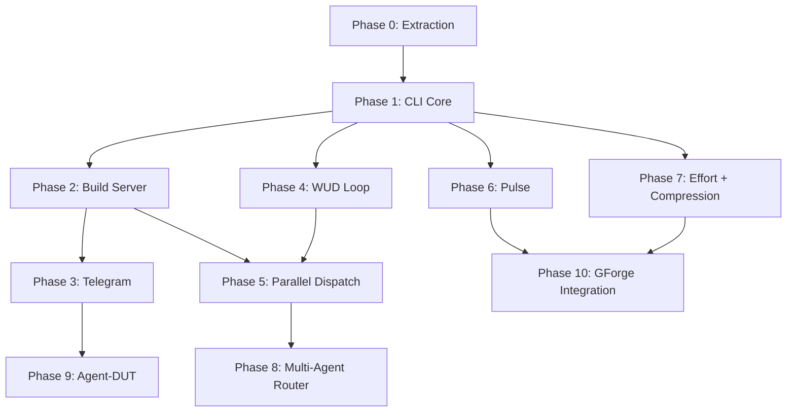

# 000 Build Plan — gwrk

> **Status:** Authoritative · **Date:** 2026-02-26
> **Anchored to:** [architecture.md](file:///Users/gonzo/Code/gwrk/docs/architecture.md), [GWRK-PRD-PRFAQ.md](file:///Users/gonzo/Code/gwrk/docs/GWRK-PRD-PRFAQ.md)

---

## Dependency Graph



---

## Critical Path

```
P0 → P1 → P2 → P3
              → P4 → P5 → P8
         → P6
         → P7
```

**P1 (CLI Core) is the keystone.** Everything depends on the CLI command infrastructure and the flat-file task tracking system. P2 (Build Server) and P4 (WUD Loop) are the next-order dependencies that unlock the daemon and autonomous execution.

---

## Phases

### Phase 0 — Extraction ✅

Extract the code-red agent workflow system into the gwrk repository.

| Feature | Content | Gate |
|---|---|---|
| `.agent/` | Workflows, rules, personas, templates | Files exist |
| `.specify/` | Templates, scripts, memory | Files exist |
| `scripts/dev/` | Shell orchestrators | `make agent-specify` runs |
| `Makefile` | Agent invocation targets | Targets fire |

**Status:** Complete. Committed on `develop`.

---

### Phase 1 — CLI Core

Bootstrap the gwrk TypeScript CLI with the foundational commands and the flat-file task tracking system (ADR-001).

| Spec | Content | Gate |
|---|---|---|
| `001-cli-core` | CLI entry, Commander routing, `specify`, `plan`, `plan-to-tasks`, `tasks` | `gwrk tasks done` enforces gates |

**Dependencies:** Phase 0
**Agent:** Gemini CLI (definition + multi-file generation)

#### What ships:

```bash
gwrk specify <feature>         # Wrapper: invokes gemini with /specify workflow
gwrk plan <feature>            # Wrapper: invokes gemini with /plan workflow
gwrk tasks <feature>           # List tasks from .gwrk/tasks.json
gwrk tasks done <feature> <id> # Gate-enforced state transition
gwrk init                      # Scaffold .agent/, .specify/, specs/ in a new project
```

#### Key files:
- `src/cli.ts` — Commander entry point
- `src/commands/specify.ts`, `plan.ts`, `tasks.ts`
- `src/utils/exec.ts` — Shell command runner (wraps `child_process`)
- `src/utils/state.ts` — Read/write `tasks.json` with Zod validation
- `src/utils/parser.ts` — Extract phases/tasks from `plan.md`
- `src/utils/gate-gen.ts` — Generate `gates/T0xx-gate.sh` from contracts
- `src/utils/config.ts` — `.gwrkrc.json` loader (Zod, fail-fast)

#### Tech decisions:
- **Commander.js** for CLI routing (not Ink — see architecture.md §4)
- **Zod** for all schema validation
- **Vitest** for testing
- **Biome** for lint + format
- **ES2022** target, ESM modules

---

### Phase 2 — Build Server

Local persistent daemon that serves as the control plane.

| Spec | Content | Gate |
|---|---|---|
| `002-build-server` | Fastify daemon, dispatch queue, Docker sandbox manager | `gwrk server start` creates sandboxes |

**Dependencies:** Phase 1
**Agent:** Claude Code (long-context server architecture)

#### What ships:

```bash
gwrk server start              # Start localhost:18790 daemon
gwrk server stop               # Stop daemon
gwrk status                    # Active agents, clones, system resources
```

#### Key files:
- `src/server/index.ts` — Fastify bootstrap
- `src/server/dispatch.ts` — Phase dispatch queue + retry logic
- `src/server/sandbox.ts` — Docker container lifecycle
- `src/server/git-manager.ts` — Branch creation, merge, conflict resolution

---

### Phase 3 — Telegram

grammY bot integration for mobile control plane.

| Spec | Content | Gate |
|---|---|---|
| `003-telegram` | Bot setup, status notifications, inline buttons, commands | Receive and approve a review from Telegram |

**Dependencies:** Phase 2
**Agent:** Gemini CLI

#### What ships:

```bash
gwrk telegram setup            # BotFather pairing
gwrk telegram pair             # Pair Telegram account
# Telegram commands: /status, /approve, /reject, /dispatch, /pulse
```

---

### Phase 4 — WUD Loop

Autonomous implement → review → PR → CI loop.

| Spec | Content | Gate |
|---|---|---|
| `004-wud-loop` | `gwrk wud`, `gwrk implement`, review gates, PR creation | Agent completes a phase and opens a PR |

**Dependencies:** Phase 1
**Agent:** Codex Cloud (autonomous execution)

#### What ships:

```bash
gwrk implement <feature> <phase>   # Execute a single phase
gwrk wud <feature>                 # Autonomous lifecycle
```

---

### Phase 5 — Parallel Dispatch

Multi-phase concurrent execution with conflict resolution.

| Spec | Content | Gate |
|---|---|---|
| `005-parallel-dispatch` | Concurrent sandboxes, merge ordering, managed repo clones | Three agents work simultaneously |

**Dependencies:** Phase 2, Phase 4
**Agent:** Claude Code

#### What ships:

```bash
gwrk feature <feature>         # Full end-to-end lifecycle
gwrk config set parallelism.local.clones 3
```

---

### Phase 6 — Pulse

Productivity dashboard with historical git analysis.

| Spec | Content | Gate |
|---|---|---|
| `006-pulse` | Git log scanner, PulseSnapshot, historical scan | `gwrk pulse scan` produces data |

**Dependencies:** Phase 1
**Agent:** Gemini CLI

#### What ships:

```bash
gwrk pulse                     # Current snapshot across repos
gwrk pulse scan [path]         # Scan any existing git repo
gwrk pulse dashboard           # Future: Ink-based TUI (stretch)
```

---

### Phase 7 — Effort + Compression

SP-driven estimation and delivery speed measurement.

| Spec | Content | Gate |
|---|---|---|
| `007-effort-compression` | Story extraction, role bracketing, timestamp collection, compression ratios | `gwrk compression` produces a report |

**Dependencies:** Phase 1
**Agent:** Gemini CLI

#### What ships:

```bash
gwrk effort <feature>          # Generate effort estimate from spec stories
gwrk compression <feature>     # Show compression ratios
gwrk compression --all         # Summary across all features
```

---

### Phase 8 — Multi-Agent Router

Agent backend selection, Done Done! protocol, retry + escalation.

| Spec | Content | Gate |
|---|---|---|
| `008-agent-router` | Router logic, per-backend invocation, fallback chain, tandem dispatch | Dispatch to Codex, retry on Claude, feature ships |

**Dependencies:** Phase 5
**Agent:** Claude Code

---

### Phase 9 — Agent-DUT

Telegram conversational ideation → spec generation.

| Spec | Content | Gate |
|---|---|---|
| `009-agent-dut` | DUT conversational loop, voice notes, spec generation, ship action | `/dream` produces a `spec.md` from conversation |

**Dependencies:** Phase 3
**Agent:** Gemini CLI

---

### Phase 10 — GForge Integration

Unified Pulse + Compression dashboard across repos.

| Spec | Content | Gate |
|---|---|---|
| `010-gforge-integration` | Pulse replaces PulseStore, unified dashboard | Single pane across repos |

**Dependencies:** Phase 6, Phase 7

---

## Wave Strategy

| Wave | Phases | Parallelizable? | Theme |
|---|---|---|---|
| **Wave 1** | P1 | No (keystone) | Bootstrap: CLI exits cleanly, tasks enforce gates |
| **Wave 2** | P2, P4, P6, P7 | Yes (independent after P1) | Core engines: server, execution, productivity |
| **Wave 3** | P3, P5 | Partially (P3 needs P2, P5 needs P2+P4) | Multipliers: Telegram, parallelism |
| **Wave 4** | P8, P9 | Yes (independent) | Intelligence: smart routing, mobile ideation |
| **Wave 5** | P10 | No (needs P6+P7) | Integration: unified dashboard |

---

## Estimated Effort

| Phase | SP | Primary Role | Est. Hours |
|---|---|---|---|
| P0 (Extraction) | 3 | PE | Done |
| P1 (CLI Core) | 13 | TS | 65h |
| P2 (Build Server) | 13 | TS | 65h |
| P3 (Telegram) | 8 | TS | 40h |
| P4 (WUD Loop) | 8 | TS | 40h |
| P5 (Parallel Dispatch) | 8 | TS | 40h |
| P6 (Pulse) | 5 | TS | 25h |
| P7 (Effort + Compression) | 5 | TS | 25h |
| P8 (Agent Router) | 8 | TS | 40h |
| P9 (Agent-DUT) | 8 | TS | 40h |
| P10 (Integration) | 5 | TS | 25h |
| **Total** | **84 SP** | | **405h** |

---

## Open Questions Blocking Architecture

None. The PRD-PRFAQ (§23) has 12 open questions, but none block the P0→P1→P2 critical path. They affect P8 (router learning), P9 (DUT model selection), and P3 (multi-user Telegram), which are all Wave 3+.
