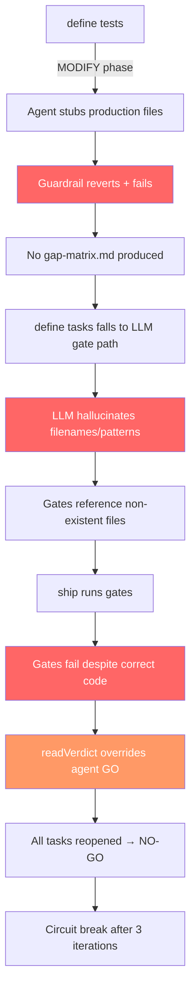

# Ship Pipeline Failure Diagnosis — 014-plugin-system (Phase 9 & Phase 6)

**Date**: 2026-05-29 | **Feature**: 014-plugin-system | **Runs**: #6002, #6094, #6155  
**Total wasted compute**: ~6 ship runs × 3 iterations × ~10 min = ~3 hours of agent time

---

## Executive Summary

Both Phase 9 and Phase 6 ship failures share a single architectural pattern: **the review agent correctly returned GO, but the gate verification system overrode the verdict and force-reopened all tasks.** The implementation was done on iteration 1 in both cases. The subsequent 2 iterations were pure waste — the implement agent had nothing to fix because the code was correct; the gates were wrong.

Three additional failure modes were observed in the `define tests` and `define tasks` pipelines feeding into ship.

---

## Failure Mode 1: Gate SIGPIPE (Phase 9)

### Symptom
All 5 Phase 9 gates (T055–T059) returned exit code 1 even though all 9 tests passed.

### Mechanism
```bash
# Gate script pattern (generated)
set -euo pipefail
pnpm vitest run src/plugins/enforcement.p9.red.test.ts -t "TR-P9-003" --reporter=verbose 2>&1 | grep -q "pass"
```

Under `pipefail`, the pipeline exit code is the **highest non-zero exit** from any command in the pipe. `grep -q` closes its stdin immediately upon finding a match (POSIX spec: "The -q option shall be ignored if the -c, -l, or -q option is specified"). When `grep -q` closes the pipe, vitest receives SIGPIPE (signal 13) and exits 141 (128 + 13). Under `pipefail`:

```
vitest exit=141 (SIGPIPE) | grep exit=0 → pipeline exit=141 → FAIL
```

### Evidence
```bash
$ set -o pipefail && pnpm vitest ... 2>&1 | grep -q "pass"; echo $?
1   # ← should be 0
```

### Contributing Factor
This pattern (`command | grep -q`) is a well-known `pipefail` footgun. The gate generator (`gate-gen.ts`) does not use this pattern — it writes `pnpm vitest run $FILE ... || { echo "FAIL" >&2; exit 1; }`. The SIGPIPE pattern was introduced by the **LLM gate authoring agent** (gwrk-author-gates workflow), which wrote gates using the piped grep pattern instead of vitest's native exit code.

### Scope
Affects any gate that uses `command | grep -q` under `set -euo pipefail`. The deterministic vitest gates generated by `generateVitestGates()` in [gate-gen.ts](file:///Users/gonzo/Code/gwrk/src/utils/gate-gen.ts#L390-L535) are immune because they use vitest's exit code directly.

---

## Failure Mode 2: Gate Filename Hallucination (Phase 6)

### Symptom
T036 and T037 gates expected `src/commands/define-plan.test.ts`. The file is actually `src/commands/plan.test.ts`. Gates returned exit 1 ("file not found").

### Mechanism
The LLM gate authoring agent (gwrk-author-gates workflow) generated gates referencing `define-plan.test.ts` — a filename that has never existed in the repository. The agent apparently inferred the name from the task description ("Implement src/commands/specify.ts, plan.ts, tasks-generate.ts") and the DefineOrchestrator naming convention, producing a plausible but incorrect synthesis.

### Evidence
```
$ cat specs/014-plugin-system/gates/T036-gate.sh
test -f src/commands/define-plan.test.ts || { echo "FAIL" >&2; exit 1; }
```
```
$ ls src/commands/plan.test.ts
src/commands/plan.test.ts   # ← actual file
```

### Contributing Factor
The gate brief JSON ([gate-gen.ts L46–87](file:///Users/gonzo/Code/gwrk/src/utils/gate-gen.ts#L46-L87)) derives `primaryFile` from task title/description text via regex. The task title was `"Implement src/commands/specify.ts, plan.ts, tasks-generate.ts"` — the gate agent was supposed to map `plan.ts` → `plan.test.ts`, but hallucinated `define-plan.test.ts` instead.

---

## Failure Mode 3: Gate Assertion Drift (Phase 6)

### Symptom
T034 gate checked for `grep -q 'new WorkflowRuntime()' src/commands/specify.ts`. The string `new WorkflowRuntime()` does not appear anywhere in the codebase.

### Mechanism
The gate agent inferred from the task description ("MODIFY: Rewire to WorkflowRuntime") that the commands should contain a literal `new WorkflowRuntime()` instantiation. In reality, the commands dispatch through `DefineOrchestrator`, which internally uses `WorkflowRuntime`. The gate assertion tested for a surface-level code pattern that was architecturally wrong.

### Evidence
```bash
$ grep -c "WorkflowRuntime" src/commands/specify.ts
0   # ← commands use DefineOrchestrator, not direct WorkflowRuntime
$ grep "workflow" src/commands/specify.ts
workflow: "specify",   # ← the actual dispatch pattern
```

### Contributing Factor
The gate brief contains `identifiers` extracted from task text, but these are lexical matches, not semantic understanding. The LLM agent does not have access to the actual codebase architecture when authoring gates — it works from task descriptions alone.

---

## Failure Mode 4: `define tests` Production File Stubbing

### Symptom
`gwrk define tests 014 6 --force` exited with code 2: "Agent violated guardrails and modified production code." Modified files: `src/commands/init.ts`, `src/plugins/migrate.ts`, `src/plugins/seed.ts`.

### Mechanism
The `define tests` workflow instructs the agent to write RED test files only. However, for phases that MODIFY existing files, the test agent needs to import functions that don't exist yet (they're the subject of the phase). The agent resolves this by writing stubs into the production files to make imports compile.

The guardrail in [tests-generate.ts L250–278](file:///Users/gonzo/Code/gwrk/src/commands/tests-generate.ts#L250-L278) detects any `src/*.ts` modifications (excluding `.test.ts`) and reverts them:

```typescript
const rogueModifications = diffOutput.split("\n").filter((line) => {
  const file = line.slice(3);
  return file.startsWith("src/") && file.endsWith(".ts") && !file.endsWith(".test.ts");
});
if (rogueModifications.length > 0) {
  execSync("git restore src/", { cwd: projectRoot, stdio: "ignore" });
  // ... fail with exit 2
}
```

The guardrail works correctly — it prevents the agent from destroying production code. But it means `define tests` **cannot produce RED tests for any phase that modifies existing files**, because the agent always tries to stub the missing exports.

### Scope
This affects Phase 6 (DefineOrchestrator), Phase 7 (Provisioning), Phase 8 (Routing), and any future MODIFY-phase. It does NOT affect phases that only CREATE new files (Phase 1, Phase 2, Phase 9), because the agent can write failing imports against non-existent modules without touching production code.

### Contributing Factor
The workflow prompt ([gwrk-define-tests.md](file:///Users/gonzo/Code/gwrk/.agents/workflows/gwrk-define-tests.md)) explicitly states: "A compilation/import error for missing functions is a perfectly valid RED state." But the agent ignores this instruction because its training strongly biases toward making code compile. The `UNSAFE actions (PROHIBITED)` section and `FILE WRITE GUARDRAIL` block were added specifically to counter this, but the agent consistently violates the constraint.

---

## Failure Mode 5: Plan/Task Phase Numbering Misalignment

### Symptom
`gwrk ship 014 6` targeted `phase-06` in tasks.json (DefineOrchestrator), but the implementation plan listed Phase 6 as Provisioning & Migration. Phases were off by one.

### Mechanism
Commit [2c05559](file:///Users/gonzo/Code/gwrk) introduced "Phase 3A: Antigravity (agy) Adapter" into plan.md as a sub-phase. The `define tasks` parser ([parser.ts](file:///Users/gonzo/Code/gwrk/src/utils/parser.ts)) linearized this as `phase-04`, pushing all subsequent phases down by one:

| plan.md | tasks.json | Actual Content |
|---|---|---|
| Phase 3A | phase-04 | Antigravity Adapter |
| Phase 4 | phase-05 | WorkflowRuntime |
| Phase 5 | phase-06 | DefineOrchestrator |
| Phase 6 | phase-07 | Provisioning |
| Phase 7 | phase-08 | Routing |

When `gwrk ship 014 6` runs, it dispatches against `phase-06` (DefineOrchestrator), but a human reading the plan thinks Phase 6 is Provisioning. The ship agent reads the plan's Phase 6 section (Provisioning) but operates against the wrong task set (DefineOrchestrator tasks), causing semantic mismatch.

### Contributing Factor
The plan parser treats all `### Phase N:` headers as sequential phases regardless of numbering. Non-sequential numbering (3A, skipped numbers) creates a divergence between the plan's human-readable numbering and the parser's positional indexing.

---

## Architectural Root Cause: Gate-Driven Verdict Design

All three ship failures (FM-1, FM-2, FM-3) share a common architectural pathway. The ship orchestrator's verdict system is deliberately designed to distrust agent output:

```
readVerdict() [ship-orchestrator.ts L758-808]
├── Ignores agent's JSON verdict (GO/NO-GO/reopenedTasks)
├── Re-runs every gate script for every task in the phase
├── If any gate fails → task.status = "open" → NO-GO
└── Overrides agent GO with gate NO-GO
```

This is documented as intentional design:

```typescript
// Gate-driven verdict: run gates directly, don't trust agent edits.
// "Gates are truth, tasks.json status is bookkeeping." (gwrk-review-code.md L59)
```

The design philosophy is sound: deterministic verification should override non-deterministic agent judgment. The problem is that the gates themselves are non-deterministic artifacts produced by another LLM agent (the gate authoring workflow). This creates a **circular trust violation**:

```
LLM review agent → verdict: GO (correct)
LLM gate author  → gate script (hallucinated/buggy)
Orchestrator     → "gates are truth" → runs buggy gate → NO-GO
Result           → correct agent overridden by incorrect gate
```

The system replaces one non-deterministic source (review agent) with another (gate-authoring agent), but treats the second as deterministic ground truth.

---

## Observation: GENERATED vs AUTHORED Gates

The gate file headers reveal the reliability split:

| Source | Marker | Failures | Notes |
|---|---|---|---|
| `generateVitestGates()` in gate-gen.ts | `# Generated from gap-matrix.md` | **0** | Deterministic: maps test file → vitest command |
| LLM gate authoring workflow | `# GENERATED` | **5** | Hallucinated filenames, wrong patterns, SIGPIPE |
| Human (manual fix) | `# AUTHORED` | **0** | All manually written gates work correctly |

Every gate failure in this investigation traces to the LLM-authored path. The deterministic vitest gate generator has zero failures.

---

## Observation: Define Tests Cannot Serve MODIFY Phases

The `define tests` → `define tasks` → `ship` pipeline assumes:

1. `define tests` writes RED test files (import errors = valid RED state)
2. `define tasks` generates gates referencing those test files
3. `ship` runs implement → gates verify → done

For MODIFY phases, step 1 fails because the agent stubs production files. This forces manual test authoring, which breaks the automated gate generation in step 2 (no gap-matrix.md is produced, so `generateVitestGates()` has no rows to process, and the LLM gate fallback path runs instead, producing the hallucinated gates that cause FM-2 and FM-3).

The pipeline's reliability degrades along this chain:

```
define tests (fails for MODIFY phases)
  → no gap-matrix.md
  → define tasks falls back to LLM gate authoring
  → LLM gates are hallucinated/buggy
  → ship runs buggy gates
  → gates override correct agent verdicts
  → circuit break after 3 iterations
```

---

## Timeline of Wasted Compute

### Phase 9 (Run #6002)
| Iteration | Implement | Build | Tests | Code Review | UAT | Verdict | Actual State |
|---|---|---|---|---|---|---|---|
| 1 | 5 min | ✅ | ✅ | GO | – | NO-GO (gates) | Code was done |
| 2 | 17 min | ✅ | ✅ | GO | – | NO-GO (gates) | No meaningful changes |
| 3 | 7 min | ✅ | ✅ | GO | – | NO-GO (gates) | Circuit break |

**Root cause**: SIGPIPE in gate scripts (FM-1)  
**Wasted**: ~29 minutes of implement + review time

### Phase 6 (Run #6155)
| Iteration | Implement | Build | Tests | Code Review | UAT | Verdict | Actual State |
|---|---|---|---|---|---|---|---|
| 1 | 5 min | ✅ | ✅ | GO | GO | NO-GO (gates) | Code was done |
| 2 | 4 min | ✅ | ✅ | GO | GO | NO-GO (gates) | No meaningful changes |
| 3 | 5 min | ✅ | ✅ | GO | – | NO-GO (gates) | Circuit break |

**Root cause**: Hallucinated filename + wrong assertion pattern (FM-2, FM-3)  
**Wasted**: ~14 minutes of implement + review time

---

## Systemic Pattern Summary



Five independent failure modes, but they compose into a single failure cascade: **the inability of `define tests` to handle MODIFY phases triggers an LLM-gate fallback path that produces unreliable verification artifacts, which then override correct agent verdicts in the ship loop.**
