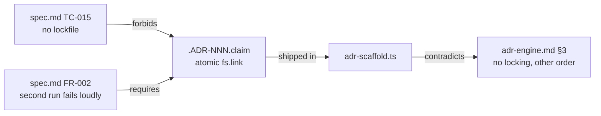

## Code Review — Phase 2: Scaffolder and `gwrk define adr`

**Verdict: GO.** T006, T007, T008 completed. Build passes, gate assertions pass, 38 phase tests pass, no blocking findings.

### Mechanical baseline

| Check | Result |
|---|---|
| `pnpm build` | pass |
| `adr-scaffold.test.ts` + `adr.test.ts` | 26 pass |
| `cli.ux` + `cli.e2e` + `cli.option-collisions` | 27 pass |
| `define --help` lists `adr`, `define adr --help` has `Examples:` | pass |
| `gates/T008-gate.sh` | pass |
| `tsc --noEmit`, no `any`, MPL headers | pass |

Every US-001 named `-t` assertion runs live (`1 passed`, not `0`). All five `029 TR-010` e2e tests execute unskipped.

### Contract §3 error states, verified on the built CLI

| Condition | Observed |
|---|---|
| Empty title | `exit:1` · `Title is required: gwrk define adr "<title>"` |
| No `.gwrkrc.json` in any parent | `exit:1` · `Not a gwrk project: … Run: gwrk init` |
| `docs/decisions/` unwritable | `exit:1` · `Cannot write docs/decisions/: EACCES` |
| Taken number | `exit:1` · names the conflicting path, `writeFile` not called |

Happy path allocates 004 over a 001-003 corpus, works from `src/deep/nested`, and honours `project.architecture.decisions: "docs/adr"` (FR-019).

### Integration check the gate does not run

The rendered template was fed to the Phase 1 parser. It parses clean: `number 010`, `status Proposed`, `dependsOn []`, `supersedes []`, addresses `1, 2, 2.1, 3, 4, 5, 6, 7`, and `## Amendments` resolves as an unnumbered `depth: 2` heading. Plan AMBER-2 holds: the registry is invisible to a `## N.` max+1 scan, and the parser's header-row skip (`/^amending$/i`) matches the template's `| Amending | Section | Summary |`.

### Non-blocking observations

- **Repo lint baseline is red.** `pnpm lint` reports 357 biome errors, one of them a format error in `src/commands/define.ts:94-101`. Verified pre-existing: that block is absent from the Phase 2 diff (`0444738`). Not auto-fixed, because `biome lint --write` would touch 65+ files well outside this phase.
- **TR-009 landed as a dedicated block, not a list entry.** The plan asked for `"define adr"` in `commandsWithExamples`. The assertion instead lives in a `029 TR-009` describe block, with the deviation documented at `src/cli.ux.test.ts:73`. Coverage is equivalent.
- **Absolute config path.** `resolveDecisionsDir` uses `path.join(projectRoot, configured)`, so an absolute `project.architecture.decisions` would be mangled. Unspecified in the contract.
- **Empty slug.** A punctuation-only title writes `ADR-NNN-.md`. Numbering stays correct on the next run. Unspecified.
- **Table header cosmetics.** `## 3. Decision Record` renders `| Field | Value |` where research §4.1 shows `| | |`. The four row labels match the contract, so no fourth table shape is introduced.
- **For Phase 10.** `src/commands/adr.test.ts` carries bare `ADR-010` strings. FR-024 assertion 1 treats every bare `ADR-\d{3}` under `src/` as a citation that must resolve, and ADR-010 arrives in Phase 9. Correctly sequenced today; it becomes a failure only if Phase 9 slips past Phase 10.

---

## Code Review — Phase 2, second pass (after the UAT concurrency fix)

**Verdict: NO-GO.** T006 stays open. The UAT defect is fixed and verified. The mechanism that fixes it
contradicts TC-015, and no commitment records the departure.

### The UAT finding is closed

Two `gwrk define adr` processes racing against a one-record corpus, five iterations:

| Run | Records at 002 | Winner | Loser exit | Litter left |
|---|---|---|---|---|
| 1-5 | 1 every time | alternates | 1 | none |

The loser's stderr is the contracted string: `ADR-002 already exists: docs/decisions/ADR-002-beta-two.md`.
`docs/decisions/` holds records only afterwards — no claim, no stage file. The mocked suite gained a
real-filesystem block (`adr-scaffold.test.ts:548-656`) that drives overlapping `scaffold()` calls, which
is what the previous pass lacked.

### Mechanical baseline

| Check | Result |
|---|---|
| `pnpm build` (`tsc` + postbuild) | pass |
| `adr-scaffold.test.ts` + `adr.test.ts` | 30 pass |
| `cli.ux` + `cli.e2e` + `cli.option-collisions` | 27 pass |
| `define --help` lists `adr`, `define adr --help` has `Examples:` | pass |
| `gates/T008-gate.sh` | pass |
| `biome check` on the four phase files | 0 errors |

### The blocking finding

TC-015 forbids the only mechanism that delivers FR-002. Check-then-write cannot serialise two writers:
both finish reading before either writes. The implementation resolved the contradiction correctly and
recorded it only in a source comment at `adr-scaffold.ts:22-28`.

Four commitments now describe code that does something else:

| File | Line | Says | Code does |
|---|---|---|---|
| `spec.md` | 464 | no lockfile | publishes `.ADR-NNN.claim` |
| `contracts/adr-engine.md` | 156 | max+1 over records, no locking | claims count as held |
| `contracts/adr-engine.md` | 195 | allocate, check, mkdir, write | mkdir, claim, check, write |
| `plan.md` | 197, 843 | honoured, no lockfile | has one |

Remediation is documentation, not code. The full instruction is on T006 in `tasks.json`, and it opens by
saying the claim mechanism must not be reverted.

### Gate coverage hole

The T006 gateScript passes in full over this finding. Nothing in it compares the shipped mechanism
against the contract text, so a departure of this kind can never turn the phase red.

### Non-blocking observations

- **`src/cli.ts:171-183` is outside the plan's seven Phase 2 files.** The `preAction` hook ran
  `loadConfig(process.cwd())` on every non-`init` command, which would defeat the parent walk before
  `findProjectRoot` runs. The exemption is correct and narrow, and `define adr` from a non-project
  directory still exits 1 with the FR-002 message. It belongs in the plan's file list.
- **A crash between staging and linking leaves an orphan `.ADR-NNN.<pid>-<n>.stage`.** Neither
  `RECORD_FILE` nor `CLAIM_FILE` matches it, so nothing ever removes it. The leftover-claim test covers
  the claim, not the stage file.
- **`conflictingPath` can name a file that does not exist.** If the winner publishes its claim and then
  its `writeFile` fails, the `finally` releases the claim and the loser reports
  `ADR-NNN already exists: docs/decisions/.ADR-NNN.claim` for a number that is free.
- **Repo lint baseline is still red** at 357 biome errors, none of them in the four phase files.
  Unchanged from the first pass, and unrelated to this phase.

---

## Pass 3 — after `dd55b14` (AMBER-3 recorded)

**Verdict: GO.** T006, T007, T008 stay completed. The Pass 2 finding is closed.

### The Pass 2 finding is resolved

Pass 2 blocked T006 because every commitment naming TC-015 asserted "no locking" about code that
publishes a `.ADR-NNN.claim`. The mechanism was correct; the documents disagreed with it.

| Commitment | Now reads |
|---|---|
| `plan.md:101` | AMBER-3 records why check-then-write cannot deliver FR-002's outcome |
| `spec.md:464` | TC-015 permits the atomic claim, still bans manager, daemon, timeout, retry |
| `spec.md:338` | FR-002 names the `.ADR-NNN.claim` |
| `contracts/adr-engine.md:157,198` | A claimed number counts as held; the order of operations is the one the code runs |
| `plan.md:224,876` | The two "no lockfile" traceability rows corrected |
| `checklists/requirements.md:27,95` | FR-002 and TC-015 rows follow |

The gate closed its own coverage hole. The T006 gateScript now fails if `adr-scaffold.ts` contains
`fs.link` while any commitment still says "No locking".

### Mechanical baseline

| Check | Result |
|---|---|
| `pnpm build` | pass |
| `gates/run-all-gates.sh` | 11 of 11 pass |
| T006 gateScript, all 15 lines | exit 0 |
| `adr-scaffold.test.ts` + `adr.test.ts` | 30 pass |
| `cli.ux` + `cli.e2e` + `cli.option-collisions` | 27 pass |
| biome on the three phase source files | 1 error, pre-existing on `develop` |
| `any` types in phase source | none |
| MPL headers on the two new files | present |

### Race, re-measured on the built CLI

Two processes, five repetitions: exactly one `ADR-002` every time, loser exits 1 naming the winner's
real path, no claim or stage file left behind.

Five processes, eight repetitions: one winner and four losers every time, no duplicate number, no
leftovers. Each loser named the winner's actual filename.

### Contract §3 error states, re-verified

| Condition | Observed |
|---|---|
| Taken number under race | `exit:1` · `ADR-002 already exists: docs/decisions/ADR-002-alpha-one.md` |
| No `.gwrkrc.json` in any parent | `exit:1` · `Not a gwrk project: … Run: gwrk init` |
| Empty title, and no title | `exit:1` · `Title is required: gwrk define adr "<title>"` |
| `docs/decisions/` unwritable | `exit:1` · `Cannot write docs/decisions/: EACCES` |

### Plan Phase 2 acceptance, file by file

All seven planned files delivered. `adr` is registered on `defineCommand` and appears in the parent
`Examples:` block. FR-019 honoured in all three config shapes: `architecture.decisions` object form
writes to `docs/adr`, the bare-string form defaults to `docs/decisions`, and an unparseable
`.gwrkrc.json` still writes rather than throwing (TC-014).

`cli.ux.test.ts` carries `define adr` in its own describe block rather than in `commandsWithExamples`.
The comment at `:73` gives the reason: the loop generates active `it()` calls the phase activator
cannot gate. TR-009's assertion is met either way.

### Non-blocking observations, carried forward

- **A third racer can be told a path that will never exist.** If run B claims a number after run A
  released it, and B is then refused by the existence check, a run C refused by B's claim reports B's
  filename. Needs three concurrent runs and a narrow window. Not reproduced in 40 attempts.
- **The orphan `.stage` file and the `src/cli.ts:171-183` plan-file omission** are unchanged from
  Pass 2. The `cli.ts` exemption re-verified as correct and narrow: it matches the exact command path
  `define adr` only, and a non-project directory still exits 1.
- **Repo lint baseline is still 357 biome errors.** The single error in the three phase source files
  is a `define.ts` ternary that is byte-identical on `origin/develop`. Not introduced here, and not
  auto-fixed, because the fix would touch lines outside this phase.
