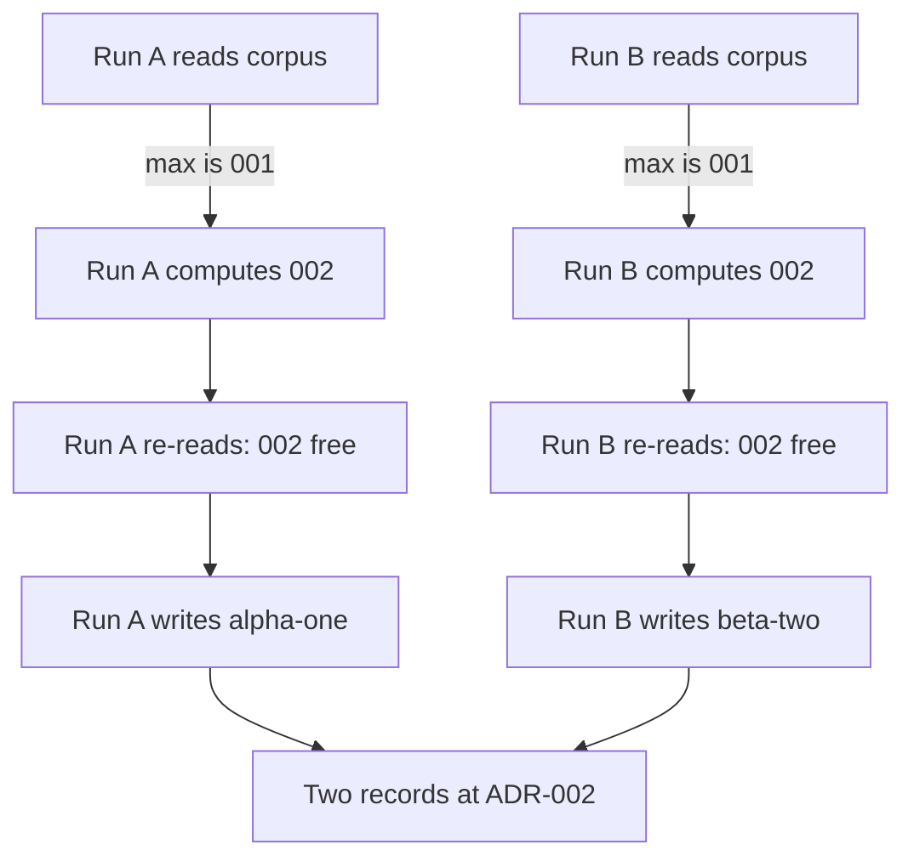

# UAT Review — 029 Decision Records, Phase 2

**Verdict: NO-GO.** One in-scope acceptance criterion fails. `T006` is re-opened.

Two concurrent `gwrk define adr` runs both write a record at the same number. The spec
requires the second to refuse.

## Scope

Phase 2 ships the scaffolder and `gwrk define adr`. Requirements in scope: FR-001, FR-002,
FR-003, FR-008, FR-019 · US-001 · TC-002, TC-013, TC-015 · SC-001.

## Result by criterion

| Criterion | Plain name | Result |
|---|---|---|
| TC-015 | Second concurrent run must refuse | FAIL |
| FR-002 | Number allocated max+1, refuse if taken | PARTIAL |
| SC-001 | Correct number from any subdirectory | PASS |
| FR-003 | §4.1 template with Status Proposed | PASS |
| FR-019 | `project.architecture.decisions` honoured | PASS |
| FR-001 | Registered on `define`, `Examples:`, `withSignal` | PASS |
| FR-008 | Neither `--refs` nor `--dry-run` declared | PASS |
| TC-002 | Fail fast with a corrective message | PASS |

## The failure

FR-002 requires the allocator to "**fail** naming the conflicting path if `ADR-NNN-*.md`
already exists at the computed number, rather than silently writing a sibling". TC-015
states the mechanism: "two concurrent runs both compute the same number and the existence
check makes the second fail loudly".

Reproduced five times out of five against a corpus holding only `ADR-001-x.md`:

```
node dist/cli.js define adr "Alpha One" &
node dist/cli.js define adr "Beta Two"  &
wait
```

Both runs exit 0. Both print a written path. The corpus ends with:

```
ADR-001-x.md
ADR-002-alpha-one.md
ADR-002-beta-two.md
```

That is the silent sibling FR-002 names as the second flaw of the research allocator, still
present.



Both processes finish the re-read before either writes, so the check sees nothing. The `wx`
flag refuses only an identical filename, and the two slugs differ.

The mocked-fs unit test passes because it hands the scaffolder a corpus that already holds a
record at the computed number. The real filesystem sequence never produces that state, so the
test exercises the code path without covering the scenario TC-015 names.

## Fix direction

Claim the number atomically instead of checking then writing. Create with `wx` first and
handle `EEXIST` by re-allocating, or re-scan for `ADR-NNN-*.md` straight after the write and
refuse when a second one appears.

Add a regression using a real temp directory rather than a mock. Two overlapping `scaffold()`
calls, one record surviving at the number, the loser rejecting.

## Advisory, not a re-open

`gwrk define adr --dry-run "Nope"` writes a record and exits 0. The flag binds to the parent
`define` command and evaporates. This is not a Phase 2 defect. FR-008 requires only that the
subcommand declare neither flag, and it declares neither. The nine-entry collision baseline
holds. Every `define` subcommand has behaved this way since before this feature. Flagged as a
usability trap for the maintainer, not counted against the phase.

## What passed

`gwrk define adr "Decision Records"` from three levels below the project root wrote
`docs/decisions/ADR-010-decision-records.md` at max+1 over a nine-record corpus.

The template carries `Status: Proposed`, today's date, sections 1 through 7 numbered, and
`## Amendments` last and unnumbered per plan AMBER-2.

`--print` emits the template and writes nothing. An empty corpus allocates 001. Directories,
`README.txt` and `notes.md` are excluded by the filter. Punctuation never reaches the
filename: ``Decision Records & `Index` — v2!`` becomes `decision-records-index-v2`.

`project.architecture.decisions` set to `docs/adr` routed the write there.

Every run emitted the `[exit:N | Xs]` line ADR-004 requires.

Three error states exit 1 with a corrective message: empty title, no `.gwrkrc.json` in any
parent, and an unwritable decisions directory.

`pnpm run build` succeeds. The full Phase 2 "Done When" block passes end to end, including
both help assertions. Tests: 26 pass in `adr-scaffold.test.ts` and `adr.test.ts`, 27 pass in
`cli.ux.test.ts`, `cli.e2e.test.ts` and `cli.option-collisions.test.ts`.

## Task state

| Task | File | Action |
|---|---|---|
| T006 | `src/engine/adr-scaffold.ts` | Re-opened with remediation note |
| T007 | `src/commands/adr.ts` | Left completed |
| T008 | `src/commands/define.ts` | Left completed |
